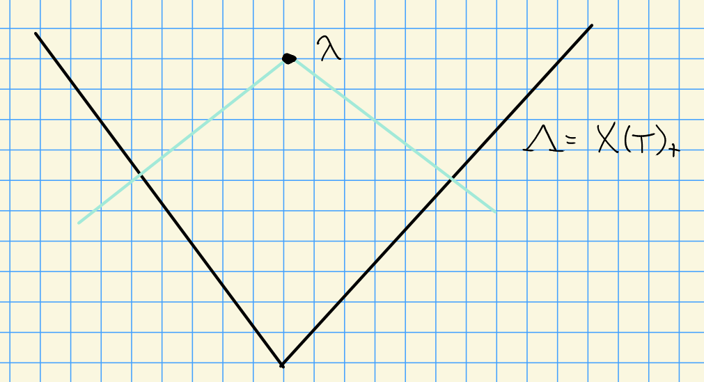

# Monday, October 05

Crelle 1988 (CPS: Cline Parshall Scott)

Let HWC denote a highest weight category

:::{.example}

1. BGG Category $\OO$

2. $\Rat(G)$ for $G$ a reductive algebraic group

3. $\Perv_W(G/B) \cong \OO_0$
:::

See

1. Donkin: On generalized Schur algebras

2. Irving: BGG algebras

There is a equivalence between HWC and QHA (quasi-hereditary algebras)

:::{.remark}
Key Points

1. $L(\lambda) = \soc_G \nabla(\lambda)$ and $\nabla(\lambda) = A(\lambda)$.

2. All composition factors of $\nabla(\lambda)$ satisfy $\mu \leq \lambda$

3. We have cohomological vanishing:
\[
\Ext_G^i(\Delta(\lambda), \nabla(\mu)) = 
\begin{cases}
0 & i >0 \\
0 & i=0, \lambda \neq \mu \\
k & i=0. \lambda = 0
\end{cases}
\]
:::

Interval finite poset: we'll have a cone $\Lambda$ of positive weights:

> See handout!

:::{.theorem title="?"}
Let $G ,G'$ be rational $G\dash$modules admitting good filtrations.
Then the tensor product $V\tensor V'$ also admits a good filtration.
:::

- First proofs: 
  - JP Wong, Type A
  - Donkin, all but characteristic 2 and $E_7, E_8$.
  
