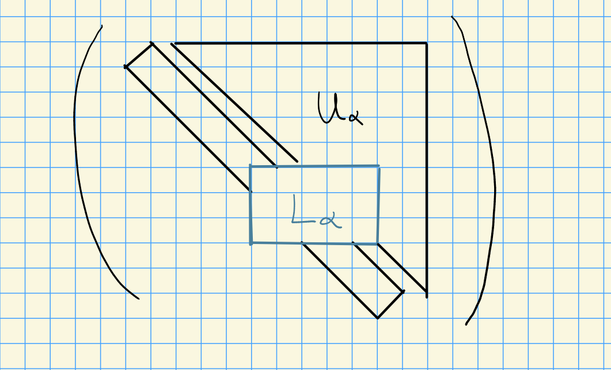
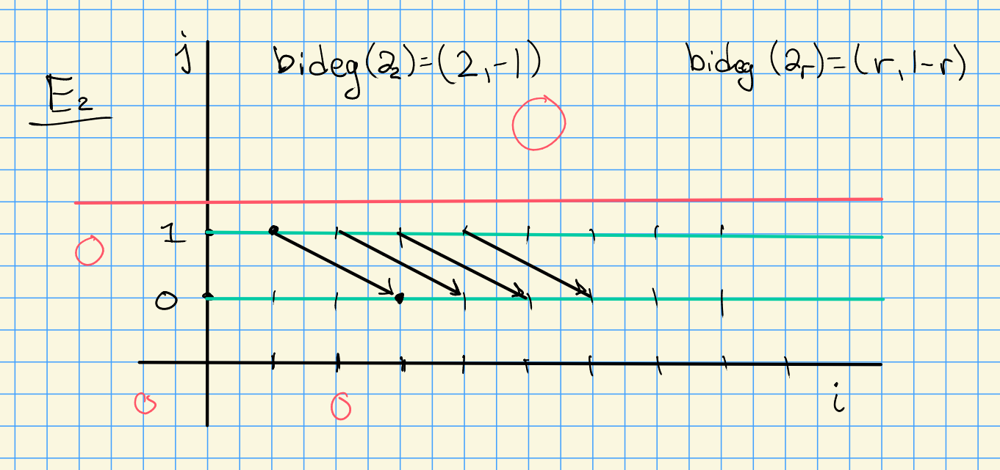
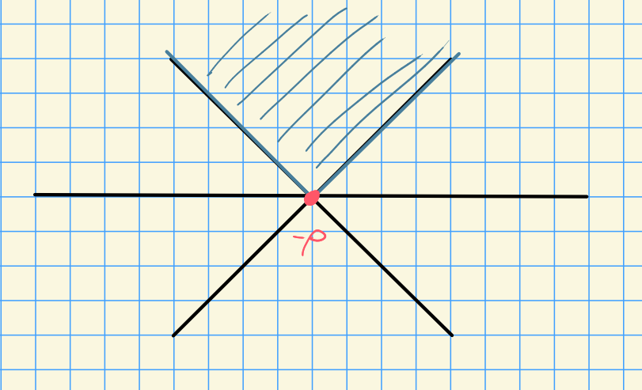

# Friday, October 09

Last time: Bott-Borel-Weil.
Stated for characteristic zero, working toward a generalization.

Let $\Delta$ be the set of simple roots, and $\alpha\in \Delta$. 
We can form a Levi decomposition $P_\alpha \da L_\alpha \semidirect U_\alpha$:

We have $B \subseteq P_\alpha \subseteq G$.
The dot action is given by the following:
Let $W$ be the Weyl group, then $W$ acts on $X(T)$ by $w\cdot \lambda = w(\lambda + \rho) - \rho$, where
\[  
\rho = {1\over 2} \sum_{\alpha\in \Phi^+} \alpha = \sum_{i=1}^n w_n
.\]

We obtained a formula
\[  
S_\alpha \cdot \lambda = \lambda - \inner{\lambda  + \rho}{\alpha\dual} \alpha
.\]

## Bott-Borel-Weil Theory

:::{.proposition title="?"}
 Let $\alpha\in\Delta$ be simple and $\lambda \in X(T)$ be an arbitrary weight.
Then

- $U_\alpha$ acts trivially on $\ind_B^{P_\alpha} \lambda$.

- (Kempf's Vanishing for $P_\alpha$) If $\inner{\lambda}{\alpha\dual} = r \geq 0$, then 
  \[  
  R^i \ind_B^{P_\alpha} \lambda = 0 \qquad \text{for } i \geq 0
  ,\]
  and $\dim \ind_B^{P_\alpha}\lambda = r + 1$.

- If $\inner{\lambda}{\alpha\dual} = -1$, then $R^i \ind_B^{P_\alpha} \lambda = 0$ for all $i$.

- If $\inner{\lambda}{\alpha\dual} \leq -2$, then 
  
  - $R^i \ind_B^{P_\alpha} \lambda = 0$ for $i \neq 1$, and 

  - $\dim R^1 \ind_B^{P_\alpha} \lambda = r+1$ 

Note: we have
\[  
\ind_B^{P_\alpha} \lambda = S^r(V) \qquad &\text{when } \inner{\lambda}{\alpha\dual} = r \geq 0 \\
R^1 \ind_B^{P_\alpha} = S^r(V)\dual \qquad&\text{where $V$ is a 2-dim representation and } \inner{\lambda}{\alpha\dual} \leq -2 \\
&\text{and } r = \abs{\inner{\lambda}{\alpha\dual}} - 1
.\]
:::
This gives us an analog of $A_1$ or $\SL_2$ theory.
Also note that we have Serre duality:
\[  
H^1(\lambda) = H^0( - (\lambda + 2\rho) )\dual
.\]

:::{.corollary title="?"}
Let $\alpha\in \Delta$ and $\lambda\in X(T)$, and suppose $\lambda$ is dominant with respect to $\alpha$, i.e. $\inner{\lambda}{\alpha\dual} \geq 0$.

- If $\ch(k) = 0$ then
  $\ind_B^{P_\alpha}\lambda = R^1 \ind_B^{P_\alpha} s_\alpha \cdot \lambda$

- If $\ch(k) = p$ and if there exists an $s, m$ with $0<s<p$ and $\inner{\lambda}{\alpha\dual} = sp^m - 1$ (Steinberg weights), then
\[  
\ind_B^{P_\alpha} \lambda = R^1 \Ind_B^{P_\alpha} s_\alpha \cdot \lambda
.\]

:::

The proof of this will use a Grothendieck-type spectral sequence of the form
\[  
E_2^{i, j} = R^i \ind_{P_\alpha}^G \qty{ R^j \ind_B^{P_\alpha} \lambda} \abuts R^{i+j} \ind_B^G \lambda
.\]

We'll have a version of *Grothendieck vanishing*:
\[  
R^j \ind_B^{P_\alpha} \lambda = 0 \qquad\text{for } j > \dim P_\alpha/B = 1
.\]

So the resulting spectral sequence will only be supported on the first two lines, and $E_3 = E_\infty$.
Note the differential will be of bidegree $\del_r \leadsto (r, 1-r)$, and $E_2$ will look like the following, 

Recall that $R^i \ind_B^G \lambda \da H^i(\lambda)$

:::{.proposition title="?"}
Let $\alpha\in\Delta$ and $\lambda \in X(T)$.

1. If $\inner{\lambda}{\alpha\dual} = -1$, then $H^\wait(\lambda) = 0$.
2. If $\inner{\lambda}{ \alpha\dual} \geq 0$, then $H^i(\lambda) = R^i \ind_B^{P_\alpha} \lambda$ for all $i\geq 0$.
3. If $\inner{\lambda}{\alpha\dual} \leq -2$, then
\[  
H^i(\lambda) = R^{i-1} \ind_{P_\alpha}^G \qty{ R^1 \ind_B^{P_\alpha} \lambda } \qquad \forall i
.\]

4. Suppose $\inner{\lambda}{\alpha\dual} \geq 0$.
  If $\ch(k) = 0$, or $\ch(k) = p> 0$ and $\inner{\lambda}{\alpha\dual} = sp^n - 1$, then 
  \[  
  H^i(\lambda) = H^{i+1}(s_\alpha\cdot \lambda)
  .\]
:::

:::{.proof title="of a"}
If $\inner{\lambda}{\alpha\dual} = -1$, then $R^\wait \ind_B^{P_\alpha} \lambda = 0$.
But this is what appears as the "coefficients" in the spectral sequence, so $E_2^{\wait, \wait} = 0$ and this $R^\wait \ind_B^{P_\alpha} = 0$.
:::

:::{.proof title="of b"}
If $\inner{\lambda}{\alpha\dual} = 0$, then $R^j \ind_B^{P_\alpha} \lambda = 0$ for all $j>0$.
Thus only the bottom line survives, and the spectral sequence degenerates on page 2. 
Thus $E_2^{1, 0} = R^i \ind_B^G \lambda$, where the LHS is equal to $R^i \ind_{P_\alpha}^G \qty{\ind_B^{P_\alpha} \lambda }$.
:::

:::{.proof title="of c"}
If $\inner{\lambda}{\alpha\dual} = -2$, then $R^i \ind_B^{P_\alpha} \lambda = 0$ for $i\neq 1$, so only $i=1$ survives
Then
\[
R^{i-1} \ind_{P_\alpha}^G \qty{ \ind_B^{PP_\alpha} \alpha} = R^i \ind_B^G \lambda
,\]
so there is some dimension shifting.
:::

:::{.proof title="of d"}
If $\inner{\lambda}{\alpha\dual} \geq 0$, then by (b),
\[  
H^i(\lambda) 
&= R^i \ind_{P_\alpha}^G \qty{ \ind_B^{P_\alpha} \lambda } \qquad\text{by c}\\
&= R^i \ind_{P_\alpha}^G \qty{ R^1 \ind_B^{P_\alpha} s_\alpha\cdot \lambda } \qquad\text{by corollary}\\
&= H^{i+1}(s_\alpha\cdot \lambda)
.\]

We can then check that 
\[  
s_\alpha \cdot \lambda
&= \lambda - \inner{\lambda + \rho}{\alpha\dual}\alpha \\
&= \lambda - \qty{ \inner{\lambda}{\alpha\dual} + 1 }\alpha && \text{using } \inner{\rho}{\alpha\dual} = 1 \\ \\
\implies 
\inner{s_\alpha \cdot \lambda}{\alpha\dual}
&= \inner{\lambda}{\alpha\dual} - \qty{ \inner{\lambda}{\alpha\dual}+1 }\inner{\alpha}{\alpha\dual} \\
&= \inner{\lambda}{\alpha\dual} - \qty{ \inner{\lambda}{\alpha\dual}+1 }2 \\
&= -\inner{\lambda}{\alpha\dual} - 2 \\
&\leq -2
.\]
:::

Now define
\[  
\bar{C}_{\ZZ} 
&\da 
\ts{
\lambda \in X(T) \st 0 \leq \inner{\lambda+\rho}{\beta\dual} \,\forall \beta \in \Phi^+
} \qquad\text{ if } \ch(k) = 0 \\
&\da
\ts{
\lambda \in X(T) \st 0 \leq \inner{\lambda+\rho}{\beta\dual} \leq \ch(k) \,\forall \beta \in \Phi^+
} \qquad\text{if } \ch(k) = p
.\]

Idea:

:::{.theorem title="Bott-Borel-Weil Generalization, due to Andersen"}

a. If $\lambda \in \bar{C}_\ZZ$ and $\lambda \not\in X(T)_+$, then $H^0(w\cdot \lambda) = 0$.

b. If $\lambda \in \bar{C}_\ZZ \intersect X(T)_+$, then for all $w\in W$,
\[  
H^i(w\cdot \lambda) = 
\begin{cases}
H^0(\lambda) & i= \ell(w) \\
0 & \text{otherwise}
\end{cases}
.\]
:::

Note that this covers everything in the $\ch(k) = 0$ case, but only gives the following hexagon in the $\ch(k) = p$ case:

:::{.remark}
**Open Problem**:
Determine $\ch H^i(\lambda)$ for $\lambda\in X(T)$ in characteristic $p>0$.

Andersen provided necessary an sufficient conditions
for $H^1(\lambda) \neq 0$ and computed $\soc_G H^1(\lambda)$.
:::

