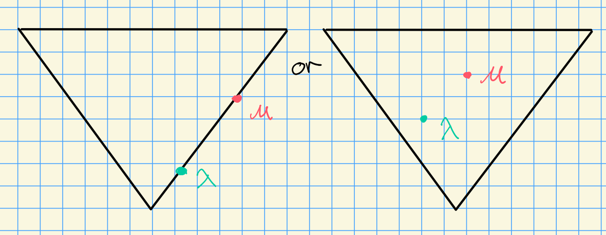

# Wednesday, October 28

## Review of Last Time

Suppose we have two weights in the same facet, i.e. they're in the same stabilizer under the action of the affine Weyl group:

We had a theorem: if $\lambda, \mu$ are in the same facet, then $\mathcal{B}_\lambda \cong \mathcal{B}_\mu$ is an equivalence of categories, where the map is via the translation functors.

## Description of $T_\lambda^\mu \qty{H^i(w\cdot \lambda) }$
