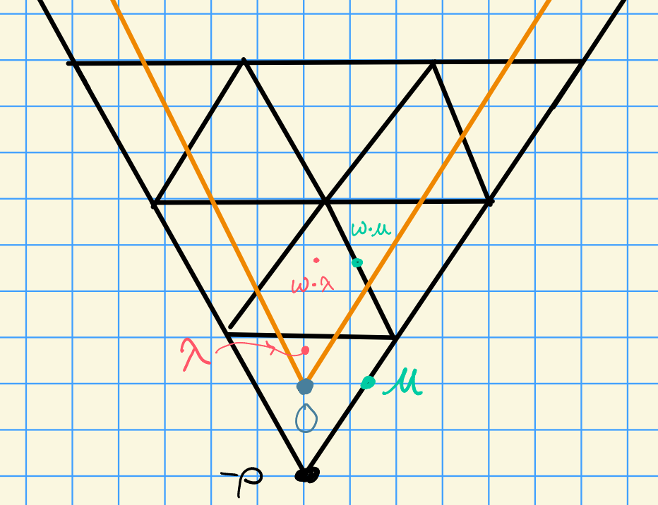

# Wednesday, October 28

## Review of Last Time

Suppose we have two weights in the same facet, i.e. they're in the same stabilizer under the action of the affine Weyl group:

We had a theorem: if $\lambda, \mu$ are in the same facet, then $\mathcal{B}_\lambda \cong \mathcal{B}_\mu$ is an equivalence of categories, where the map is via the translation functors.

## Description of $T_\lambda^\mu \qty{H^i(w\cdot \lambda) }$

We can write
\[  
T_\lambda^\mu \qty{H^i(w\cdot \lambda)} 
&= \pr_\mu \qty{L(\nu_1) \tensor \pr_\lambda\qty{H^i(w\cdot \lambda)} } \\
&= \pr_\mu \qty{L(\nu_1) \tensor {H^i(w\cdot \lambda)} } \\
&= \pr_\mu \qty{L(\nu_1) \tensor {R^i \ind_B^G w\cdot \lambda} } \\
&= \pr_\mu\qty{R^i \ind_B^G \qty{L(\nu_1) \tensor w\cdot \lambda } }
.\]

Take a composition series by $B\dash$modules of $L(\nu_1) \tensor w\cdot \lambda$, say
\[  
0 = M_0 \subseteq M_1 \cdots \subseteq M_r = L(\nu_1) \tensor w\cdot \lambda
.\]
where $M_j / M_{j-1} \cong \lambda+j + w\cdot \lambda$ and $\lambda_j < \lambda_{j'} \implies j < j'$, i.e. we can order them in a decreasing way.

Consider the SES

\begin{tikzcd}
0 \ar[r] & M_{j-1} \ar[r] & M_j \ar[r] & M_{j} / M_{j-1} \ar[r] & 0
\end{tikzcd}

where applying $\pr_\mu(\wait)$ induces the LES
\begin{tikzcd}
\cdots \ar[r] & \pr_\mu M_{j-1} \ar[r] & \pr_\mu M_j \ar[r] & \pr_\mu \qty{ M_{j} / M_{j-1} } \ar[r] & \cdots
\end{tikzcd}

We know that
\[  
\pr_\mu H^i\qty{\lambda_j + w\cdot \lambda} = 
\begin{cases}
H^i(\lambda_j + w\cdot \lambda ) & \lambda+j + w\cdot \lambda \in W_p\cdot \mu \\
0 & \text{else}
\end{cases}
,\]
i.e. this projection is the identity for weights linked to $\mu$ and zero otherwise.
We also have
\[  
\pr_\mu H^i(M_r) = T_\lambda^\mu H^i(w\cdot \lambda)
.\]

:::{.theorem title="?"}
Let $\lambda, \mu \in \bar{C}_\ZZ$ and $F$ be a facet with $\lambda \in F$.
If $\mu \in \bar{F}$, then we have
\[  
T_\lambda^\mu\qty{H^i(w\cdot \lambda)} = H^i(w\cdot \mu) \qquad \forall w\in W_p
.\]
:::

:::{.example title="?"}

Here consider $H_0(\lambda) \mapsvia{T_\lambda^\mu} H_0(\mu) = 0$, since $\mu$ is outside of the dominant region (in orange.)
We also have $H^0(w\cdot \lambda) \to H^0(w\cdot \mu) \neq 0$, since this falls *into* the dominant region.
:::

:::{.proof title="?"}
Let $\lambda \in F$ and $\mu\in\bar{F}$.
Then $\stab_{W_p}(\lambda) \subseteq \stab_{W_p}(\mu)$.
By a previous technical lemma, we had a formula for computing $\ch T_\lambda^\mu V$, which involved considering 
\[  
w_1 \in {\stab_{W_p}(\lambda) \over \stab_{W_p}(\lambda) \intersect \stab_{W_p}(\mu)}
.\]
In this case, we get $w_1 = \id$, since the top and bottom are equal.

By that lemma, there exists a unique $\ell$ such that $w\cdot \lambda + \lambda_\ell \in W_p\cdot \mu$, where $\lambda_\ell$ is a weight of $L(\nu_1)$.
From the LES, we have

\begin{tikzcd}
\cdots \ar[r] & \pr_\mu M_{j-1} \ar[r] & \pr_\mu M_j \ar[r] & \pr_\mu \qty{ M_{j} / M_{j-1} } = \lambda_j + w\cdot \lambda \ar[r] & \cdots
\end{tikzcd}
where the last term will only be nonzero in restricted cases.

:::
