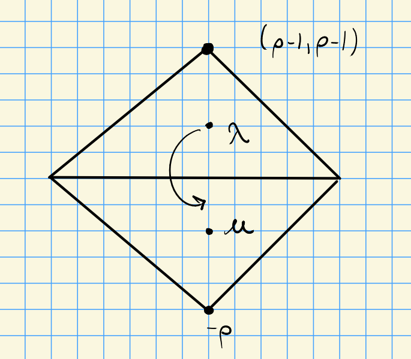
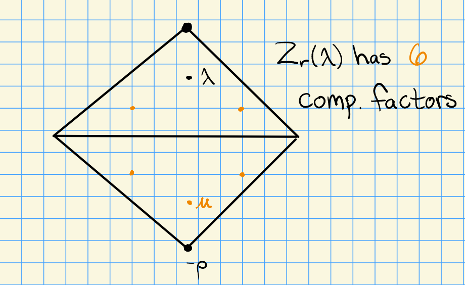

# Monday, November 09

## Strong Linkage

We have two categories:

- $G_r T$, with a notion of *strong linkage*, and 
- $G_r$, which instead only has *linkage*.

We'll restate a few theorems.

:::{.theorem title="?"}
\envlist
Let $\lambda, \mu \in X(T)$.

1. If $[\hat{Z}_r(\lambda) : \hat{L}_r(\mu) ]_{G_r T} \neq 0$, then $\mu \uparrow \lambda$ are strongly linked.

2. If $[{Z}_r(\lambda) : {L}_r(\mu) ]_{G_r} \neq 0$, then $\mu \in W_p \cdot\lambda + p^r X(T)$.

:::

:::{.example title="?"}
In the case of $\Phi = A_2$, we'll consider the two different categories.

We have the following picture for $\hat{Z}$:

Considering $X_1(T)$ and $[\hat{Z}_1(\lambda) : \hat{L}_1(\mu)] \neq 0$, and $\hat{Z}_1(\lambda)$ has 6 composition factors as $G_1T\dash$modules.

On the other hand, for $Z$, we have the following:

This again has 6 composition factors, obtained by ??

\todo[inline]{What's the main difference?}

:::

## Extensions

Let $\lambda, \mu \in X(T)$.
We can use the Chevalley anti-automorphism (essentially the transpose) to obtain a form of duality for extensions:
\[  
\ext_{G_r T}^j \qty{ \hat{L}_r(\lambda), \hat{L}_r(\mu) } 
= 
\ext_{G_r T}^j \qty{ \hat{L}_r(\mu), \hat{L}_r(\lambda) } \qquad \text{for }j\geq 0
.\]

We have a form of a weight space decomposition
\[  
\ext_{G_r}^j \qty{L_r(\lambda), L_r(\mu) }
.\]
