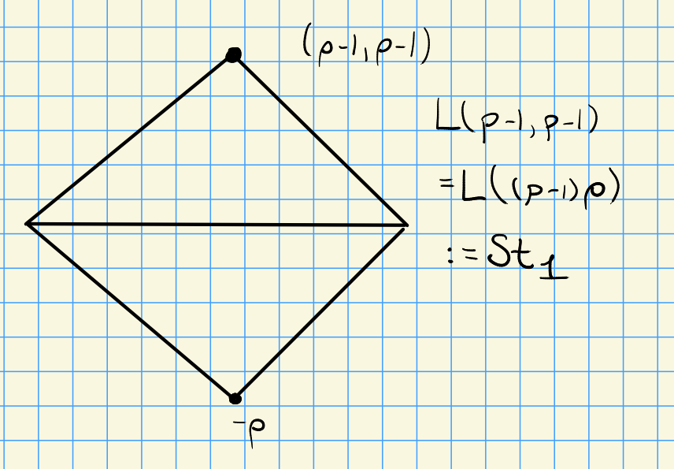

# Monday, November 09

## Strong Linkage

We have two categories:

- $G_r T$, with a notion of *strong linkage*, and 
- $G_r$, which instead only has *linkage*.

We'll restate a few theorems.

:::{.theorem title="?"}
\envlist
Let $\lambda, \mu \in X(T)$.

1. If $[\hat{Z}_r(\lambda) : \hat{L}_r(\mu) ]_{G_r T} \neq 0$, then $\mu \uparrow \lambda$ are strongly linked.

2. If $[{Z}_r(\lambda) : {L}_r(\mu) ]_{G_r} \neq 0$, then $\mu \in W_p \cdot\lambda + p^r X(T)$.

:::

:::{.example title="?"}
In the case of $\Phi = A_2$, we'll consider the two different categories.

We have the following picture for $\hat{Z}$:

Considering $X_1(T)$ and $[\hat{Z}_1(\lambda) : \hat{L}_1(\mu)] \neq 0$, and $\hat{Z}_1(\lambda)$ has 6 composition factors as $G_1T\dash$modules.

On the other hand, for $Z$, we have the following:

This again has 6 composition factors, obtained by ??

\todo[inline]{What's the main difference?}

:::

## Extensions

Let $\lambda, \mu \in X(T)$.
We can use the Chevalley anti-automorphism (essentially the transpose) to obtain a form of duality for extensions:
\[  
\ext_{G_r T}^j \qty{ \hat{L}_r(\lambda), \hat{L}_r(\mu) } 
= 
\ext_{G_r}^j \qty{ \hat{L}_r(\mu), \hat{L}_r(\lambda) } \qquad \text{for }j\geq 0
.\]

We have a form of a weight space decomposition
\[  
\ext_{G_r}^j \qty{L_r(\lambda), L_r(\mu) }
= \bigoplus_{\gamma \in X(T)} \ext_{G_r}^j \qty{L_r(\lambda), L_r(\mu) }_{\gamma}
\]
where we are taking the fixed points under the torus $T$ action on the first factor (for which $T_r$ acts trivially).
We can write this as 
\[  
\cdots 
&= \bigoplus_{\gamma \in X(T)} \ext_{G_r}^j \qty{L_r(\lambda), L_r(\mu) \tensor \gamma } \\
&= \bigoplus_{\gamma \in X(T)} \ext_{G_rT}^j \qty{L_r(\lambda), L_r(\mu) \tensor p^r v } \\
&= \bigoplus_{v \in X(T)} \ext_{G_rT}^j \qty{ \hat{L}_r(\lambda), \hat{L}_r(\mu + p^r v) }
.\]

So if we know extensions in the $G_r$ category, we know them in the $G_r T$ category.

There is an isomorphism
\[  
\ext_{G_r T}^1 \qty{ \hat{L}_r(\lambda), \hat{L}_r(\mu) } 
\cong \Hom_{G_R T}\qty{ \rad_{G_r T} \hat{Z}_r(\lambda), \hat{L}_r(\mu) }
.\]

Finally, for $\lambda, \mu \in X(T)$, if the above $\ext^1$ vanishes, then $\lambda \in W_p \cdot \mu$ (i.e. $\lambda$ and $\mu$ are linked).

## The Steinberg Modules

:::{.example title="Steinberg"}
Consider $A_2$:

Taking the representation corresponding to $(p-1, p-1)$ yields the "first Steinberg module" 
\[  
L(p-1, p-1) = L((p-1)\rho) \da \operatorname{St}_1 
.\]

In this case, we have an equality of many modules:

\[  
H^0((p-1) \rho) =
L((p-1) \rho) =
V((p-1) \rho) =
T((p-1) \rho)
.\]
:::

:::{.definition title="Steinberg Modules"}
The $r$th **Steinberg module** is defined to be $L((p^r-1)\rho)$.
:::

:::{.remark}
In general, we have
\[  
L((p^r-1)\rho) = 
H^0((p^r-1)\rho) = 
V((p^r-1)\rho)
.\]

We also have
\[  
\hat{Z}_r((p^r-1)\rho) \cong
L((p^r-1)\rho) \downarrow_{G_r T}
.\]
:::

:::{.theorem title="?"}
The Steinberg module is both injective and projective as both a $G_r\dash$module and a $G_rT\dash$module.
:::

:::{.proof title="?"}
It suffices to prove that $\St_r$ is projective over $G_r T$, then by a previous theorem, it will also be projective over $G_r$.
Let $\hat{L}_r(\mu)$ be a simple $G_rT\dash$module, and consider
\[  
\ext_{G_rT}^1(\St_r, \hat{L}_r(\mu)) =
\ext_{G_rT}^1(\hat{L}_r((p^r-1)\rho), \hat{L}_r(\mu))
.\]
If we show this is zero for every simple module, the result will follow.

Suppose $(p^r-1)\rho\not< \mu$.
In this case, the RHS above is zero.

\todo[inline]{Missed why: something to do with radical of the first term?}

Otherwise, we have
\[  
\ext_{G_rT}^1(\hat{L}_r(\mu), \St_r) =
\ext_{G_rT}^1(\rad(\hat{Z}_r(\mu)) , \St_r)
.\]
Suppose that the RHS is nonzero.
Then $\rad \hat{Z}_r(\mu) \surjects \St_r$
:::

