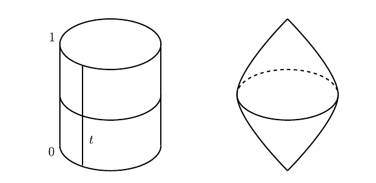

Important Theorems:

Important ideas:

- Compactness of $\mathcal{L}(x, y)$.
- $\del^2 = 0$.
- Using broken trajectories to compactify
- Gluing

# Background from Chapter 8

- $(M, \omega)$ with $\omega \in \Omega^2(M)$ is a symplectic manifold with an almost complex structure $J$.
- $H \in C^\infty(M; \RR)$ a Hamiltonian with $X_H$ the corresponding symplectic gradient.
  - Defined by how it acts on tangent vectors in $T_x M$:
  \[  
  \omega_x(\wait , X_H(x)) = (dH)_x(\wait) 
  .\]
  - Zeros of vector field $X_H$ correspond to critical points of $H$:
  \[  
  X_H(x) = 0 \iff (dH)_x = 0
  .\]
  - Take the associated flow $\psi^t:M\to M$, assumed 1-periodic so $\psi^1(x) = x$: critical points of $H$ are periodic trajectories.
  
  

- $u \in C^\infty(\RR\cross S^1; M)$ is a solution to the Floer equation.

- The Floer equation and its linearization:
\begin{align*}
\mcf(u) &= \dd{u}{s} + J \dd{u}{t} + \grad_u(H) = 0 \\
\qty{d\mcf}_u(Y) &= \dd{Y}{s} + J_0 \dd{Y}{t} + S\cdot Y \\ \\ \\
&Y\in u^* TW,~ S \in C^\infty(\RR\cross S^1; \endo(\RR^{2n}))
.\end{align*}

- $\mcl M$ is the *free loop space* of $M$, i.e. space of contractible loops on $M$, i.e. $C^\infty(S^1; M)$ with the $C^\infty$ topology
   - Loops in $\mcl M$ can be viewed as maps $S^2\to M$, since they're maps $I\cross S^1\to M$ with the boundaries pinched:

  
  
  - Elements $x\in \mcl M$ can be viewed as maps $S^1\to M$.
  - Can extend to maps from a closed disc, $u: \bar \DD^2 \to M$.

- The action functional is given by
  \begin{align*}
  \mca_H: \mcl W &\to \RR\\
  x &\mapsto -\int_{\DD} u^* \omega + \int_0^1 H_t(x(t)) ~dt
  \end{align*}

  - Example: $W = \RR^{2n} \implies A_H(x) = \int_0^1 \qty{H_t ~dt - p~dq}$. 
  - Correspondence between trajectories of the gradient of $\mathcal{A}_H$ and solutions to Floer equations.

- Assumption of *symplectic asphericity*, i.e. the symplectic form is zero on spheres. 
  Statement: for every $u\in C^\infty(S^2, M)$,
\[  
\int_{S^2} u^* \omega = 0 \qtext{or equivalently} \inner{\omega}{\pi_2 M} = 0
.\]

- Assumption of *symplectic trivialization*: for every $u\in C^\infty(S^2; M)$ there exists a symplectic trivialization of the fiber bundle $u^* TM$, equivalently
\[  
\inner{c_1 TM}{\pi_2 M} = 0
.\]
  
  > Locally a product of base and fiber, transition functions are symplectomorphisms.

- $x, y$ periodic orbits of $H$ (nondegenerate, contractible), equivalently critical points of $\mathcal{A}_H$.

- Maslov index: used the fact that 
  - $\Sp(2n, \RR)$ retracts onto $U(n)$: use a polar decomposition $S = PQ$ as a PSD times orthogonal, then homotope $P$ to $I$.
  - $\pi_1 U_n = \ZZ$: use $U(n, \CC) \simeq SU(n, \CC)\cross S^1$ by the determinant, and $\pi_1 SU(n, \CC) = 0$.
  - Thus every path in $\gamma: I\to \Sp(2n, \RR)$ can be assigned an integer by getting a map $\tilde \gamma: I \to S^1$ and taking (approximately) its winding number.

- $\mathcal{M}(x, y)$, the moduli space of contractible finite-energy solutions to the Floer equation connecting $x, y$.

  - Showed that after perturbing $H$ to get transversality, get a manifold of dimension $\mu(x) - \mu(y)$.

  - How did we do it: describe as zeros of a section of a vector bundle over $\mathcal{P}^{1, p}(x, y)$ (Banach manifold modeled on the Sobolev spaces $W^{1, p}$), apply Sard-Smale to show $\mathcal{M}(x, y)$ is the inverse image of a regular value of some map.
  - Needed tangent maps to be Fredholm operators, proved in Ch. 8 and used to show transversality.
  Followed from showing $(d\mathcal{F})_u$ is a Fredholm operator of index $\mu(x) - \mu(y)$.

Goals

- Construct Floer homology and prove the Arnold Conjecture ("Symplectic Morse Inequalities?"): 
\[  
\# \ts{\text{1-Periodic trajectories of }X_H} \geq \sum_{k\in \ZZ} HM_k(w; \, \ZZ/2\ZZ)
.\]

Steps 

1. Define the action functional $\mathcal{A}_H$.

2. Construct the chain complex (graded vector space) $CF_*$.

3. Define $X_H$, which will be used to define $\del$ later. 

4. Count trajectories.

5. Show finite-energy trajectories connect critical points of $\mathcal{A}_H$.

6. Show compactness property for space of trajectories of finite energy.

7. Define $\del$ (uses a compactness property in 9.1c)

8. Show space of trajectories is a manifold (plus genericity, "Smale property")

9. Show that $\del^2 = 0$.

10. Show that $HF_*$ doesn't depend on $\mathcal{A}_H$ or $X_H$

11. Show $HF_* \cong HM_*$, and compare dimensions of the vector spaces $CM_*$ and $CF_*$. 

# 9.1 and Review

- Defined moduli space of (parameterized) **solutions**:
\[  
\mathcal{M}(x, y) &= \ts{\text{Contractible finite-energy solutions connecting }x, y } 
\\ \\
\mcm &= \ts{\text{All contractible finite-energy solutions to the Floer equation}}
= \bigcup_{x, y} \mathcal{M}(x, y)
.\]

- Defined the moduli space of (unparameterized) **trajectories** connecting $x$ to $y$:
\[  
\mathcal{L}(x, y) \da \mathcal{M}(x, y) / \RR
.\]

  - Use the quotient topology, define sequentially:
  \[  
  \tilde u_n \converges{n\to\infty}\too \tilde u 
  \quad\iff\quad 
  \exists \ts{s_n}\subset \RR \text{ such that } u_n(s_n + s, \wait) \converges{n\to\infty}\too u(s, \wait)
  .\]

  - When $\abs{\mu(x) - \mu(y)} = 1$, get a compact 0-manifold, so the number of trajectories $$n(x, y) \da \# \mathcal{L}(x, y)$$ is well-defined.

- $C_k(H) \da \ZZ/2\ZZ[S]$ where $S$ is the set of periodic orbits of $X_H$ of Maslov index $k$.

  - Finitely many since they are nondegeneracy implies they are isolated.

- Defined a differential
\[  
\del: C_k(H) &\to C_{k-1}(H) \\
x &\mapsto \sum_{\mu(y) = k-1} n(x, y) y \\ \\
n(x, y) &\da \# \ts{\text{Trajectories of } \grad \mathcal{A}_H \text{ connecting } x, y} \mod 2 \\
&= \# \mathcal{L}(x, y) \mod 2
.\]

- Examined $\del^2$:

\[  
\del^2: C_{k}(H) &\to C_{k-2}(H) \\
x &\mapsto \del(\del(x)) \\
&= \del \qty{\sum_{\mu(y) = \mu(x)-1} n(x, y) y} \\ \\
&= \sum_{\mu(y) = \mu(x) - 1} n(x, y) \del(y) \\ \\
&= \sum_{\mu(y) = \mu(x) - 1} n(x, y) \qty{\sum_{\mu(z) = \mu(y)-1} n(y, z) z} \\ \\
&= \sum_{\mu(y) = \mu(x) - 1} \,\,\sum_{\mu(z) = \mu(y)-1} n(x, y)  n(y, z) \,z \\
&= \sum_{\mu(z) = \mu(y) - 1} \qty{\sum_{\mu(y) = \mu(x)-1} n(x, y)  n(y, z)}\,z \hspace{4em} \text{(finite sums, swap order)}
,\]
  so it suffices to show
\[  
\sum_{\mu(y) = \mu(x)-1} n(x, y)  n(y, z) = 0 \qtext{when} \mu(z) = \mu(x) - 2 
.\]

  > Easier to examine parity, so we'll show it's zero mod 2.

  - When $\mu(z) = \mu(x) - 2$, $\mathcal{L}(x, z)$ is a non-compact 1-manifold, so we compactify by adding in *broken trajectories* to get $\bar{\mathcal{L}}(x, y)$.
  
  - We'll then have
  \[  
  \bar{\mathcal{L}}(x, z) = \mathcal{L}(x, z) \union \bd \bar{\mathcal{L}}(x, z), \qquad \bd \bar{L}(x, z) = \bigcup_{\mu(y) = \mu(x) - 1} \mathcal{L}(x, y) \cross \mathcal{L}(y, z)
  ,\]
  which "space-ifies" the equation we want.

  - We'll show $\bd \bar{\mathcal{L}}(x, z)$ is a 1-manifold, which must have an even number of points, and thus
  \[  
  \sum_{\mu(y) = \mu(x)-1} n(x, y)  n(y, z) = 
  \# \qty{\bd \bar{\mathcal{L}}(x, z)} \equiv 0 \mod 2
  .\]

## Three Important Theorems

- Shown last time: a sequence of trajectories can converge to a broken trajectory.

:::{.theorem title="9.1.7"}
Let $\ts{u_n}$ be a sequence in $\mathcal{M}(x, y)$, then there exist
\

- A subsequence $\ts{u_{n_j}}$
\
- Critical points $\ts{x_0, x_1, \cdots, x_{\ell+1}}$ with $x_0=x$ and $x_{\ell+1} = y$
\
- Sequences $\ts{s_n^1}, \ts{s_n^2}, \cdots, \ts{s_n^\ell}$.
\
- Elements $u^k \in \mathcal{M}(x_k, x_{k+1})$ such that for every $0\leq k \leq \ell$,
\[  
u_n \cdot s_n^k \converges{n\to\infty}\too u^k
.\]
:::

:::{.definition title="Regular Pair"}
For an almost complex structure $J$ and a Hamiltonian $H$, the pair $(H, J)$ is **regular** if the Floer equation
\[  
\mathcal{F}
.\]
:::

:::{.theorem title="9.2.1"}
Let $(H, J)$ be a regular pair with $H$ nondegenerate and $x, z$ be two periodic trajectories of $H$ such that
\[  
\mu(x) = \mu(z) + 2
.\]

Then $\bar{\mathcal{L}}(x, z)$ is a compact 1-manifold with boundary with
\[  
\bd \bar{\mathcal{L}}(x, z) = \bigcup_{y\in \mathcal{I}(x, z)} \mathcal{L}(x ,y) \cross \mathcal{L}(y, z) \qquad\text{where} \quad \mathcal{I}(x, z) = 
\ts{
y \st \mu(x) < \mu(y) < \mu(z)
}
.\]

> Note: possibly a typo in the book?
:::

:::{.remark}
\hfill
- As a corollary, $\bd^2 = 0$.
- Most of chapter 9 is spent proving this theorem.
:::

:::{.remark}
Some notation:
\begin{center}
\begin{tikzcd}
\RR \ar[r] & \mathcal{M}(x, z)\ar[d, "\pi"] \\
 & \mathcal{L}(x, z) \\
\end{tikzcd}
\end{center}

Hats will generally denote maps induced on quotient.
:::

:::{.theorem title="9.2.3: Gluing"}
Let $x,y,z$ be three critical points of $\mathcal{A}_H$ with three consecutive indices
\[  
\mu(x) = \mu(y)+1 = \mu(z) + 2
.\]

and let 
\[  
(u, v) \in \mathcal{M}(x, y) \cross \mathcal{M}(y, z) \quad\leadsto\quad (\hat u, \hat v)\in \mathcal{L}(x, y) \cross \mathcal{L}(y, z)
.\]

Then

1. There exists a $\rho_0 > 0$ and a differentiable map 
  \[  
  \psi: [\rho_0, \infty) &\to \mathcal{M}(x, z) 
  \]
  such that $\hat \psi$, the induced map on the quotient
  \begin{center}
  \begin{tikzcd}
  {[\rho_0, \infty)} \ar[r, "\psi"] \ar[rd, "\hat\psi"', dotted] & \mathcal{M}(x, z)\ar[d, "\pi"] \\
  & \mathcal{L}(x, z) \\
  \end{tikzcd}
  \end{center}
    is an embedding that satisfies 
  \[  
  \hat\psi(\rho) \converges{\rho\to\infty}\too (\hat u, \hat v) \in \bar{\mathcal{L}}(x, z)
  .\]

2. For any sequence $\ts{\ell_n}\subseteq \mathcal{L}(x, z)$,
\[  
\ell_n \converges{n\to\infty}\too (\hat u, \hat v) \quad\implies\quad \ell_n \in \im(\hat \psi) \text{ for } n \gg 0
.\]

:::

## Review Last Time

- $\RR\actson \mathcal{M}_{x, y}$, so we quotient to define $\mathcal{L}(x, y) =\da \mathcal{M}_{x, y} / \RR$ with the quotient topology.

- Topology defined by when sequences converge: 
\[  
\tilde u_n \converges{n\to\infty}\to \tilde u \iff \exists \ts{s_n} \subseteq \RR \text{ such that } u_{n}(s_n + s, \wait) \converges{n\to\infty}\to u(s, \cdot)
.\]

:::{.proposition title="?"}
$\mathcal{L}(x, y)$ is Hausdorff.
:::

- Want to show $\mathcal{L}(x, y)$ is a compact 0-dimensional manifold.

- Have a differential

\[  
\partial: C_{k}(H) &\longrightarrow C_{k-1}(H) \\
\partial(x) &= \sum_{\operatorname{Ind}(y)=k-1} n(x, y) y
.\]
with $n(x ,y)$ the number (mod 2) of trajectories of $\grad \mathcal{A}_H$ connecting $x, y$, i.e solutions to the Floer equation.

- Want to prove that the following is a 1-dimensional manifold:
\[  
M \da \overline{\mathcal{L}}(x, z)=\mathcal{L}(x, z) \cup_{\mu(y)=\mu(x)+1} \mathcal{L}(x, y) \times \mathcal{L}(y, z)
.\]
and show that $M$ is compact with $\bd M$ equal to the last union.

- Last time: closure of space of trajectories connecting $x, y$ contains "broken" trajectories.

- Last time: toward proving that $M$ is compact

# 9.2 

- Wanted to compactify $\mathcal{L}(x, y)$, needed to go to space of broken trajectories.

- Main theorem of chapter 9: 9.2.1.

:::{.theorem title="9.2.1"}
Let $(H, J)$ be a regular pair with $H$ nondegenerate.

Let $x, z$ be two periodic trajectories of $H$ such that $\mu(x) = \mu(z) + 2$.

Then $\bar{\mathcal{L}}(x, y)$ is a compact 1-manifold with boundary satisfying
\[  
\partial \overline{\mathcal{L}}(x, y)=\bigcup_{\mu(x)<\mu(y)<\mu(z)} \mathcal{L}(x, y) \times \mathcal{L}(y, z)
.\]

As a corollary, $\bd^2 = 0$.
:::

- Know $\bar{\mathcal{L}}(x, y)$ is compact and $\mathcal{L}(x ,y)$ is a 1-manifold
- Now suffices to study in a neighborhood of boundary points ("gluing theorem")

## Three steps to gluing theorem

1. Pre-gluing: Get a function $w_p$ which interpolates between $u$ and $v$ (not exactly a solution itself, but will be approximated by one later).

2. Constructing $\psi$ a "true solution" from $w_p$ using the Newton-Picard method.
  We'll have
  \[  
  \psi(p) = \oldexp_{w_p}\qty{\gamma(p)} \qquad \gamma(p) \in W^{1, p}(w_p^*\, TW) = T_{w_p} \mathcal{P}(x, z)
  .\]
  where $\mathcal{P} = ?$.
  

3. Get a lift $\hat \psi = \pi \circ \psi$ where $\pi = ?$ satisfying 

  - $\hat \psi(p) \converges{n\to\infty}\to (\hat u, \hat v)$
  - $\hat \phi$ is an embedding
  - $\hat \psi$ is unique in the following sense (the last point)

:::{.theorem title="9.2.3 (Gluing Theorem)"}
Let $x,y,z$ be critical points of the action functional $\mathcal{A}_H$ such that $\mu(x) = \mu(y) + 1 = \mu(z) + 2$.
Let $(u, v)\in \mathcal{M}(x, y) \cross \mathcal{M}(y, z)$ be trajectories, inducing $(\bar u, \bar v) \in \mathcal{L}(x, y) \cross \mathcal{L}(y, z)$.

- There exist a differentiable map $\psi: (\rho_0, \infty) \to \mathcal{M}(x , z)$ for some $\rho > 0$ such that 

- $\pi \circ \psi: (\rho_0, \infty) \to \mathcal{L}(x, z)$ is an embedding

- $\hat \psi \converges{\rho\to\infty}\to (\bar u, \bar v) \in \bar{\mathcal{L}(x, z)}$.

- If $\ell_n \in \mathcal{L}(x, z)$ with $\ell_n \converges{n\to\infty}\to (\bar u, \bar v)$, then for $n\gg 1$ we have $\ell \in \Im(\hat\psi)$.
:::

# 9.3: Pre-gluing

- Choose a bump function $\beta$ on $\ts{0}^c \subset \RR \to [0, 1]$ which is 1 on $\abs{x} \geq 1$ and $0$ on $\abs{x} < \eps$
- Split into positive and negative parts $\beta^\pm$:

- Define the interpolation $w_\rho$ from $u$ to $v$ in the following way:

\begin{equation*}
w_{\rho}(s, t)=\left\{\begin{array}{ll}
u(s+\rho, t) & \text { if } s \leq-1 \\
\oldexp _{y(t)}\left(\beta^{-}(s) \oldexp _{y(t)}^{-1}(u(s+\rho, t))\right. \left.+\beta^{+}(s) \oldexp _{y(t)}^{-1}(v(s-\rho, t))\right) & \text { if } s \in[-1,1] \\
v(s-\rho, t) & \text { if } s \geq 1
\end{array}\right.
\end{equation*}

- Why does this make sense?
\[  
  \abs{s}\leq 1 \implies u(s\pm \rho, t) \in 
  \ts{\oldexp_{y(t)} Y(t) \st \sup_{t\in S^1} \norm{Y(t)}\leq r_0 }
.\]

# 9.4: Construction of $\psi$.

- Have constructed $w_\rho \in C^\infty_{\searrow}(x, z)C^\infty(x, z)$ for every $\rho \geq \rho_0$, since there is exponential decay.
- Yields $\psi_\rho \in \mathcal{M}(x, z)$ a true solution (to be defined).
- Need to check that $\mathcal{F}(\psi_\rho) = 0$ where 
\[  
\mathcal{F} = \dd{}{s} + J\dd{}{t} + \grad H
x\]
  in the weak sense.

- $\psi_\rho$ already continuous, and by elliptic regularity, makes it a strong solution.

- Trivialization

- Defining $\mathcal{F}_\rho$.

\[  
W^{1, p}\left(\mathbf{R} \times S^{1} ; \mathbf{R}^{2 n}\right) &\stackrel{\mathcal{F}_{\rho}}{\longrightarrow} L^{p}\left(\mathbf{R} \times S^{1} ; \mathbf{R}^{2 n}\right) \\
\left(y_{1}, \ldots, y_{2 n}\right) &\longmapsto\left[\left(\frac{\partial}{\partial s}+J \frac{\partial}{\partial t}+\operatorname{grad} H_{t}\right)\left(\oldexp _{w_{\rho}} \sum y_{i} Z_{i}^{\rho}\right)\right]_{Z_{i}}
\]
where $\mathcal{F}_\rho \da \mathcal{F} \circ \oldexp_{w_\rho}$ written in the bases $Z_i$.
sd
- Newton-Picard method, general idea

- Original method and variant: find the limit of a sequence
\[  
x_{n+1} = x_n - {f(x_n) \over f'(x_n)}
,\qquad x_{n+1} = x_n - {f(x_n) \over f'({\color{red} x_0} )}
.\]

- Allows finding zeros of $f$ given an approximate zero $x_0$.

- Linearize $\mathcal{F}_\rho$.

