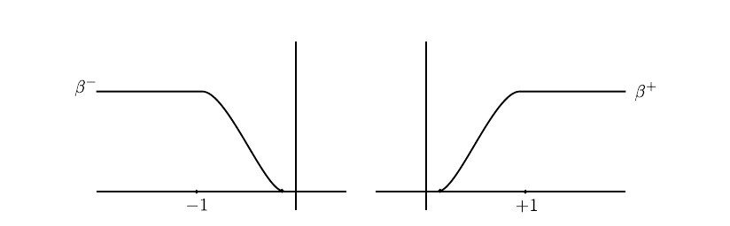

# Chapter 9 

# 9.1 and Review

- $(M, \omega)$ a symplectic manifold, $H \in ?$ a Hamiltonian, $X_H$ its ?

- $\int_{S^2} u^* \omega =\sigma_1$ where $u\in C^\infty(S^2, W)$.

- $\inner{c_1(TW)}{\pi_2(TW)} = 0$?

- $C_k(H) \da \ZZ/2\ZZ[S]$ where $S$ is the set of periodic orbits of $X_H$ of Maslov index $k$.

- $x, y$ critical points of $\mathcal{A}_H$ with $\mathcal{M}(x, y)$ the moduli space of contractible solutions of finite energy connecting $x,y$.

## Review Last Time

- $\RR\actson \mathcal{M}_{x, y}$, so we quotient to define $\mathcal{L}(x, y) =\da \mathcal{M}_{x, y} / \RR$ with the quotient topology.

- Topology defined by when sequences converge: 
\[  
\tilde u_n \converges{n\to\infty}\to \tilde u \iff \exists \ts{s_n} \subseteq \RR \text{ such that } u_{n}(s_n + s, \wait) \converges{n\to\infty}\to u(s, \cdot)
.\]

:::{.proposition title="?"}
$\mathcal{L}(x, y)$ is Hausdorff.
:::

- Want to show $\mathcal{L}(x, y)$ is a compact 0-dimensional manifold.

- Have a differential

\[  
\partial: C_{k}(H) &\longrightarrow C_{k-1}(H) \\
\partial(x) &= \sum_{\operatorname{Ind}(y)=k-1} n(x, y) y
.\]
with $n(x ,y)$ the number (mod 2) of trajectories of $\grad \mathcal{A}_H$ connecting $x, y$, i.e solutions to the Floer equation.

- Want to prove that the following is a 1-dimensional manifold:
\[  
M \da \overline{\mathcal{L}}(x, z)=\mathcal{L}(x, z) \cup_{\mu(y)=\mu(x)+1} \mathcal{L}(x, y) \times \mathcal{L}(y, z)
.\]
and show that $M$ is compact with $\bd M$ equal to the last union.

- Last time: closure of space of trajectories connecting $x, y$ contains "broken" trajectories.

- Last time: toward proving that $M$ is compact

# 9.2 

- Wanted to compactify $\mathcal{L}(x, y)$, needed to go to space of broken trajectories.

- Main theorem of chapter 9: 9.2.1.

:::{.theorem title="9.2.1"}
Let $(H, J)$ be a regular pair with $H$ nondegenerate.

Let $x, z$ be two periodic trajectories of $H$ such that $\mu(x) = \mu(z) + 2$.

Then $\bar{\mathcal{L}}(x, y)$ is a compact 1-manifold with boundary satisfying
\[  
\partial \overline{\mathcal{L}}(x, y)=\bigcup_{\mu(x)<\mu(y)<\mu(z)} \mathcal{L}(x, y) \times \mathcal{L}(y, z)
.\]

As a corollary, $\bd^2 = 0$.
:::

- Know $\bar{\mathcal{L}}(x, y)$ is compact and $\mathcal{L}(x ,y)$ is a 1-manifold
- Now suffices to study in a neighborhood of boundary points ("gluing theorem")

## Three steps to gluing theorem

1. Pre-gluing: Get a function $w_p$ which interpolates between $u$ and $v$ (not exactly a solution itself, but will be approximated by one later).

2. Constructing $\psi$ a "true solution" from $w_p$ using the Newton-Picard method.
  We'll have
  \[  
  \psi(p) = \oldexp_{w_p}\qty{\gamma(p)} \qquad \gamma(p) \in W^{1, p}(w_p^*\, TW) = T_{w_p} \mathcal{P}(x, z)
  .\]
  where $\mathcal{P} = ?$.
  

3. Get a lift $\hat \psi = \pi \circ \psi$ where $\pi = ?$ satisfying 

  - $\hat \psi(p) \converges{n\to\infty}\to (\hat u, \hat v)$
  - $\hat \phi$ is an embedding
  - $\hat \psi$ is unique in the following sense (the last point)

:::{.theorem title="9.2.3 (Gluing Theorem)"}
Let $x,y,z$ be critical points of the action functional $\mathcal{A}_H$ such that $\mu(x) = \mu(y) + 1 = \mu(z) + 2$.
Let $(u, v)\in \mathcal{M}(x, y) \cross \mathcal{M}(y, z)$ be trajectories, inducing $(\bar u, \bar v) \in \mathcal{L}(x, y) \cross \mathcal{L}(y, z)$.

- There exist a differentiable map $\psi: (\rho_0, \infty) \to \mathcal{M}(x , z)$ for some $\rho > 0$ such that 

- $\pi \circ \psi: (\rho_0, \infty) \to \mathcal{L}(x, z)$ is an embedding

- $\hat \psi \converges{\rho\to\infty}\to (\bar u, \bar v) \in \bar{\mathcal{L}(x, z)}$.

- If $\ell_n \in \mathcal{L}(x, z)$ with $\ell_n \converges{n\to\infty}\to (\bar u, \bar v)$, then for $n\gg 1$ we have $\ell \in \Im(\hat\psi)$.
:::

# 9.3: Pre-gluing

- Choose a bump function $\beta$ on $\ts{0}^c \subset \RR \to [0, 1]$ which is 1 on $\abs{x} \geq 1$ and $0$ on $\abs{x} < \eps$
- Split into positive and negative parts $\beta^\pm$:

- Define $w$ in the following way:

\begin{equation*}
w_{\rho}(s, t)=\left\{\begin{array}{ll}
u(s+\rho, t) & \text { if } s \leq-1 \\
\oldexp _{y(t)}\left(\beta^{-}(s) \oldexp _{y(t)}^{-1}(u(s+\rho, t))\right. \left.+\beta^{+}(s) \oldexp _{y(t)}^{-1}(v(s-\rho, t))\right) & \text { if } s \in[-1,1] \\
v(s-\rho, t) & \text { if } s \geq 1
\end{array}\right.
\end{equation*}

- Why does this make sense?
\[  
  \abs{s}\leq 1 \implies u(s\pm \rho, t) \in 
  \ts{\oldexp_{y(t)} Y(t) \st \sup_{t\in S^1} \norm{Y(t)}\leq r_0 }
.\]

