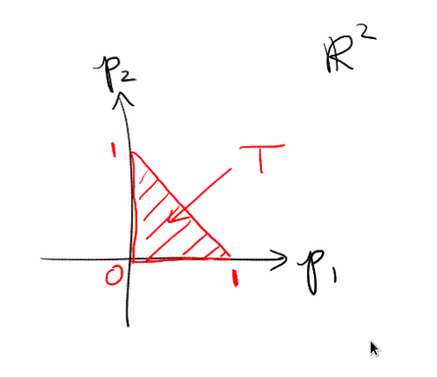

# Tuesday, September 29

:::{.exercise title="?"}
Show that the 3 natural coordinate charts on $\CP^2$ given by e.g. $\phi_{U_0}\qty{\thevector{z_0: z_1: z_2}} = \thevector{{z_1 \over z_0}, {z_2\over z_0}}$ yield a smooth atlas.
:::

:::{.exercise title="?"}
Consider the map
\[  
\pi: \CP^2 &\to \RR^2 \\
\thevector{z_0: z_1 : z_2} &\mapsto \thevector{
{\abs z_1^2 \over \abs z_0^2 + \abs z_1^2 + \abs z_2^2},
{\abs z_2^2 \over \abs z_0^2 + \abs z_1^2 + \abs z_2^2}
}.\]

Show that $\pi$ is smooth and $\im \pi = \ts{p_1, p_2 \geq 0, p_1 + p_2 \leq 1}$.

:::

:::{.exercise title="?"}
Show that if $\thevector{p_1, p_2} \in T^\circ$ is in the interior of the above triangle, then $\pi^{-1}(p_1, p_2) \cong S^1 \cross S^1$ is diffeomorphic to a torus.
If instead the point is on an edge, the fiber is diffeomorphic to $S^1%
:::
