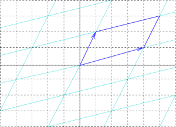

# Saturday, September 26

:::{.remark}
There is a natural action of $\MCG(\Sigma)$ on $H_1(\Sigma; \ZZ)$, i.e. a *homology representation* of $\MCG(\Sigma)$:
\[  
\rho: \MCG(\Sigma) &\to \Aut_{\Grp}(H_1(\Sigma; \ZZ)) \\
f &\mapsto f_*
.\]
:::

:::{.definition title="Special Linear Group"}
\[  
\SL(n, \kk) = \ts{M\in \GL(n, \kk) \mid \det M = 1} = \ker \det_{\GG_m}
.\]
:::

:::{.remark}
\[  
\SL(2, \ZZ) = \gens{ S = 
\begin{bmatrix}
0 & -1 \\
1 & 0
\end{bmatrix}
, T =
\begin{bmatrix}
1 & 1 \\
0 & 1
\end{bmatrix}
}
.\]

Note that $S^2 = 1$ and
\[  
T^n = 
\begin{bmatrix}
1 & n \\
0 & 1
\end{bmatrix}
\]

Moreover, if $\vector x = \thevector{x_1, x_2} \in \ZZ \oplus \ZZ$ and $A\in \SL(2, \ZZ)$, we have $A\vector x \in \ZZ\oplus \ZZ$, i.e. this preserves any integer lattice
\[  
\Lambda = \ts{p \vector v_1 + q\vector v_2 \st p, q\in \ZZ} \cong \ts{p\omega_1 + q\omega_2 \st p, q \in \ZZ} \simeq \ts{p' + q' \tau \st p', q'\in \ZZ}
.\]
where the $\omega_i, \tau$ come from identifying $\RR^2$ with $\CC$, and in the last step we've rescaled the lattice by *homothety* to align one vector with the $x\dash$axis.

:::

:::{.theorem title="Mapping Class Group of the Torus"}
The homology representation of the torus induces an isomorphism
\[  
\sigma: \MCG(\Sigma_2) \mapsvia{\cong} \SL(2, \ZZ)
\]
:::

:::{.proof}
\hfill

- For $f$ any automorphism, the induced map $f_*: \ZZ^2 \to \ZZ^2$ is a group automorphism, so we can consider the group morphism 
\[  
\tilde \sigma: (\Map(X,X), \circ) &\to (\GL(2, \ZZ), \circ) \\
f &\mapsto f_*
.\]

- This will descend to the quotient $\MCG(X)$ iff $\Map^0(X, X) \subseteq \ker \tilde \sigma = \tilde\sigma\inv(\id)$
  - This holds because any map in the identity component is homotopic to the identity, and homotopic maps induce the equal maps on homology.
- So we have a (now injective) map
\[  
\tilde \sigma:\MCG(X) &\to \GL(2, \ZZ)  \\
f &\mapsto f_*
.\]

:::{.claim}
$\im(\tilde\sigma )\subseteq \SL(2, \ZZ)$.
:::

- We can thus freely restrict the codomain to define the map
\[  
\sigma:\MCG(X) &\to \SL(2, \ZZ)  \\
f &\mapsto f_*
.\]

:::{.claim}
$\sigma$ is surjective.
:::

- 

:::

