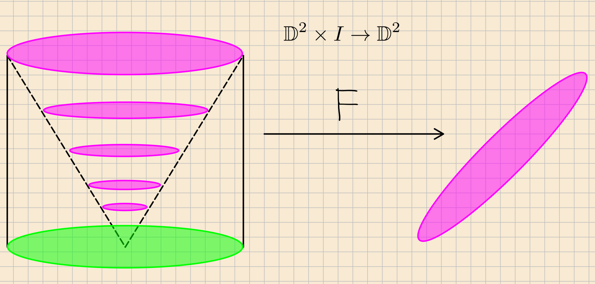

\newpage

# Setup

- All manifolds: 
  - Connected
  - Oriented
  - 2nd countable (countable basis)
  - Hausdorff (separate with disjoint neighborhoods, uniqueness of limits)
  - With boundary (possibly empty)

- Weakly Hausdorff: every continuous image of a compact Hausdorff space into it is closed.

- Compactly generated: sets are closed iff their intersection with every compact subspace is closed.

- Curves: simple, closed, oriented

- For $X, Y$ topological spaces, consider 
  \[  
  Y^X = C(X, Y) = \hom_\Top(X, Y) \da \ts{f: X\to Y \st f\,\,\text{is continuous}}
  .\]

## The Compact-Open Topology

- General idea: *cartesian closed* categories, require *exponential objects* or *internal homs*: i.e. for every hom set, there is some object in the category that represents it 
  - Slogan: we'd like homs to be spaces.
  
- Can make this work if we assume WHCG: weakly Hausdorff and compactly generated.

- Topologize with the *compact-open* topology $\OO_{\text{CO}}$: 
\[  
U \in \OO_{\text{CO}} \iff 
\forall f\in U, \quad f(K) \subset Y \text{ is open for every compact } K\subseteq X
.\]

### Mapping Spaces

- So define
\[  
\Map(X, Y) \da (\hom_\Top(X, Y), \OO_{\text{CO}}) \qquad\text{where }\OO_{\text{CO}}\text{ is the compact-open topology}
.\]

- Can immediately define interesting derived spaces:

  - $\Homeo(X, Y)$ the subspace of homeomorphisms
  - $\mathrm{Imm}(X, Y)$, the subspace of immersions (injective map on tangent spaces)
  - $\mathrm{Emb}(X, Y)$, the subspace of embeddings (immersion + diffeomorphic onto image)
  - $C^k(X, Y)$, the subspace of $k\times$ differentiable maps
  - $C^\infty(X, Y)$ the subspace of smooth maps
  - $\mathrm{Diffeo}(X ,Y)$ the subspace of diffeomorphisms
  - $C^\omega(X, Y)$ the subspace of analytic maps
  - $\mathrm{Isom}(X, Y)$ the subspace of isometric maps (for Riemannian metrics)
  - $[X, Y]$ homotopy classes of maps

## Aside on Analysis 

- If $Y = (Y, d)$ is a metric space, this is the topology of "uniform convergence on compact sets": for $f_n \to f$ in this topology iff 
\[  
\norm{f_n - f}_{\infty, K} \da \sup \ts{d(f_n(x), f(x)) \st x\in K}\converges{n\to\infty}\to 0 \quad \forall K\subseteq X \,\,\text{compact}
.\]

  - In words: $f_n\to f$ uniformly on every compact set.

- If $X$ itself is compact and $Y$ is a metric space, $C(X, Y)$ can be promoted to a metric space with 

\[
d(f, g) = \sup_{x\in X}(f(x), g(x))
.\]

### Application in Analysis 

- Useful in analysis: when does a family of functions 

  \[ 
  \mathcal{F} = \ts{f_\alpha} \subset \hom_\Top(X, Y)
  \]   
  form a compact subset of $\Map(X, Y)$? 

- Essentially answered by:

:::{.theorem title="Ascoli"}
If $X$ is locally compact Hausdorff and $(Y, d)$ is a metric space, a family $\mathcal{F} \subset \hom_\Top(X, Y)$ has compact closure $\iff$ $\mathcal{F}$ is equicontinuous and $F_x \da \ts{f(x) \st f\in \mathcal{F}}\subset Y$ has compact closure.
:::

:::{.corollary title="Arzela"}
If $\ts{f_n}\subset \hom_\Top(X, Y)$ is an equicontinuous sequence and $F_x \da \ts{f_n(x)}$ is bounded for every $X$, it contains a uniformly convergent subsequence.
:::

## Aside on Number Theory

- Useful in Number Theory / Rep Theory / Fourier Series: 
  - Can take $G$ to be a locally compact abelian topological group and define its Pontryagin dual 
  \[\hat G \da \hom_{\Top\Grp}(G, S^1)\] 
  where we consider $S^1\subset \CC$.

- Can integrate with respect to the Haar measure $\mu$, define $L^p$ spaces, and for $f\in L^p(G)$ define a Fourier transform $\hat f\in L^p(\hat G)$.
  \[  
  \hat f(\chi) \da \int_G f(x) \bar{\chi(x)} d\mu(x)
  .\]

\newpage

---

# Path Spaces

- Can immediately consider some interesting spaces via the functor $\Map(\wait, Y)$:
\[  
X = \pt &\leadsto \quad \Map(\pt, Y) \cong Y \\
X= I &\leadsto\quad \mathcal{P}Y  \da \ts{f: I\to Y} = Y^I  \\
X= S^1 &\leadsto\quad \mathcal{L}Y  \da \ts{f: S^1\to Y } = Y^{S^1} 
.\]

- Adjoint property: there is a homeomorphism
\[  
\Map(X\cross Z, Y) &\leftrightarrow_{\cong} \Map(Z, Y^X) \\
H:X\cross Z \to Y &\iff \tilde H: Z\to \Map(X, Y)\\
(x, z) \mapsto H(x,z) &\iff z \mapsto H(\wait, z)
.\]

  - Categorically, $\hom(X, \wait) \leftrightarrow (X\cross \wait)$ form an adjoint pair in $\Top$.

  - A form of this adjunction holds in any cartesian closed category (terminal objects, products, and exponentials)

## Homotopy and Isotopy in Terms of Path Spaces

- Can take basepoints to obtain the base path space $PY$, the based loop space $\Omega Y$.

- Importance in homotopy theory: the path space fibration 
\[ 
\Omega Y \injects PY \mapsvia{\gamma \mapsto \gamma(1)} Y
\]

  - Plays a role in "homotopy replacement", allows you to assume everything is a fibration and use homotopy long exact sequences.

- Fun fact: with some mild point-set conditions (Locally compact and Hausdorff),
\[  
\pi_0 \Map(X, Y) = \ts{[f],\, \text{homotopy classes of maps }f: X\to Y}
,\]
i.e. two maps $f, g$ are homotopic $\iff$ they are connected by a path in $\Map(X, Y)$.

  > Picture!

### Proof
\[  
  \mathcal{P}\Map(X, Y) = \Map(I, Y^X) \cong \Map(X\cross I, Y)
,\]
  and just check that $\gamma(0) = f \iff H(x, 0) = f$ and $\gamma(1) = g \iff H(x, 1) = g$.

  - Interpretation: the RHS contains homotopies for maps $X\to Y$, the LHS are paths in the space of maps.

## Iterated Path Spaces

- Now we can bootstrap up to play fun recursive games by applying the pathspace *endofunctor* $\Map(I, \wait)$: 
\[  
\mathcal{P} \Map(X, Y)  &\da \Map(I, Y^X) \\
\mathcal{P}^2 \Map(X, Y) &\da \mathcal{P}\Map(I, Y^X) = \Map(I, (Y^X)^I) = \Map(I, Y^{XI}) \\
\vdots & \\
\mathcal{P}^n\Map(X, Y) &\da \mathcal{P}^{n-1}\Map(I, Y^{XI})  =\Map(X, Y^{XI^n})
.\]

- Can interpret
\[  
\mcp^2\Map(X, Y) = \mathcal{P}\Map(X\cross I, Y)
.\]
  as the space of paths between homotopies.

- Interpretation: we can consider paths in the *space* of paths, and paths between homotopies, and homotopies between homotopies, ad infinitum!

> This in fact defines a *monad* on spaces: an endofunctor that behaves like a monoid.

> Picture, link to infinity categories.

---

\newpage

# Defining the Mapping Class Group

## Isotopy

- Define a homotopy between $f, g: X\to Y$ as a map $F:X\cross I \to Y$ restricting to $f, g$ on the ends.
  - Equivalently: a *path*, an element of $\Map(I, C(X, Y))$.
- Isotopy: require the partially-applied function $F_t:X\to Y$ to be homeomorphisms for every $t$.
  - Equivalently: a path in the subspace of homeomorphisms, an element of $\Map(I, \Homeo(X, Y))$

> Picture: picture of homotopy, paths in $\Map(X, Y)$, subspace of homeomorphisms.

\newpage

## Self-Homeomorphisms

- In any category, the automorphisms form a group. 

  - In a general category $\mathcal{C}$, we can always define the group $\Aut_{\mathcal{C}}(X)$.
    - If the group has a topology, we can consider $\pi_0 \Aut_{\mathcal{C}}(X)$, the set of path components.
    - Since groups have identities, we can consider $\Aut^0_{\mathcal{C}}(X)$, the path component containing the identity.

  - So we make a general definition, the *extended mapping class group*:
  \[  
  \MCG^\pm_{\mathcal{C}}(X) \da \Aut_{\mathcal{C}}(X) / \Aut_{\mathcal{C}}^0(X)
  .\]

  - Here the $\pm$ indicates that we take both orientation preserving and non-preserving automorphisms.

  - Has an index 2 subgroup of orientation-preserving automorphisms, $\MCG^+(X)$.

  - Can define $\MCG_\bd(X)$ as those that restrict to the identity on $\bd X$.

> Picture: quotienting out by identity component

\newpage

## Definitions in Several Categories

- Now restrict attention to
\[  
\Homeo(X) \da \Aut_{\Top}(X) = \ts{f\in \Map(X, X) \st f \text{ is an isomorphism}} \\
\qquad\text{equipped with }\OO_{\text{CO}}
.\]
  - Taking $\MCG^\pm_\Top(X)$ yields *homeomorphism up to homotopy*

- Similarly, we can do all of this in the smooth category:
\[  
\Diffeo(X) \da \Aut_{C^\infty}(X)
.\]
  - Taking $\MCG_{C^\infty}(X)$ yields *diffeomorphism up to isotopy*

- Similarly, we can do this for the homotopy category of spaces:
\[  
\text{ho}(X) \da \ts{[f] \in [X, Y]}
.\]
  - Taking $\MCG(X)$ here yields *homotopy classes of self-homotopy equivalences*.

\newpage

## Relation to Moduli Spaces

- For topological manifolds: Isotopy classes of homeomorphisms
  - In the compact-open topology, two maps are isotopic iff they are in the same component of $\pi \Aut(X)$.

- For surfaces:
  For $\Sigma$ a genus $g$ surface, $\MCG(S)$ acts on the Teichmuller space $T(S)$, yielding a SES
  \[  
  0 \to \MCG(\Sigma) \to T(\Sigma) \to {\mathcal{M}}_g \to 0 
  \]
  where the last term is the moduli space of Riemann surfaces homeomorphic to $X$.

- $T(S)$ is the moduli space of complex structures on $S$, up to the action of homeomorphisms that are isotopic to the identity:

  - Points are isomorphism classes of marked Riemann surfaces
  - Equivalently the space of hyperbolic metrics

- Used in the Neilsen-Thurston Classification: for a compact orientable surface, a self-homeomorphism is isotopic to one which is any of: 
  - Periodic,
  - Reducible (preserves some simple closed curves), or 
  - Pseudo-Anosov (has directions of expansion/contraction)

> Picture: $\mathcal{M}_g$.

\newpage

# Examples of MCG

## The Plane: Straight Lines

- $\MCG_\Top(\RR^2) = 1$: for any $f:\RR^2\to \RR^2$, take the straight-line homotopy:
\[  
F: \RR^2 \cross I &\to \RR^2 \\
F(x, t) &= tf(x) + (1-t)x
 .\]

 > Picture: parameterize line between $x$ and $f(x)$ and flow along it over time.

\newpage

## The Closed Disc: The Alexander Trick 

- $\MCG_\Top(\bar \DD^2) = 1$: for any $f: \bar\DD^2\to\bar\DD^2$ such that $\ro{f}{\bd \bar\DD^2} = \id$, take
\[  
F: \bar\DD^2 \cross I &\to \bar\DD^2 \\
F(x, t) &\da
\begin{cases}
t f \qty{x\over t} & \norm{x} \in [0, t) \\
x & \norm{x} \in [1-t, 1]
\end{cases}
.\]

  - This is an isotopy from $f$ to the identity.

  - Interpretation: "cone off" your homeomorphism over time:

  

  - Note that this won't work in the smooth category: singularity at origin

## Overview of Big Results 

- The word problem in $\MCG(\Sigma_g)$ is solvable

- Any finite group is $\MCG(X)$ for some compact hyperbolic 3-manifold $X$.

- For $g\geq 3$, the center of $\MCG(\Sigma_g)$ is trivial and $H_1(\MCG(\Sigma_g); \ZZ) = 1$

  - Why care: same as abelianization of the group.

:::{.theorem title="Dehn-Neilsen-Baer"}
Let $\Sigma_g$ be compact and oriented with $\chi(\Sigma_g) < 0$.
Then
\[  
\MCG^+_\del(\Sigma_g) \cong \Out_\del(\pi_1(\Sigma_g)) \cong_{\Grp} \pi_0 \mathrm{ho}_\del(\Sigma_g)
.\]
:::

- For $g\geq 4$, $H_2(\MCG(\Sigma_g); \ZZ) = \ZZ$

  - Why care: used to understand surface bundles

  \begin{center}
  \begin{tikzcd}
  \Sigma_g \ar[r] & E \ar[d] \\
   & B  \\
  \end{tikzcd}
  \end{center}

  - Find the classifying space $B\Diffeo$ 

  - Understand its homotopy type, since the homotopy LES yields 
  \[
  [S^n, B\Diffeo(\Sigma_g)] \cong [S^{n-1}, \Diffeo(\Sigma_g)]
  \]

  - Theorem (Earle-Ells): For $g\geq 2$, $\Diffeo_0(\Sigma_g)$ is contractible. 
  As a consequence, $\Diffeo(\Sigma_g) \surjects \Mod(\Sigma_g)$ is a homotopy equivalence, and there is a correspondence:
  \[  
  \correspond{\text{Oriented $\Sigma_g$ bundles} \\ \text{over } B }/\text{\tiny Bundle isomorphism}
  \iff
  \correspond{\text{Monodromy Representations} \\ \rho: \pi_1(B) \to \MCG(\Sigma_g)}/\text{\tiny Conjugacy}
  .\]
  

---

\newpage

# Dehn Twists

- $\MCG(\Sigma_g)$ is generated by finitely many **Dehn twists**, and always has a finite presentation

:::{.claim}
Let $A \da \ts{z\in \CC \st 1\leq \abs z \leq 2}$, then $\MCG(A) \cong \ZZ$, generated by the map
\[  
\tau_0: \CC &\to \CC \\
z & \mapsto \exp{2\pi i \abs z}\, z
.\]

:::

\newpage

# MCG of the Torus

:::{.definition title="Special Linear Group"}
\[  
\SL(n, \kk) = \ts{M\in \GL(n, \kk) \mid \det M = 1} = \ker \det_{\GG_m}
.\]
:::

:::{.definition title="Symplectic Group"}
\[  
\Sp(2n, \kk) = \ts{M\in \GL(2n, \kk) \mid M^t\Omega M = \Omega} \leq \SL(2n, \kk)
\]
where $\Omega$ is a nondegenerate skew-symmetric bilinear form on $\kk$.

Example:
\[  
\Omega = 
\begin{bmatrix}
0 & I_n \\
-I_n & 0
\end{bmatrix}
.\]
:::

- Algebraic intersection: a bilinear antisymmetric form $\hat \iota$ on $H_1(\Sigma_g; \ZZ)$
  - $x$ is isotropic iff $\iota(x, \wait) = 0$.
- There is a natural action of $\MCG(\Sigma)$ on $H_1(\Sigma; \ZZ)$, i.e. a *homology representation* of $\MCG(\Sigma)$:
\[  
\rho: \MCG(\Sigma) &\to \Aut_{\Grp}(H_1(\Sigma; \ZZ)) \\
f &\mapsto f_*
.\]

  - For a surface of finite genus $g\geq 1$, elements in $\im \rho$ preserve the *algebraic intersection form*, which is a symplectic pairing.

  - Thus there is an interesting surjective representation:
  \[  
  0 \to \mathrm{Tor}(\Sigma_g) \injects \MCG(\Sigma_g) \surjects \Sp(2g; \ZZ) \to 0
  .\]

  - Kernel is the *Torelli group*, interesting because the symplectic group is well understood, so questions about $\MCG$ reduce to questions about $\Tor$.

:::{.remark}
\[  
\SL(2, \ZZ) = \gens{ S = 
\begin{bmatrix}
0 & -1 \\
1 & 0
\end{bmatrix}
, T =
\begin{bmatrix}
1 & 1 \\
0 & 1
\end{bmatrix}
}
.\]

Note that $S^2 = 1$ and
\[  
T^n = 
\begin{bmatrix}
1 & n \\
0 & 1
\end{bmatrix}
\]

Moreover, if $\vector x = \thevector{x_1, x_2} \in \ZZ \oplus \ZZ$ and $A\in \SL(2, \ZZ)$, we have $A\vector x \in \ZZ\oplus \ZZ$, i.e. this preserves any integer lattice
\[  
\Lambda = \ts{p \vector v_1 + q\vector v_2 \st p, q\in \ZZ} \cong \ts{p\omega_1 + q\omega_2 \st p, q \in \ZZ} \simeq \ts{p' + q' \tau \st p', q'\in \ZZ}
.\]
where the $\omega_i, \tau$ come from identifying $\RR^2$ with $\CC$, and in the last step we've rescaled the lattice by *homothety* to align one vector with the $x\dash$axis.

:::

:::{.remark}
For any finite-index subgroup $G\leq \SL(2, \ZZ)$, the orbits/left-quotient ${}_G\backslash^\HH$ yields a complex curve (i.e. a torus).
:::

:::{.theorem title="Mapping Class Group of the Torus"}
The homology representation of the torus induces an isomorphism
\[  
\sigma: \MCG(\Sigma_2) \mapsvia{\cong} \SL(2, \ZZ)
\]
:::

## Proof

\hfill

- For $f$ any automorphism, the induced map $f_*: \ZZ^2 \to \ZZ^2$ is a group automorphism, so we can consider the group morphism 
\[  
\tilde \sigma: (\Homeo(X,X), \circ) &\to (\GL(2, \ZZ), \circ) \\
f &\mapsto f_*
.\]

- This will descend to the quotient $\MCG(X)$ iff \[\Homeo^0(X, X) \subseteq \ker \tilde \sigma = \tilde\sigma\inv(\id)\]
  - This holds because any map in the identity component is homotopic to the identity, and homotopic maps induce the equal maps on homology.
- So we have a (now injective) map
\[  
\tilde \sigma:\MCG(X) &\to \GL(2, \ZZ)  \\
f &\mapsto f_*
.\]

:::{.claim}
$\im(\tilde\sigma )\subseteq \SL(2, \ZZ)$.
:::

:::{.proof}
\hfill
- Algebraic intersection numbers in $\Sigma_2$ correspond to determinants
- $f\in \Homeo^+(X)$ preserve algebraic intersection numbers.
- See section 1.2
:::

- We can thus freely restrict the codomain to define the map
\[  
\sigma:\MCG(X) &\to \SL(2, \ZZ)  \\
f &\mapsto f_*
.\]

:::{.claim}
$\sigma$ is surjective.
:::
- $\RR^2$ is the universal cover of $\Sigma_2$, with deck transformation group $\ZZ^2$.

- Any $A\in \SL(2, \ZZ)$ extends to $\tilde A \in \GL(2, \RR)$, a linear self-homeomorphism of the plane that is orientation-preserving.

:::{.claim}
$\tilde A$ is equivariant wrt $\ZZ^2$
:::

:::{.proof}
?
:::

- So $\tilde A$ descends to a well-defined map $\psi_{\tilde A}$ on $\Sigma_2 \da \RR^2 / \ZZ^2$, which is still a linear self-homeomorphism

- There is a correspondence
\[  
\correspond{\text{Primitive vectors in }\ZZ^2}
\iff
\correspond{\text{Oriented simple closed} \\\text{curves in } \Sigma_2}/\text{homotopy}
.\]

- Thus $\sigma([\psi_{\tilde A}]) = \tilde A$, and we have surjectivity.

:::{.claim}
$\sigma$ is injective.
:::

- Useful fact: $\Sigma_2 \simeq K(\ZZ^2, 1)$.

:::{.proposition title="Hatcher 1B.9"}
Let $X$ be a connected CW complex and $Y$ a $K(G, 1)$.
Then there is a map
\[  
\hom_\Grp(\pi_1(X; x_0), \pi_1(Y; y_0)) \to \hom_\Top((X; x_0), (Y; y_0))
,\]
i.e. every homomorphism of fundamental groups is induced by a continuous pointed map.

Moreover, the map is unique up to homotopies fixing $x_0$.
:::

- Thus there is a correspondence
\[  
\correspond{\text{Homotopy classes of } \\ \text{maps }\Sigma_2 \selfmap}
\iff
\correspond{\text{Group morphisms } \ZZ^2\selfmap}
.\]

- Claim: any element $f\in \MCG(\Sigma_2)$ has a representative $\phi$ which fixes any given basepoint

- So if $f\in \ker \sigma$, then $f\simeq \phi \simeq \id$ are homotopic, so $\ker \sigma = 1$.

