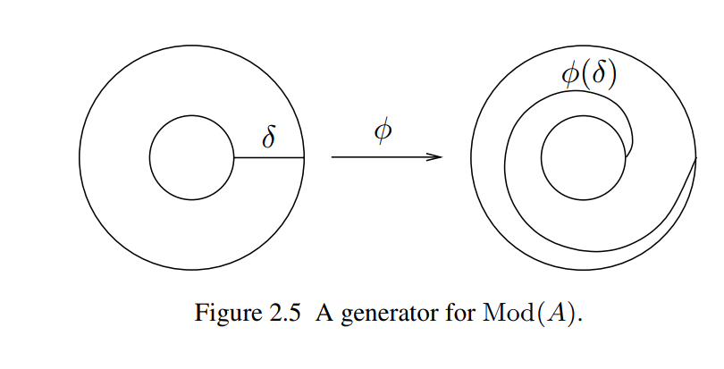
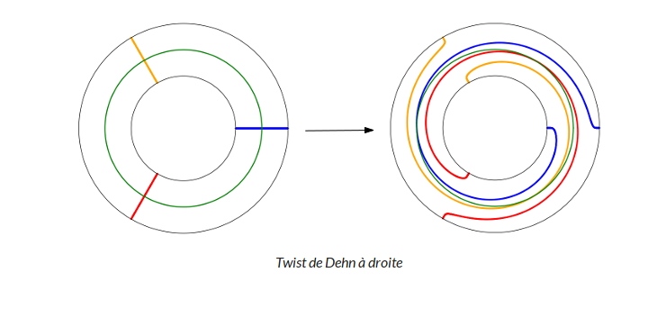
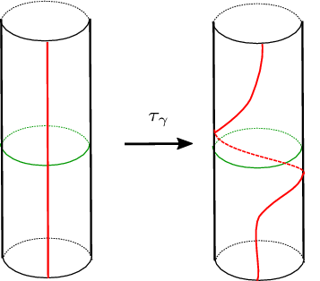
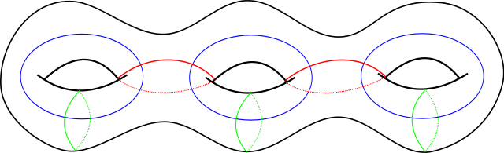
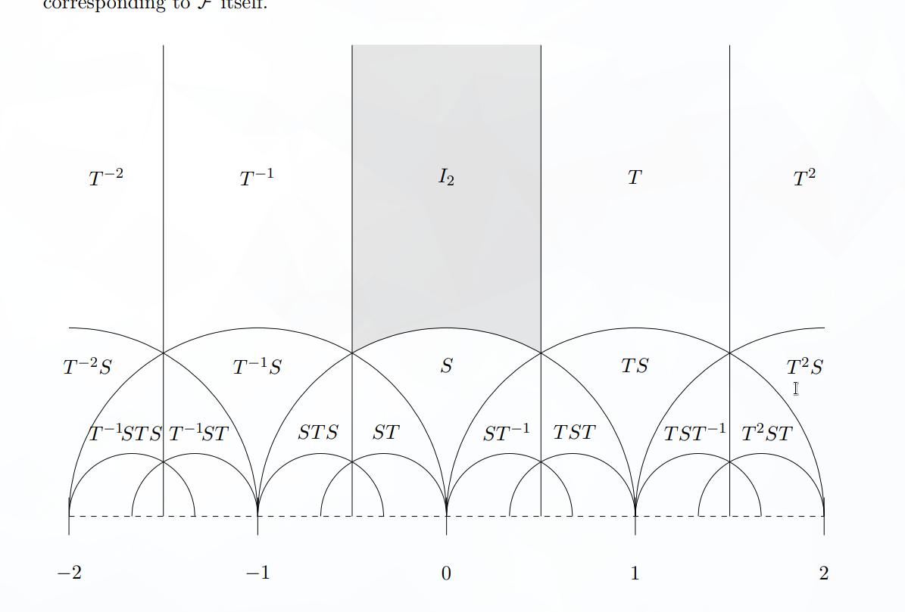
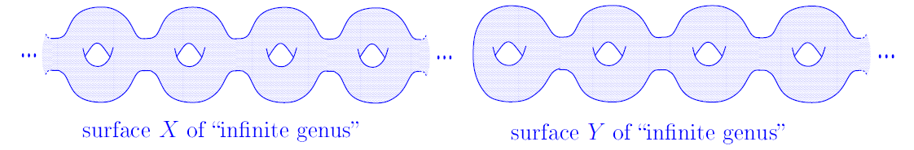
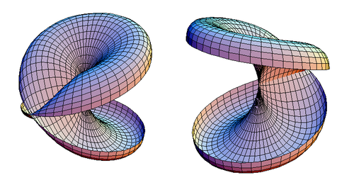
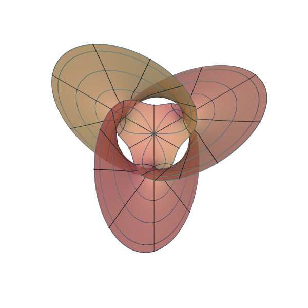

# Dehn Twists

> See [complex function plotter](https://people.ucsc.edu/~wbolden/complex/#e%5E(2*pi*i%20*%7Cz%7C)*z*t%20+%20z*(t-1)),or on [planet earth](http://davidbau.com/conformal/#e%5E(2*pi*i*%7Cz%7C)*z*t%20%2B%20(1-t)*z&b=earth)

