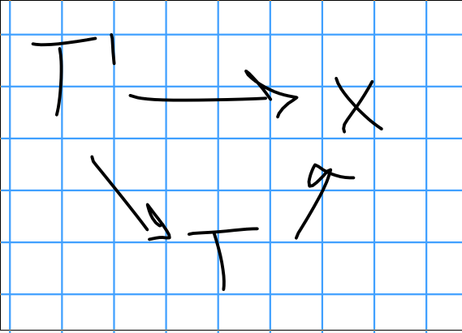
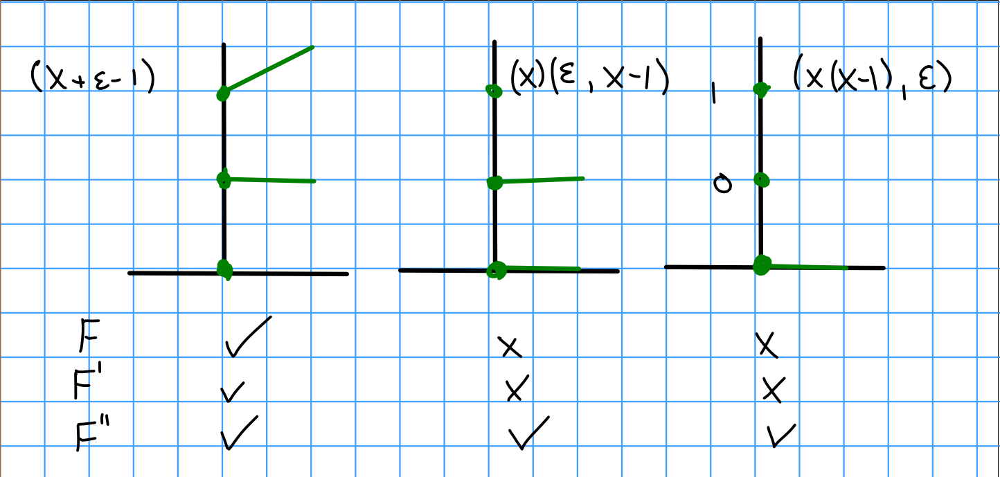

# Thursday January 9th

## Representability

Last time:
Fix an $S\dash$scheme, i.e. a scheme over $S$.

Then there is a map

\begin{align*}
\mathrm{Sch}/S &\to \mathrm{Fun}( \mathrm{Sch}/S^{op}, Sets )\\
x &\mapsto h_x(T) = \hom_{Sch/S}(T, x)
.\end{align*}

where $T' \mapsvia{f} T$ is given by 

\begin{align*}
h_x(f): h_x(T) &\to h_x(T') \\
T \mapsto x &\to \text{triangles}
\end{align*}

of the form

\

Theorem (Yoneda)
: $\hom_{Fun}(h_x, F) = F(x)$.

Corollary
: $\hom_{\Sch/S}(x, y) \cong \hom_{\text{Fun}}(h_x, h_y)$.

Definition
:   A **moduli functor** is  a map

    \begin{align*}
    F: (Sch/S)^{op} \to \mathrm{Sets} \\
    F(x) &= \text{ "Families of something over $x$" } \\
    F(f) &= \text{"Pullback"}
    .\end{align*}

Definition
: A **moduli space** for that "something" appearing above is an $M \in \mathrm{Obj}(Sch/S)$ such that $F \cong h_M$.

Now fix $S = \spec(k)$.

> $h_m$ is the functor of points over $M$
> 
Remark (1)
: $h_m(\spec(k)) = M(\spec(k)) \cong$ "families over $\spec k$" $= F(\spec k)$.
    
Remark (2)
:   $h_M(M) \cong F(M)$ are families over $M$, and $\id_M \in \mathrm{Mor}_{Sch/S}(M, M) = \xi_{Univ}$ is the universal family
  
    Every family is uniquely the pullback of $\xi_{\text{Univ}}$ 
    This makes it much like a classifying space.

    For $T\in \Sch/S$,

    \begin{align*}
    h_M &\mapsvia{\cong} F \\
    f\in h_M(T) &\mapsvia{\cong} F(T) \ni \xi = F(f)(\xi_{\text{Univ}})
    .\end{align*}

    where $T\mapsvia{f} M$ and $f = h_M(f)(\id_M)$.

Remark (3)
:   If $M$ and $M'$ both represent $F$ then $M \cong M'$ up to unique isomorphism.

    \begin{tikzcd}
    \xi_M              &  & \xi_{M'} \\
    M \arrow[rr, "f"]  &  & M'       \\
                      &  &          \\
    M' \arrow[rr, "g"] &  & M        \\
    \xi_{M'}           &  & \xi_M   
    \end{tikzcd}

    which shows that $f, g$ must be mutually inverse by using universal properties.

Example
:   A length 2 subscheme of $\AA^1_k$ then $F(S) = \theset{ V(x^2 + bx + c)} \subset \AA_5'$ where $b, c \in \mathcal O_s(s)$, which is functorially bijective with $\theset{b, c \in \mathcal O_s(s)}$ and $F(f)$ is pullback.

    Then $F$ is representable by $\AA_k^2(b, c)$ and the universal object is given by $V(x^2 + bx + c) \subset \AA^1(?) \cross \AA^2(b, c)$ where $b, c \in k[b, c]$.

    Moreover, $F'(S)$ is the set of effective Cartier divisors in $\AA_5'$ which are length 2 for every geometric fiber.

    $F''(S)$ is the set of subschemes of $\AA_5'$ which are length 2 on all geometric fibers.
    In both cases, $F(f)$ is always given by pullback.

Problem: $F''$ is not a good moduli functor, as it is not representable.
Consider $\spec k[\varepsilon]$.

\

\begin{tikzcd}
\spec k \arrow[rrr, "i", hook]                &  &  & {\spec k[\varepsilon]} &  & =F'(\spec k) \arrow[rd] &               \\
{F(\spec k[\varepsilon])} \arrow[rrr, "F(i)"] &  &  & F(\spec k) \arrow[rru] &  &                         & =F''(\spec k) \\
\subset                                       &  &  & \in                    &  &                         &               \\
{T_p F^{', ''}}                               &  &  & P = V(x(x-1))          &  &                         &              
\end{tikzcd}

We think of $T_p F^{', ''}$ as the tangent space at $p$.

If $F$ is representable, then it is actually the Zariski tangent space.

\begin{tikzcd}
{M(\spec k[\varepsilon])} \arrow[rr] &  & M(\spec k) \\
\subset                              &  & \subset    \\
T_p M \arrow[rr]                     &  & p         
\end{tikzcd}

\begin{tikzcd}
&                                            & \spec k \arrow[rdd, "?"] \arrow[lldd, hook] &                                     \\
&                                            &                                             &                                     \\
{\spec k[\varepsilon]} \arrow[rrr] &                                            &                                             & {\spec \mathcal O_{M, p} \subset M} \\
&                                            &                                             & k                                   \\
& {\mathcal O_{M, p}} \arrow[rru] \arrow[rr] &                                             & {k[\varepsilon]} \arrow[u]          \\
& m_p                                        &                                             & (\varepsilon)                       \\
& m_p^2                                      &                                             & 0                                  
\end{tikzcd}

Moreover, $T_p M = (m_p / m_p^2)\dual$, and in particular this is a $k\dash$vector space.
To see the scaling structure, take $\lambda \in k$.

\begin{align*}
\lambda: k[\varepsilon] \to k[\varepsilon] \\
\varepsilon \mapsto \lambda \varepsilon \\
\lambda^*: \spec(k[\varepsilon]) \to \spec(k[\varepsilon]) \\
\lambda: M(\spec(k[\varepsilon])) \to M(\spec(k[\varepsilon])) \\
\supset T_pM \to T_pM \subset
.\end{align*}

**Conclusion**:
If $F$ is representable, for each $p\in F(\spec k)$ there exists a unique point of $T_p F$ that are invariant under scaling.

1. If $F, F', G \in Fun((Sch/S)^{op}, Sets)$, there exists a fiber product

    \begin{tikzcd}
    F \cross_G F' \arrow[rr, dotted] \arrow[dd, dotted] &  & F' \arrow[dd] \\
                                                        &  &               \\
    F \arrow[rr]                                        &  & G            
    \end{tikzcd}

    where $(F \cross_G F')(T) = F(T) \cross_{G(T)} F'(T)$.

2. This works with the functor of points over a fiber product of schemes $X \cross_T Y$ for $X, Y \to T$, where $h_{X \cross_T Y}= h_X \cross_{h_t} h_Y$.

3. If $F, F', G$ are representable, then so is the fiber product $F \cross_G F'$.

4. For any functor $F: (Sch/S)^{op} \to Sets$, for any $T \mapsvia{f} S$ there is an induced functor $F_T: (Sch/T) \to Sets$ given by $x\mapsto F(x)$.

5. $F$ is representable by $M/S$ implies that $F_T$ is representable by $M_T = M \cross_S T / T$.

## Projective Space

Consider $\PP^n_\ZZ$, i.e. "rank 1 quotient of an $n+1$ dimensional free module".

**Claim:** 
$\PP^n_\ZZ$ represents the following functor

\begin{align*}
F: Sch^{op} &\to \text{Sets} \\
F(S) =  \mathcal O_s^{n+1} &\to L \to 0 / \sim
.\end{align*}

where $\sim$ identifies diagrams of the following form:

\begin{tikzcd}
\mathcal O_s^{n+1} \arrow[dd, "="] \arrow[rr] &  & L \arrow[dd, "\cong"] \arrow[rr] &  & 0 \\
&  &                                  &  &   \\
\mathcal O_s^{n+1} \arrow[rr]                 &  & M \arrow[rr]                     &  & 0
\end{tikzcd}

and $F(f)$ is given by pullbacks.

Remark
:   $\PP^n_S$ represents the following functor: 
    \begin{align*}
    F_S: (Sch/S)^{op} \to \text{Sets} \\
    F_S(T) =  \mathcal O_T^{n+1} \to L \to 0 / \sim
    .\end{align*}

    This gives us a cleaner way of gluing affine data into a scheme.

Proof (of claim)
:   Note: $\mathcal O^{n+1} \to L \to 0$ is the same as giving $n+1$ sections $s_1, \cdots s_n$ of $L$, where surjectivity ensures that they are not the zero section.

    So $F_i(S) = \theset{\mathcal O_s^{n+1} \to L \to 0}/\sim$, with the additional condition that $s_i \neq 0$ at any point.

    There is a natural transformation $F_i \to F$ by forgetting the latter condition, and is in fact a subfunctor.

    > $F\leq G$ is a subfunctor iff $F(s) \injects G(s)$.

**Claim 2:**
It is enough to show that each $F_i$ and each $F_{ij}$ are representable, since we have natural transformations:
\begin{tikzcd}
F_i  \arrow[rr]              &  & F              \\
                             &  &                \\
F_{ij} \arrow[rr] \arrow[uu] &  & F_j \arrow[uu]
\end{tikzcd}

and each $F_{ij} \to F_i$ is an open embedding (on the level of their representing schemes).

Example
:   For $n=1$, we can glue along open subschemes
    \begin{tikzcd}
    &  & F_0 \\
    F_{01} \arrow[rru] \arrow[rrd] &  &     \\
    &  & F_1
    \end{tikzcd}

    For $n=2$, we get overlaps of the following form:
    \begin{tikzcd}
    &  &                                                                                             &                              & F_0 \arrow[rrdd] &  &   \\
    &  &                                                                                             & F_{01} \arrow[rd] \arrow[ru] &                  &  &   \\
    F_{012} \arrow[rr] \arrow[rrru] \arrow[rrrd] &  & F_{02} \arrow[ru] \arrow[rd] \arrow[rruu, dotted, bend left=49] \arrow[rrdd, bend right=49] &                              & F_1 \arrow[rr]   &  & F \\
    &  &                                                                                             & F_{12} \arrow[ru] \arrow[rd] &                  &  &   \\
    &  &                                                                                             &                              & F_2 \arrow[rruu] &  &  
    \end{tikzcd}

    This claim implies that we can glue together $F_i$ to get a scheme $M$.
    We want to show that $M$ represents $F$.
    $F(s)$ (LHS) is equivalent to an open cover $U_i$ of $S$ and sections of $F_i(U_i)$ satisfying the gluing (RHS).

    Going from LHS to RHS isn't difficult, since for $\mathcal O_s^{n+1} \to L \to 0$, $U_i$ is the locus where $s_i \neq 0$ and by surjectivity, this gives a cover of $S$.

    RHS to LHS comes from gluing.

Proof of (Claim 2)
:   $$
    F_i(S) = \theset{\mathcal O_S^{n+1} \to L \cong \mathcal O_s \to 0, s_i \neq 0}
    ,$$ 
    but there are no conditions on the sections other than $s_i$.  
    So specifying $F_i(S)$ is equivalent to specifying $n-1$ functions $f_1 \cdots \hat f_i \cdots f_n \in \mathcal O_S(s)$ with $f_k \neq 0$.
    We know this is representable by $\AA^n$.

    We also know $F_{ij}$ is obviously the same set of sequences, where now $s_j \neq 0$ as well, so we need to specify $f_0 \cdots \hat f_i \cdots f_j \cdots f_n$ with $f_j \neq 0$.
    This is representable by $\AA^{n-1} \cross \GG_m$, i.e. $\spec k[x_1, \cdots, \hat x_i, \cdots, x_n, x_j\inv]$.
    Moreover, $F_{ij} \injects F_i$ is open.

    What is the compatibility we are using to glue?
    For any subset $I \subset \theset{0, \cdots, n}$, we can define 
    $$
    F_I = \theset{\mathcal O_s^{n+1} \to L \to 0, s_i\neq 0 \text{ for } i\in I} = {\bigtimes_{i\in I}}_F F_i
    ,$$ 
    and $F_I \to F_J$ when $I \supset J$.
