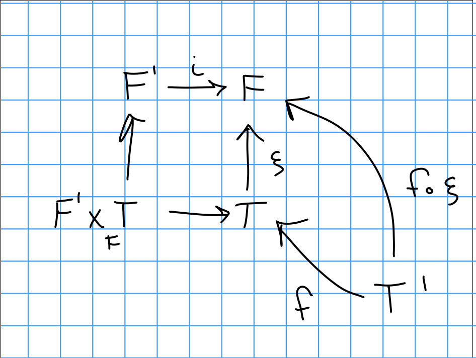
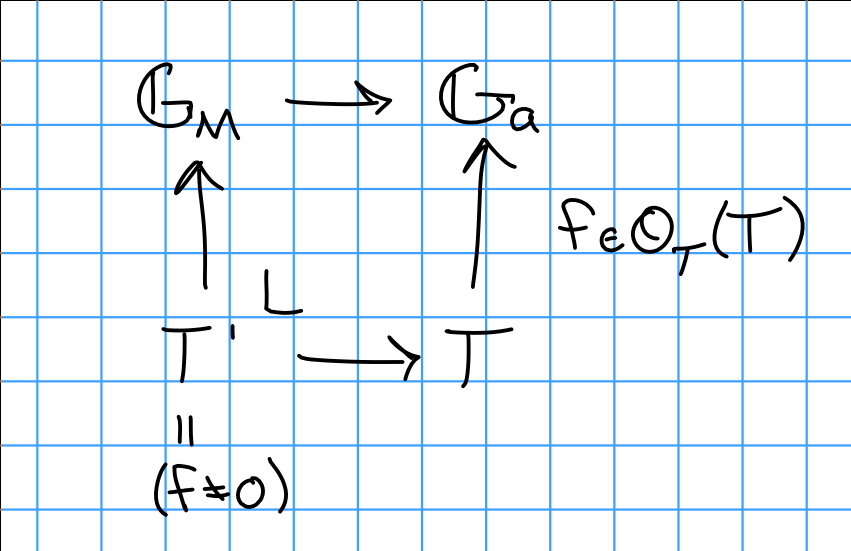
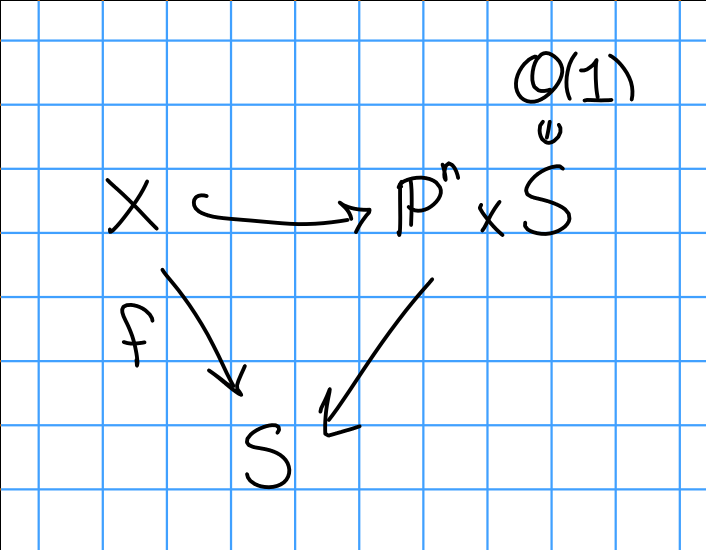

# Thursday January 16th

## Subfunctors

A functor $F' \subset F: (\Sch/S)^{op} \to \Set$ is **open** iff for all $T \mapsvia{\xi} F$ where $T = h_T$ and $\xi \in F(T)$.

We can take fiber products:

\begin{center}
\begin{tikzcd}
F' \ar[r] & F \\
 & \\
F' \cross_F T \ar[r, "open"] \ar[uu] & T \ar[uu]
\end{tikzcd}
\end{center}

\

So we can think of "inclusion in $F$" as being an open condition: for all $T/S$ and $\xi \in F(T)$, there exists an open $U \subset T$ such that for all covers $f: T' \to T$, we have $F(f)(\xi) = f^*(\xi) \in F'(T')$ iff $f$ factors through $U$.

Suppose $U \subset T$ in $\Sch/T$,  we then have

\begin{align*}
h_{U/T}(T') = \begin{cases}
\emptyset & T' \to T \text{ doesn't factor } \\
\pt & \text{otherwise}
\end{cases}
.\end{align*}

which follows because the literal statement is $h_{U/T}(T') = \hom_T(T', U)$.

By the definition of the fiber product, $(F' \cross_F T)(T') = \theset{ (a,b) \in F'(T) \cross T(T) \suchthat \xi(b) = \iota(a) \text{ in  } F(T)}$, where $F' \mapsvia{\iota} F$ and $T \mapsvia{\xi} F$.

So note that the RHS diagram here is exactly given by pullbacks, since we identify sections of $F/T'$ as sections of $F$ over $T/T'$ (?).

We can thus identify $(F' \cross_F T)(T') = h_{U/S}(T')$, and so for $U \subset T$ in $\Sch/S$ we have $h_{U/S} \subset h_{T/S}$ is the functor of maps that factor through $U$.
We just identify $h_{U/S}(T') = \hom_S(T', U)$ and $h_{T/S}(T') = \hom_S(T', T)$.

Example: $GG_m, \GG_a$.
$\GG_a$ represents giving a global function, $\GG_m$ represents giving an invertible function.

\

Where $\OO_T(T)$ are global functions.

## Actual Geometry: Hilbert Schemes

> The best moduli space!

Want to parameterize families of subschemes over a fixed object.
Fix $k$ a field, $X/k$ a scheme; we'll parameterize subschemes of $X$.

Definition:
The hilbert functor is given by

\begin{align*}
\Hilb_{X/S}: (\Sch/S)^{op} \to \Set
.\end{align*}

which sends $T$ to closed subschemes $Z \subset X \cross_S T \to T$ which are flat over $T$.

> Here flatness replaces the Cartier condition.

Recall (flatness):
For $X \mapsvia{f} Y$ and $\FF$ a coherent sheaf on $X$, $f$ is flat over $Y$ iff for all $x\in X$ the stalk $F_x$ is a flat $\OO_{y, f(x)}\dash$module.
Note that $f$ is flat if $\OO_x$ is.

> Flatness corresponds to varying continuously.

**Warning**:
Unless otherwise stated, assume schemes are Noetherian.

> Note that everything works out if we only path with finite covers.

Remark:
If $X/k$ is projective, so $X \subset \PP^n_k$, we have line bundles $\OO_x(1) = \OO(1)$.
For any sheaf $F$ over $X$, there is a hilbert polynomial $P_F(n) = \chi(F(n)) \in \ZZ[n]$.
( i.e. we twist by $\OO(1)$ $n$ times.)
The cohomology of $F$ isn't change by the pushforward into $\PP_n$ since it's a closed embedding, i.e. $\chi(X, F) = \chi(\PP^n, i_* F) = \sum (-1)^i \dim_k H^i(\PP^n, i_* F(n))$.

First fact:
For $n \gg 0$, $\dim_k H^0 = \dim M_n$, the $n$th graded piece of $M$, which is a graded module over the homogeneous coordinate ring whose $i_*F = \tilde M$.

In general, for $L$ ample of $X$ and $F$ coherent on $X$, we can define a hilbert polynomial $P_F(n) = \chi(F\tensor L^n)$.

This is an invariant of a polarized projective variety, and in particular subschemes.
Over irreducible bases, flatness corresponds to this invariant being constant.

Proposition:
For $f:X\to S$ projective, i.e. there is a factorization:

If $S$ is reduced, irreducible, locally Noetherian, then $f$ is flat iff $P_{\OO_{x_s}}$ is constant for all $s\in S$.
(To be more precise, look the base change to $X_1$, and the pullback of the fiber? $\OO\mid_{x_i}$?)

> Note: not using the word "integral" here!
> $S$ is flat iff the hilbert polynomial over the fibers are constant.

Example:
The zero-dimensional subschemes $Z \in \PP^n_k$, then $P_Z$ is the length of $Z$, i.e. $\dim_k(\OO_Z)$.
And $P_Z(n) = \chi(\OO_Z \tensor \OO(n)) = \chi(\OO_Z) = \dim_k H^0(Z; \OO_Z) = \dim_k \OO_Z(Z)$.

For two closed points in $\PP^2$, $P_Z = 2$.

Consider the affine chart $\AA^2 \subset \PP^2$, which is given by $\spec k[x, y]/(y, x^2) \cong k[x]/(x^2)$ and $P_Z = 2$.
I.e. in flat families, it has to record how the tangent directions come together.

Example:
Consider the flat family $xy = 1$ (flat because it's an open embedding) over $k[x]$, here we have points running off to infinity.

**Modified proposition:**
A sheaf $F$ is flat iff $P_{F_S}$ is constant.

*Proof of proposition:*
Assume $S = \spec A$ for $A$ a local Noetherian domain.

**Lemma:**
For $F$ a coherent sheaf on $X/A$ is flat, we can take the cohomology via global sections $H^0(X; F(n))$.
This is an $A\dash$module, and is a free $A\dash$module for $n\gg 0$.

*Proof of Lemma:*
Assumed $X$ was projective, so just take $X = \PP_A^n$ and let $F$ be the pushforward.
There is a correspondence sending $F$ to its ring of homogeneous sections constructed by taking the sheaf associated to the graded module $\sum_{n\gg0} H^0( \Pi_A^m; F(n) )$
This is equal to $\oplus_{n \gg 0} H^0(\PP_A^m; F(n))$ and taking the associated sheaf ($Y \mapsto \tilde Y$, as per Hartshorne's notation) which is free, and thus $F$ is free.

> See tilde construction in Hartshorne, essentially amounts to localizing free tings.

Conversely, take an affine cover $U_i$ of $X$.
We can compute the cohomology using Čech cohomology, i.e. taking the Čech resolution.
We can also assume $H^i(\PP^m; F(n)) = 0$ for $n \gg 0$, and the Čech complex vanishes in high enough degree.
But then there is an exact sequence

\begin{align*}
0 \to H^0(\PP^m; F(n)) \to \mathcal C^0( \underline{U}; F(n) ) \to \cdots \to C^m( \underline{U}; F(n) ) \to 0
.\end{align*}

Assuming $F$ is flat, and using the fact that flatness is a 2 out of 3 property, the images of these maps are all flat by induction from the right.

Finally, local Noetherian + finitely generated flat implies free.

$\qed$

By the lemma, we want to show $H^0(\PP^m; F(n))$ is free for $n\gg 0$ iff the hilbert polynomials on the fibers $P_{F_S}$ are all constant.

Claim 1:
It suffices to show that for each point $s\in \spec A$, we have $H^0(X_s; F_S(n)) = H^0(X; F(n)) \tensor k(S)$ for $k(S)$ the residue field, for $n\gg 0$.

Note that $P_{F_s}$ measures the rank of the LHS.

$\implies$:
The dimension of RHS is constant, whereas the LHS equals $P_{F_S}(n)$.

$\impliedby$:
If the dimension of the RHS is constant, so the LHS is free.

> For a f.g. module over a local ring, testing if localization at closed point and generic point have the same rank.

> For $M$ a finitely generated module over $A$, find $0 \to A^n \to M \to Q$ is surjective after tensoring with $\mathrm{Frac}(A)$, and tensoring with $k(S)$ for 4s$a closed point, if $\dim A^n = \dim M$ then $Q = 0$.

Proof of Claim 1:
By localizing, we can assume $s$ is a closed point.
Since $A$ is Noetherian, its ideal is f.g. and we have $A^m \to A \to k(S) \to 0$.
We can tensor with $F$ (viewed as restricting to fiber) to obtain $F(n)^m \to F(n) \to F_S(n) \to 0$.
Because $F$ is flat, this is still exact.

We can take $H^*(x, \wait)$, and for $n\gg 0$ only $H^0$ survives.
This is the same as tensoring with $H^0(x, F(n))$.

Definition:
Given a polynomial $P \in \ZZ[n]$ for $X/S$ projective, we define a subfunctor by picking only those with hilbert polynomial $p$ fiberwise as $\Hilb^P_{X/S} \subset \Hilb_{X/S}$.
This is given by $Z \subset X \cross_S T$ with $P_{Z} = P$.

Theorem (Grothendieck):
If $S$ is Noetherian and $X/S$ projective, then $\Hilb_{X/S}^P$ is representable by a projective $S\dash$scheme.

> See cycle spaces in analytic geometry.

