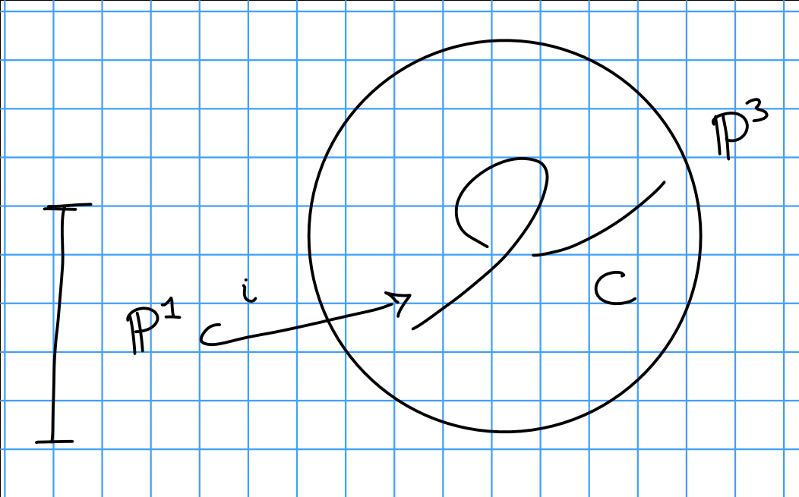

# Thursday January 23rd

Some facts about the Hilbert polynomial:

1. For a subscheme $Z \subset $\PP_k^n$ with $\deg P_z = \dim Z = n$, then $p_z(t) = \deg z t^n/(n!) + O(t^{n-1})$.
2. We have $p_z(t) = \chi(\OO_z(t))$, consider the sequence $0 \to I_z(t) \to \OO_{\PP^n}^{(t)} \to \OO_z^{(t)} \to 0$, then $\chi(I_z(t)) = \dim H^0( \PP^n, J_z(t)  )$ for $t \gg 0$, and $p_z(0)$ is the Euler characteristic of $\OO_Z$.

> Serre vanishing, Riemann-Roch, ideal sheaf.

Good example to keep in mind: the twisted cubic

Then $p_C(t) = (\deg C)t + \chi(\OO_{\PP^1}) = 3t + 1$.

Hypersurfaces:
Recall length 2 subschemes of $\PP^1$ are the same as specifying quadratics that cut them out, each such $Z \subset \PP^1$ satisfies $Z = V(f)$ where $\deg f = d$ and $f$ is homogeneous.
So we'll be looking at $\PP H^0(\PP^n_k, \OO(d))\dual$, and the guess would be that this is $\hilb_{\PP^n_k}$

Resolve the structure sheaf

\begin{align*}
0 \to \OO_{\PP^n}(-d) \to \OO_{\PP^n}(t) \to \OO_D(t) \to 0
.\end{align*}

so we can twist to obtain

\begin{align*}
0 \to \OO_{\PP^n}(t-d) \to \OO_{\PP^n}(t) \to \OO_D(t) \to 0
.\end{align*}

Then $\chi(\OO_D(t)) = \chi(\OO_{\PP^n}(t)) - \chi(\OO_{\PP^n}(t-d))$, which is ${n+t \choose n} - {n+t-d \choose n} = d t^{n-1}/(n-1)! + O(t^{n-2})$.

**Lemma:**
Anything with the Hilbert polynomial of a degree $d$ hypersurface is in fact a degree $d$ hypersurface.

Want to write a morphism of functors

\begin{align*}
\hilb_{\PP^n_k}^{P_{n, d}} \to \PP H^0 (\PP^n, \OO(d) )\dual
.\end{align*}

which sends flat families to families of equations cutting them out.

Want $Z \subset \PP^n \cross S \to \OO_s \tensor H^0( \PP^n, \OO(d) )\dual \to L \to 0$.
This happens iff $0 \to L\dual \to \OO_s \tensor H^0(\PP^n, \OO(d))$ with torsion-free quotient.
Note that we use $L\dual$ instead of $\OO_s$ because of scaling.

We have

\begin{align*}
0 \to I_z \to \OO_{\PP^n \cross S} \to \OO_z \to 0 \\
0 \to I_z(d) \to \OO_{\PP^n \cross S}(d) \to \OO_z(d) \to 0 \quad\text{by twisting}
.\end{align*}

We then consider $\pi_s: \PP^n \cross S \to S$, and apply the pushforward to the above sequence noting that it is not right-exact.

\begin{align*}
0 \to \pi_{s*} I_z(d) \to \pi_{s*} \OO_{\PP^n \cross S}(d) \to \pi_{s*} \OO_z(d) \to 0 \\
= 0 \to L\dual = \OO_s \tensor H^0(\PP^n, \OO(d)) \to \text{locally free}
.\end{align*}

This equality follows from flatness, cohomology, and base change.
In particular, we need the following facts

The scheme-theoretic fibers, given by $H^0(\PP^n, I_z(d))$ and $H^0(\PP^n, \OO_z(d))$, are all the same dimension.

Using

1. Cohomology and base change, i.e. for $X \mapsvia{f} Y$ a map of Noetherian schemes (or just finite-type) and $F$ a sheaf on $X$ which is flat over $Y$, there is a natural maop (not usually an isomorphism) $R^i f_* f \tensor k(y) \to H^i(x_y, \restrictionof{F}{x_y})$.

