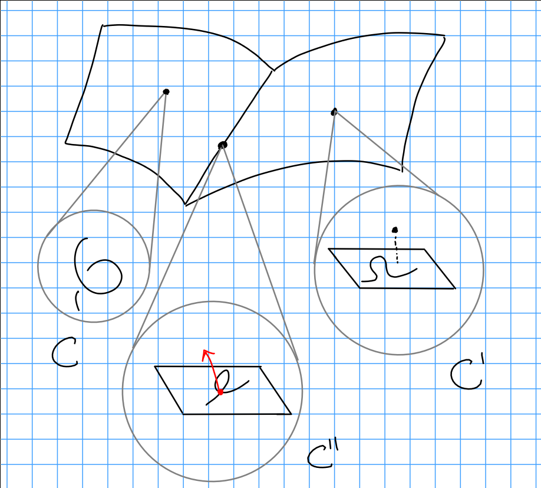

# Thursday January 23

Some facts about the Hilbert polynomial:

1. For a subscheme $Z \subset \PP_k^n$ with $\deg P_z = \dim Z = n$, then 
  $$
  p_z(t) = \deg z t^n/(n!) + O(t^{n-1})
  .$$

2. We have $p_z(t) = \chi(\OO_z(t))$, consider the sequence 
  $$
  0 \to I_z(t) \to \OO_{\PP^n}^{(t)} \to \OO_z^{(t)} \to 0
  ,$$ 
  then $\chi(I_z(t)) = \dim H^0( \PP^n, J_z(t)  )$ for $t \gg 0$, and $p_z(0)$ is the Euler characteristic of $\OO_Z$.

> Serre vanishing, Riemann-Roch, ideal sheaf.

Example (Good to keep in mind)
: The twisted cubic:

\begin{center}
\begin{tikzpicture}[x=0.75pt,y=0.75pt,yscale=-1,xscale=1, scale=0.6, every node/.style={scale=0.6}] 

\node[draw,circle,minimum size=12cm,inner sep=0pt, label={[xshift=-0cm, yshift=-0.0cm, scale=2.0] $\PP^3$ }] at (320,150) {};
%\draw [red] plot [smooth] coordinates {(-2,-2) (1,1) (0, 2) (-1, 1) (1, -1) (2,2) };

\draw[very thick, blue] (-50,400) -- (-50,100);
\draw[thick] (-50-20,400) -- (-50+20,400);
\draw[thick] (-50-20,100) -- (-50+20,100);
\node[scale=2.0] at (-25, 100-20) {$\PP^1$};

\draw  [color={rgb, 255:red, 0; green, 0; blue, 255 }  ][line width=2] [line join = round][line cap = round] (152.5,225) .. 
controls (170,225) and (185,215) .. (201,208) .. 
controls (243,189) and (283,170) .. (313,135) .. 
controls (326,120) and (355,84) .. (350,62) .. 
controls (342,34) and (318,33) .. (287,42) ..
controls (255,65) and (255,72) .. (254,76) .. 
controls (251,90) and (245,100) .. (251,115) .. 
controls (253,124) and (264,128) .. (270,135) ;
\draw  [color={rgb, 255:red, 0; green, 0; blue, 255 }  ][line width=2] [line join = round][line cap = round] (339.5,151) .. controls (382.37,151) and (419.21,130.75) .. (452.5,104) .. controls (467.73,91.76) and (491.83,72.67) .. (503.5,54) ;

\draw [thick, right hook-latex ] (-50+20, 200) -- (150, 200);     
\node[scale=2.0] at (50, 180) {$\iota$}; 

\node[scale=2.0] at (350, 180) {$C$}; 
\end{tikzpicture}
\end{center}

Then 
$$
p_C(t) = (\deg C)t + \chi(\OO_{\PP^1}) = 3t + 1
.$$

### Hypersurfaces 

Recall that length 2 subschemes of $\PP^1$ are the same as specifying quadratics that cut them out, each such $Z \subset \PP^1$ satisfies $Z = V(f)$ where $\deg f = d$ and $f$ is homogeneous.
So we'll be looking at $\PP H^0(\PP^n_k, \OO(d))\dual$, and the guess would be that this is $\hilb_{\PP^n_k}$

Resolve the structure sheaf

\begin{align*}
0 \to \OO_{\PP^n}(-d) \to \OO_{\PP^n}(t) \to \OO_D(t) \to 0
.\end{align*}

so we can twist to obtain

\begin{align*}
0 \to \OO_{\PP^n}(t-d) \to \OO_{\PP^n}(t) \to \OO_D(t) \to 0
.\end{align*}

Then 
$$
\chi(\OO_D(t)) = \chi(\OO_{\PP^n}(t)) - \chi(\OO_{\PP^n}(t-d))
,$$ 
which is 
$$
{n+t \choose n} - {n+t-d \choose n} = \frac{dt^{n-1}}{(n-1)!} + O(t^{n-2})
.$$

Lemma
:   Anything with the Hilbert polynomial of a degree $d$ hypersurface is in fact a degree $d$ hypersurface.

We want to write a morphism of functors

\begin{align*}
\hilb_{\PP^n_k}^{P_{n, d}} \to \PP H^0 (\PP^n, \OO(d) )\dual
.\end{align*}

which sends flat families to families of equations cutting them out.

Want 
$$
Z \subset \PP^n \cross S \to \OO_s \tensor H^0( \PP^n, \OO(d) )\dual \to L \to 0
.$$
This happens iff 
$$
0 \to L\dual \to \OO_s \tensor H^0(\PP^n, \OO(d))
$$ 
with torsion-free quotient.

> Note that we use $L\dual$ instead of $\OO_s$ because of scaling.

We have

\begin{align*}
0 &\to I_z \to \OO_{\PP^n \cross S} \to \OO_z \to 0 \\
0 &\to I_z(d) \to \OO_{\PP^n \cross S}(d) \to \OO_z(d) \to 0 \quad\text{by twisting}
.\end{align*}

We then consider $\pi_s: \PP^n \cross S \to S$, and apply the pushforward to the above sequence noting that it is not right-exact.

\begin{align*}
.\end{align*}

\begin{center}
\begin{tikzcd}
0\ar[r] & \pi_{s*} I_z(d) \ar[r] & \pi_{s*} \OO_{\PP^n \cross S}(d) \ar[r] & \pi_{s*} \OO_z(d) \ar[r] &  0 \\
 & & & & \\
= 0 \to L\dual = \OO_s \tensor H^0(\PP^n, \OO(d)) \to \text{locally free}

\end{tikzcd}
\end{center}

This equality follows from flatness, cohomology, and base change.
In particular, we need the following facts

The scheme-theoretic fibers, given by $H^0(\PP^n, I_z(d))$ and $H^0(\PP^n, \OO_z(d))$, are all the same dimension.

Using

1. Cohomology and base change, i.e. for $X \mapsvia{f} Y$ a map of Noetherian schemes (or just finite-type) and $F$ a sheaf on $X$ which is flat over $Y$, there is a natural maop (not usually an isomorphism) $R^i f_* f \tensor k(y) \to H^i(x_y, \restrictionof{F}{x_y})$, but is an isomorphism if $\dim H^i(x_y, \restrictionof{F}{x_y})$ is constant, in which case $R^i f_* f$ is locally free.

2. If $Z \subset \PP^n_k$ is a degree $d$ hypersurface, then independently we know $\dim H^0(\PP^n, I_z(d)) = 1$ and $\dim H^0(\PP^n, \OO_z(d)) = {d+n \choose n} - 1$.

To get a map going backwards, we take the universal degree 2 polynomial and form $V(a_{00} x_0^2 + a_{11} x_1^2 + a_{12}x_2^2 + a_{01}x_0 x_1 + a_{02} x_0 x_2 + a_{12} x_1 x_2) \subset \PP^2 \cross \PP^5$.

Next example: twisted cubics.

Consider a map $\PP^1 \to \PP^3$ obtained by taking a basis of a homogeneous cubic polynomial.
The canonical example is $(x, y) \to (x^3, x^2y, xy^2, y^3)$.
Then $P_C(t) = 3t + 1$, and $\hilb_{\PP_k^3}^{3t+1}$ has a component with generic point a twisted cubic, and another component with points a curve disjoint union a point, and the overlap are nodal curves with a "fat" 3-dimensional point:

\

Then $P_{C'} = 1 + \tilde P$, the hilbert polynomial of just the base without the disjoint point, so this equals $1 + P_{2, 3} = 1 + (3t + 0) = 3t +1$.
For $P_{C''}$, we take the sequence $0 \to k \to \OO_{C''} \to \OO_{C'' \text{reduced}} \to 0$, so $P_{C''} = 1 + P_{C'' \text{red}} = 3t+1$.

> Note: flat families have to have the same constant Hilbert polynomial.

Note that we can get paths in this space from $C\to C''$ and $C'\to C''$ by collapsing a twisted cubic onto a plane, and sending a disjoint point crashing into the node on a nodal cubic.

We're mapping $\PP^1 \to \PP^3$, and there is a natural action of $\PP\GL(4) \actson \PP^3$, so we get a map

\begin{align*}
\PP \Gl(4) \cross \PP^3 \to \PP^3
.\end{align*}

Let $c\in \PP^3$ and let $\mcc$ be the preimage.
This induces (?) a map $\PP \Gl(4) \to \hilb_{\PP^3}^{3t+1}$ where the fiber over $[C]$ in the latter is $\PP \Gl(2) = \Aut(\PP^1)$.
By dimension counting, we find that the dimension of the twisted cubic component is $15 - 3 = 12$.

The 15 in the other component comes from 3-dim choices of plane, 3-dim choices of a disjoint point, and $\PP H^0(\PP^2, \OO(3))\dual \cong \PP^9$, yielding 15 dimensions.

To show that these are actually different components, we use Zariski tangent spaces.
Let $T_1$ be the tangent space of the twisted cubic component, then $\dim T_1 \hilb_{\PP_k^3}^{3t+1} = 12$, and similarly the dimension of the tangent space over the $C'$ component is 15.

Algebra fact:
Let $A$ be Noetherian and local, then the dimension of the Zariski tangent space, $\dim \mfm /\mfm^2 \geq \dim A$, the Krull dimension.
If this is an equality, then $A$ is regular.

Thus dimensions of the tangent spaces give an upper bound.

Proposition:
If $X/k$ is projective and $P$ is a Hilbert polynomial, then $[Z] \in \hilb_{X/k}^P$, i.e. a closed subscheme of $X$ with hilbert polynomial $p$ (note there's an ample bundle floating around) then the tangent space is $\hom_{\OO_x}(I_z, \OO_z)$.
