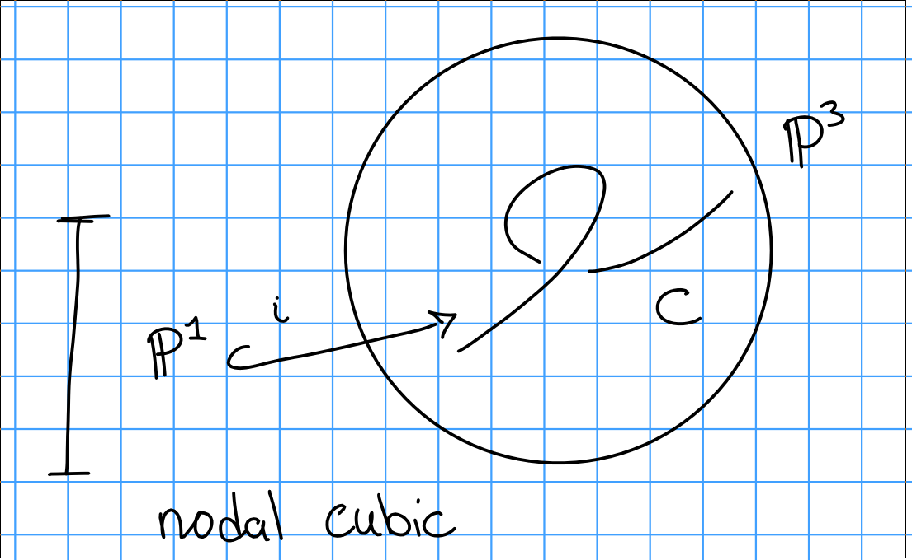

# Thursday January 23rd

Some facts about the Hilbert polynomial:

1. For a subscheme $Z \subset $\PP_k^n$ with $\deg P_z = \dim Z = n$, then $p_z(t) = \deg z t^n/(n!) + O(t^{n-1})$.
2. We have $p_z(t) = \chi(\OO_z(t))$, consider the sequence $0 \to I_z(t) \to \OO_{\PP^n}^{(t)} \to \OO_z^{(t)} \to 0$, then $\chi(I_z(t)) = \dim H^0( \PP^n, J_z(t)  )$ for $t \gg 0$, and $p_z(0)$ is the Euler characteristic of $\OO_Z$.

> Serre vanishing, Riemann-Roch.

Good example to keep in mind: the twisted cubic

