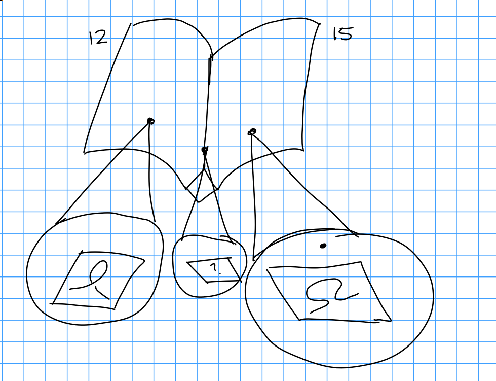
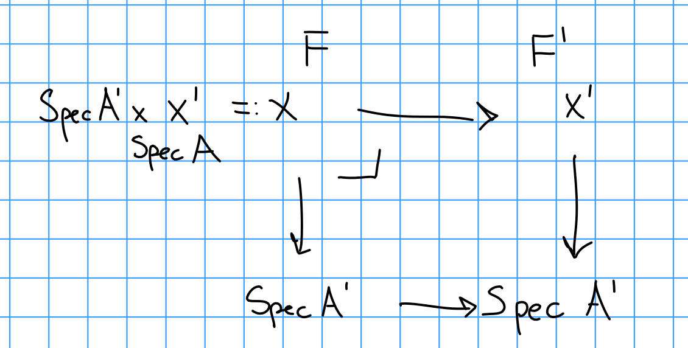

# Tuesday January 28th

Last time:
Twisted cubics, given by $\hilb_{\PP^3_k}^{3t+1}$.

\

We got lower (?) bounds on the dimension by constructing families, but want an exact dimension.

Key:
Let $Z\subset X$ be a closed $k\dash$dimensional subspace.

Proposition:
For $[z] \in \hilb_{X/k}^P(k)$, we have an identification of the Zariski tangent space $T_[z] \hilb_{X/k}^P = \hom_{\OO_x}(I_z, \OO_z)$.

Say $F: (\sch/K)\op \to \sets$ is a function and let $x\in F(k)$.
There is an inclusion $i: \spec k \injects \spec k[\eps]$.
Then there is an induced map $F(\spec k [\eps]) \mapsvia{i^*} F(\spec k)$ where $T_x F \definedas (i^*)\inv(x) \mapsto x$.
So if $F$ is represented by a scheme $H/k$, then $T_x h_J = T_x H = (\mfm_x / \mfm_x^2)\dual$ over $k$.

> Will need a criterion for flatness later, esp. for Artinian thickenings.

Lemma:
Assume $A'$ is a Noetherian ring and $0 \to J \to A' \to A \to 0$ with $J^2 = 0$.
Assume we have $X' / \spec A'$, and a coherent sheaf $F'$ on $X'$, where $X'$ is Noetherian.

Then $F'$ is flat over $A'$ iff

\

1. $F$ is flat
2. $0 \to F\tensor_A J \to F'$ is exact.

Take the first exact sequence and tensor with $F'$ (which is right-exact), then $J \tensor_{A'} F' = J \tensor_A$ canonically.
This follows because $J = J \tensor_{A'} A$, and there is an isomorphism $J \tensor_{A'} \A' \to J \tensor_{A'} A$.
And $F = F' \tensor_{A'} A$ is a pullback of $F'$.
If flat, then tensoring is exact.

Proof:
Both conditions are necessary since pullbacks of flats are flat (1), and (2) gives the flatness condition.)

Recall that for a module over a Noetherian ring, $M/A$, $M$ is flat over $A$ iff $\tor_1^A(M, A/p) = 0$ for all prime $p$.
Reason: Tor commutes with direct limits, so $M$ is flat iff $\Tor_1^A(M, N) = 0$ for all finitely generated $N$.
Since $A$ is Noetherian, $N$ has a finite filtration $N^\cdot$ where $N_i / N_{i+1} \cong A/p_i$.
Use the fact that every ideal is contained in a prime ideal.

Take $x\in N$, this yields a map $A\to N$ which factors through $A/I$.
If we make such a filtration on $A/I$, then we can quotient $N$ by $\img f$ where $f: A/I \to N$.
Continuing inductively, the resulting filtration must stabilize.
So we can assume $N = A/I$.

