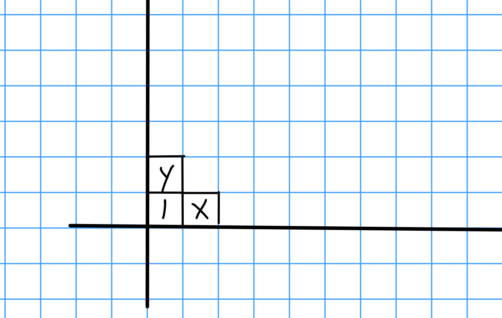
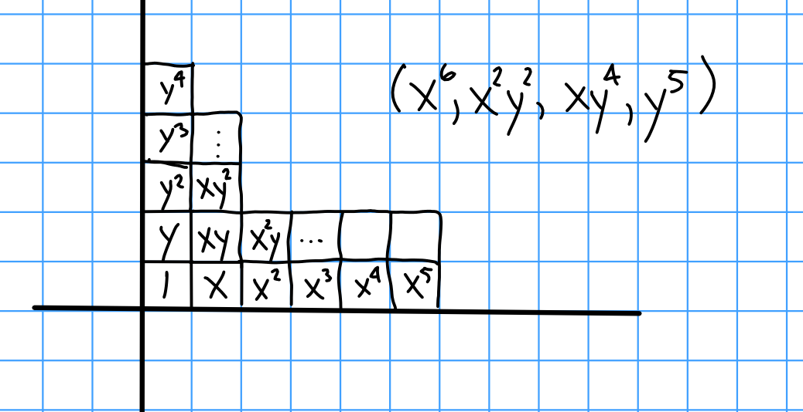
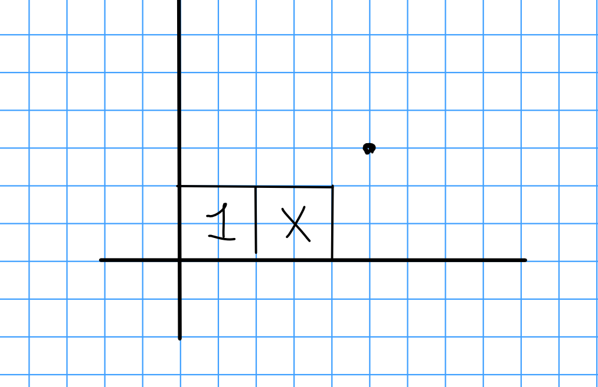
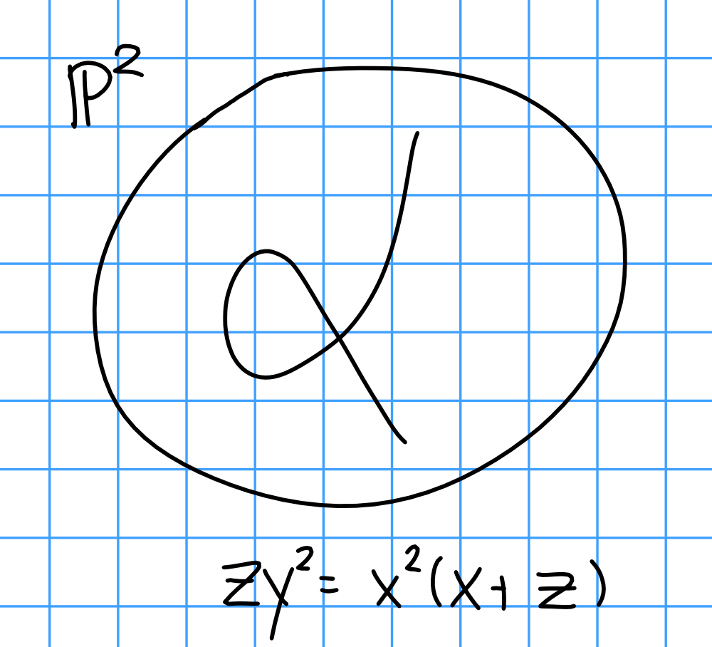
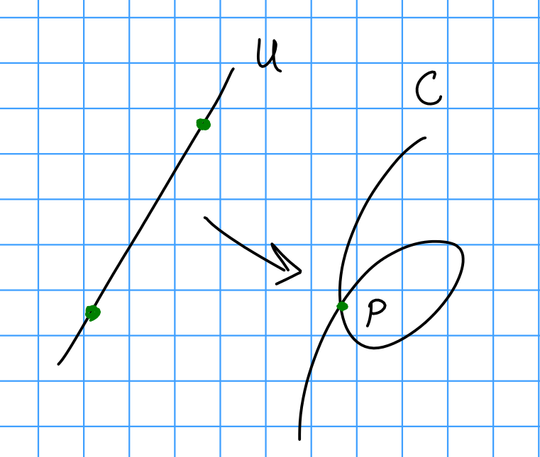

# Thursday February 6th

For $k=\bar k$, and $C/k$ a smooth projective curve, then $\hilb_{C/k}^n = \sym^n C$.
For$X/k$ a smooth projective  *surface*, $\hilb_{X/k}^n \neq \sym^n X$.
There is a map (the Hilbert-Chow map) 

\begin{align*}
\hilb_{X/k}^n &\to \sym^n X \\
Z &\mapsto \supp(Z) \\
U  = \text{reduced subschemes} &\mapsto U' = \text{ reduced multisets } \\
\PP^1 &\mapsto (x, x)
.\end{align*}

Example: 
Consider $\AA^2 \cross \AA^2$ under the $\ZZ/2\ZZ$ action $( (x_1, y_1), (x_2, y_2)) \mapsto ((x_2, y_2), (x_1, y_1))$.
Then $(\AA^2)^2 / \ZZ/2 = \spec k[x_1, y_1, x_2, y_2]^{\ZZ/2} = \spec k[x_1 x_2, y_1 y_2, x_1 + x_2, y_1 + y_2, x_1 y_2 + x_2 y_1, \cdots]$ with a bunch of symmetric polynomials adjoined. 

Example:
Take $\AA^2$ and consider $\hilb_{\PP^2}^3$.
If $I$ is a monomial ideal in $\AA^2$, there is a nice picture.
We can identify the tangent space $T_Z \hilb_{\PP^2}^n = \hom_{\OO_{\PP^2}} ( I_2, \OO_Z) = \bigopus \hom(I_{Z_i}, \OO_{Z_i})$ if $Z = \disjoint Z_i$. 
If $I$ is supported at 0, then we can identify the ideal with the generators it leaves out.

Example: $I = (x^2, xy, y^2)$:
\

Example: $I = (x^6, x^2y^2, xy^4, y^5)$:
\

Example: $I = (x^2, y)$.
Let $e=x^2, f = y$.

\

By comparing rows to columns, we obtain a relation $ye = x^2 f$.
Write $\OO = \theset{1, x}$, then note that this relation is trivial in $\OO$ since $y=x^2=0$.

Thus $\hom(I, \OO) = \hom(k^2, k^2)$ is 4-dimensional.

Note that $C/k$ for curves is an important case to know.
Take $Z \subset C \cross C^n$, then quotient by the symmetric group $S^n$ (need to show this can be done), then $Z/S^n \subset C \cross \sym^n C$ and composing with the functor $\hilb$ represents yields a map $\sym^n C \to \hilb_{C/k}^n$.
This is bijective on points, and a tangent space computation shows it's an isomorphism.

Example:
Consider the nodal cubic in $\PP^2$:

\

Consider the open subscheme $V \subset \hilb_{C/k}^2$ of points $z \subset U$ for $U \subset C$ open.

We can normalize:

\

This yields a map fro $\PP^1 \setminus\text{2 points}$.
This gives us a stratification, i.e. a locally closed embedding $(\text{z supported on U}) \disjoint (\text{1 point at p}) \disjoint (\text{both points at p}) \to \hilb_{C/k}^2$.

The first locus is given by the complement of two lines: 
\

The third locus is given by arrows at $p$ pointing in any direction, which gives a copy of $\PP^1$.

The second is $\PP^1$ minus two points.
