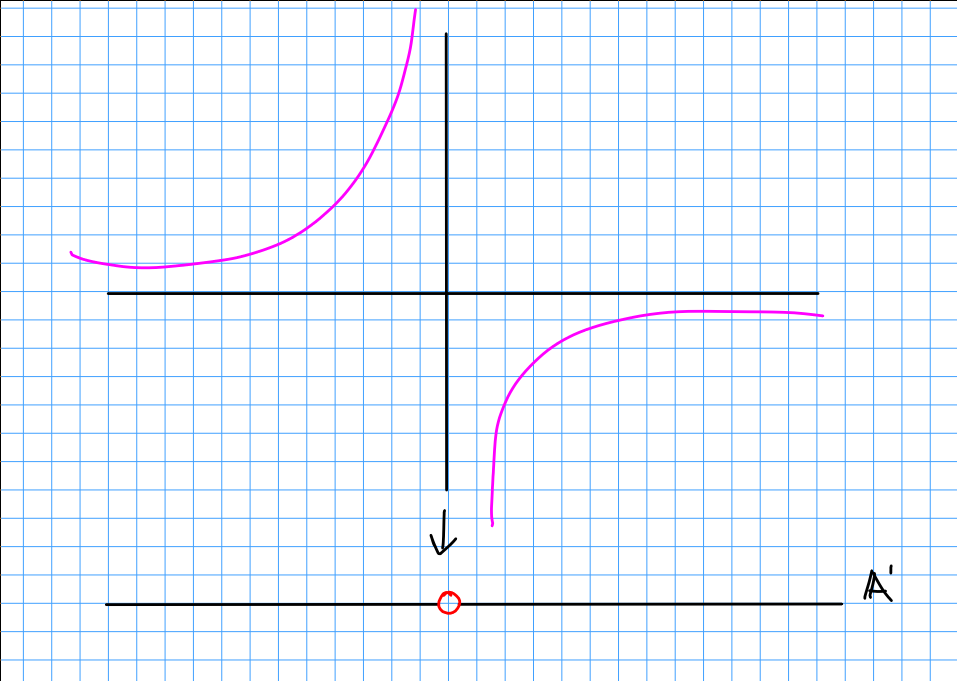
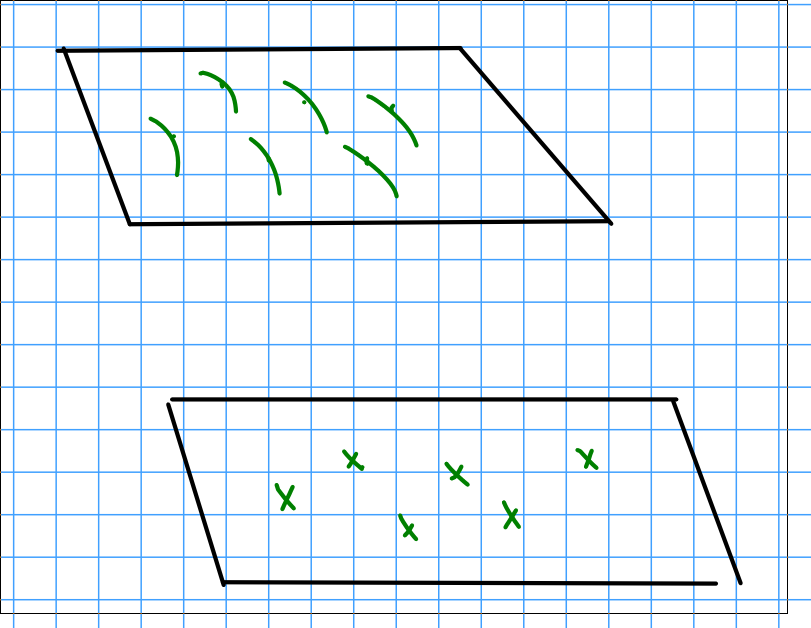

# Tuesday February 18th

**Theorem:**
Let $X/S$ be a projective subscheme (i.e. $X\subset \PP^n$ for some $n$).
The Hilbert functor of flat families $\hilb_{X/S}^p$ is representable by a projective $S\dash$scheme.

> Note that without a fixed $P$, this is *locally* of finite type but not finite type. 
> After fixing $P$, it becomes finite type.

*Example:*
For a curve of genus $g$, there is a smooth family $\mcc \mapsvia{\pi} S$ with $S$ finite-type over $\ZZ$ where every genus $g$ curve appears as a fiber.
I.e., genus $g$ curves form a *bounded family* (here there are only finitely many algebraic parameters to specify a curve).

> How did we construct? Take the third power of the canonical bundle and show it's very ample, so it embeds into some projective space and has a hilbert polynomial.

In fact, there is a finite type *moduli stack* $\mcm_g / \ZZ$ of genus $g$ curves.
There will be a map $S \surjects \mcm_g$, noting that $\mcc$ is not a moduli space since it may have redundancy.

> We'll use the fact that a finite-type scheme surjects onto $\mcm_g$ to show it is finite type.

*Remarks:*
1. If $X/S$ is proper, we can't talk about the Hilbert polynomial, but the functor $\hilb_{X/S}$ is still representable by a locally finite-type scheme with connected components which are proper over $S$.

2. If $X/S$ is *quasiprojective* (so locally closed, i.e. $X\injects \PP^n_S$), then $\hilb_{X/S}^P(T) \definedas \theset{z\in X_T \text{ projective, flat over S with fiberwise Hilbert polynomial P }}$ is still representable, but now by a quasiprojective scheme.

*Example:*
Length $Z$ subschemes of $\AA^1$: representable by $\AA^2$.

\

Upstairs: parametrizing length 1 subschemes, i.e. points.

3. If $X\subset \PP_S^n$ and $E$ is a coherent sheaf on $X$, then

\begin{align*}
\quot_{E, X/S}^{P}(T) = \theset{ j^*E \to F \to 0, \text{ over } X_T \to T,~F \text{ flat with fiberwise Hilbert polynomial  } P  }  
\end{align*}

where $T \mapsvia{g} S$ is representable by an $S\dash$projective scheme.

*Example:*
Take $E = \OO_x$, $X$ and $S$ a point, and $E$ is a vector space, then $\quot_{E/S}^P = \Gr(\rank, E)$.

> The hilbert scheme of 2 points on a surface is more complicated than just the symmetric product.

*Example:*

\begin{align*}
\qty{\AA^2}^3 &\to \qty{\AA^2}^2 \\
\supseteq \Delta\definedas \Delta_{01} \cross \Delta{02} &\to \qty{\AA^2}^2
\end{align*}

where $\Delta_{ij}$ denote the diagonals on the $i, j$ factors.
Here all associate points of $\Delta$ dominate the image, but it is not flat.
Note that if we take the complement of the diagonal in the image, then the restriction $\Delta' \to \qty{\AA^2}^2\setminus D$ is in fact flat.

Mumford example:
The Hilbert scheme may have nontrivial scheme structure, i.e. this will be a "nice" hilbert scheme with is generally not reduced.
We will find a component $H$ of a $\hilb_{\PP^3_C}^P$ whose generic point corresponds to a smooth irreducible $C\subset \PP^3$ which is generically non-reduced.

## Cubic Surfaces

> See Hartshorne Chapter 5.

Let $X\subset \PP^3$ be a smooth cubic surface, then $\OO(1)$ on $\PP^3$ restricts to a divisor class $H$ of a hyperplane section, i.e. the associated line bundle $\OO_x(H) = \OO_x(1)$.

Two important facts:

1. $X$ is the blowup of $\PP^2$ minus 6 points (replace each point with a curve).
There is thus a blowdown map $X \mapsvia{\pi} \PP^2$.

\

Let $\ell = \pi^*(\text{line})$, then a fact is that $3\ell - E_1 -\cdots - E_6$ (where $E_i$ are the curves about the $p_i$) is very ample and embeds $X$ into $\PP^3$ as a cubic.

2. Every smooth cubic surface $X$ has *precisely* 27 lines.
Any 6 pairwise skew lines arise as $E_1, \cdots, E_6$ as in the previous construction.

Take an $X$ and a line $L\subset X$.
Consider any $C$ in the linear system $\abs{4H + 2L}$.
Fact: $\OO(4H + 2L)$ is very ample, so embeds into a big projective space, and thus $C$ is smooth and irreducible by Bertini.

Then the hilbert polynomial of $C$ is of the form $at + b$ where $b = \chi(\OO_c)$, the Euler characteristic of the structure sheaf of $C$, and $a = \deg C$.
So we'll compute these.

We have $\deg C = H \cdot C$ (intersection) $= H \cdot(4H + 2L) = 4H^2 + 2H\cdot L$.
