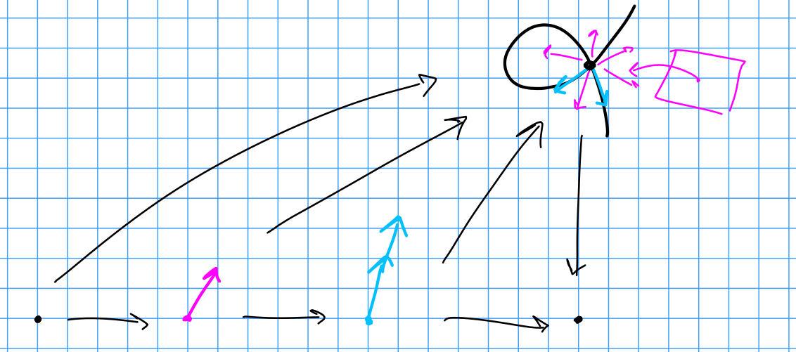

# Tuesday February 25th

Let $k$ be a field, $X/k$ projective, then the $k\dash$points $\hilb_{X/k}^P(k)$ corresponds to closed subschemes $Z\subset X$ with hilbert polynomial $P_z = P$.
Given a $P$, we want to understand the local structure of $\hilb_{X/k}^p$, i.e. diagrams of the form
\begin{tikzcd}
                                        &  &                                               &  & \hilb_{X/k}^P \arrow[dd] \\
                                        &  &                                               &  &                          \\
\spec(k) \arrow[rrrruu, "p"] \arrow[rr] &  & \spec(A) \arrow[rruu, "?", dashed] \arrow[rr] &  & \spec(k)                 \\
                                        &  &                                               &  &                          \\
                                        &  & A/k \text{ Artinian local} \arrow[uu]         &  &                         
\end{tikzcd}

Example
: For $A = k[\eps]$, the set of extensions is the Zariski tangent space.

Definition
: Let $(\Art/k)$ be the category of local Artinian $k\dash$algebras with local residue field $k$.
  Note: these will be the types of algebras appearing in the above diagrams.

Remark
: This category has fiber coproducts, i.e. there are pushouts:
  
  \begin{tikzcd}
  C \arrow[dd] \arrow[rr] &  & A \arrow[dd, dashed] \\
                          &  &                      \\
  B \arrow[rr, dashed]    &  & A \tensor_C B       
  \end{tikzcd}

  There are also fibered products,

  \begin{tikzcd}
  A \cross_C B \arrow[rr, dashed] \arrow[dd, dashed] &  & B \arrow[dd] \\
                                                    &  &              \\
  A \arrow[rr]                                       &  & C           
  \end{tikzcd}

  Here, $A \cross_C B \definedas \theset{(a, b) \suchthat f(a) = g(b)} \subset A\cross B$.

Example
: If $A = B = k[\eps]/(\eps^2)$ and $C = k$, then $A\cross_C B = k[\eps_1, \eps_2]/(\eps_1, \eps_2)^2$

Note that on the $\spec$ side, these should be viewed as $\spec(A) \disjoint_{\spec(C)} \spec(B) = \spec(A\cross_C B)$.

Definition (loose)
: A *deformation functor* is a functor $F: (\Art/k) \to \Set$ such that $F(k) = \theset{\pt}$ is a singleton.

Example
: Let $X/k$ be any scheme and let $x\in X(k)$ be a $k\dash$point.
  We can consider the deformation functor $F$ such that $F(A)$ is the set of extensions $f$ of the following form:

  \begin{tikzcd}
                                                &  &                                               &  & X \arrow[dd] \\
                                                &  &                                               &  &              \\
  \spec(k) \arrow[rrrruu, "x"] \arrow[rr, hook] &  & \spec(A) \arrow[rruu, "f", dashed] \arrow[rr] &  & \spec(k)    
  \end{tikzcd}

  If $A' \to A$ is a morphism, then we define $F(A') \to F(A)$ is defined because we can precompose to fill in the following diagram
  
  \begin{tikzcd}
                                          &  &                                                            &  &                                                       &  &  &  & X \arrow[ddd] \\
                                          &  &                                                            &  &                                                       &  &  &  &               \\
                                          &  &                                                            &  &                                                       &  &  &  &               \\
  \spec(k) \arrow[rrd] \arrow[rrrrrrrruuu] &  &                                                            &  &                                                       &  &  &  & \spec(k)      \\
                                         &  & \spec(A) \arrow[rr] \arrow[rrrrrruuuu, "\exists \tilde f"] &  & \spec(A') \arrow[rrrru] \arrow[rrrruuuu, "f", dashed] &  &  &  &              
  \end{tikzcd}

  So this is indeed a deformation functor.

Motivating example: the Zariski tangent space on the nodal cubic doesn't "see" the two branches, so we allow "second order" tangent vectors.

We can consider parametrizing the functors above as $F_{X, x}(A)$, which is isomorphic to $F_{\spec (\OO_x)_{X, x}}$ and further isomorphic to $F_{\spec \hat{\OO_x}_{x, X} }$.
This is because for Artinian algebras, we have maps $\spec (\OO_{x, X})/\mfm^N \to \spec \OO_{X, x} \to X$.

Remark: $\hat{ \OO }_{X, x}$ will be determined by $F_{X, x}$.

Example
: Consider $y^2 = x^2(x+1)$, and think about solving this over $k[t]/t^n$ with solutions equivalent to $(0, 0) \mod t$.

  \

  Note that the 'second order' tangent vector comes from $\spec k[t]/t^3$.

We can write $F_{X, x}(A) = \pi\inv(x)$ where $\hom_{\Sch/k}(\spec k, X) \mapsvia{\pi} \hom_{\Sch/k}(\spec k, x) \ni x$.
Thus $F_{X, x}(A) = \hom_{\Sch/k}(\spec A, \spec \OO_{x, X}) = \hom_{k\dash\alg}(\hat \OO_{X, x}, A)$.

Example
: Given any local $k\dash$algebra $R$, we can consider
  
  \begin{align*}
  h_R: (\Art/k) &\to \Set \\
  A &\mapsto \hom(R, A)
  .\end{align*}

  and 

  \begin{align*}
  h_{\spec R}: (\Art\Sch/k)\op \to \Set \\
  \spec(A) &\mapsto \hom(\spec A, \spec R)
  .\end{align*}

Definition
: A deformation $F$ is *representable* if it is of the form $h_R$ as above.

Remark
: There is a Yoneda Lemma,

  \begin{align*}
  \hom_{\mathrm{Fun}}(h_A, F) = F(A)
  .\end{align*}

