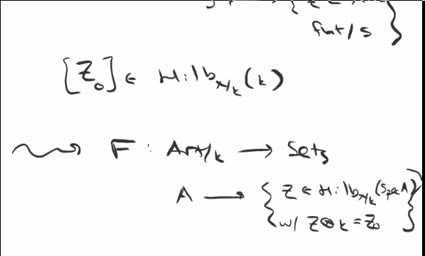

# Tuesday March 31st

See notes on Ben's website.
We'll review where we were.

## Deformation Theory

We want to represent certain moduli functors by schemes.
If we know a functor is representable, it's easier to understand the deformation theory of it and still retain a lot of geometric information.
The representability of deformation is much easier to show.

We're considering functors $F: \Art/k \to \Sets$.

Example
:   The Hilbert functor
    \begin{align*}
    \hilb_{X/k} (\Sch/k)\op \to \sets \\
    S \mapsto \theset{ Z  \subset  X \cross S \text{ flat over } S}
    .\end{align*}

    This yields to
    \begin{align*}
    F: \art/K \to \sets \\
    ???
    .\end{align*}

\

Recall that we're interested in pro-representability, where $\hat F(R) = \liminverse F(R\mu_R^n)$ is given by a lift of the form
\begin{center}
\begin{tikzcd}
\Art/k \ar[r, "F"] & \sets \\
\hat{\Art/k}\ar[u, hook] \ar[ur, "\hat F"]
\end{tikzcd}
\end{center}

Question:
Is $\hat F$ representable, i.e. is $F$ pro-representable?

Example
:   The $F$ in the previous example is pro-representable by $\hat F = \hom(\OO_{\hilb, z_0}, \wait)$.

Definition (Pro-representable Hull)
: $F$ has a *pro-representable hull* iff there is a formally smooth map $h_R \to F$.

Question: does $F$ have a pro-representable hull?

Recall that a map of functors on artinian $k\dash$algebras is formally smooth if it can be lifted through nilpotent thickenings.
That is, for $F, G: \Art/k \to \Sets$, $F \to G$ is *formally smooth* if for any thickening $A' \surjects A$, we have

\begin{center}
\begin{tikzcd}
 & & F \ar[d] \\
h_{A} \ar[rru] \ar[r] & h_{A'} \ar[ru, dotted] \ar[r] & G\\
\spec A \ar[u, "="] \ar[r] \spec A' \ar[u, "="] \ar[r] & G
\end{tikzcd}
\end{center}

We proved for $R, A$ finite type over $k$, $\spec R \to \spec A$ smooth is formally smooth.

Given a complete local $k\dash$algebra $R$ and a section $\xi \in \hat F(R)$, we make the following definitions:

Definition
:   The pair $(R, \xi)$ is

    - *Versal* for $F$ iff $h_R \mapsvia{\xi} F$ is formally smooth.
      - Not a unique map, but still a pullback
    - *Miniversal* for $F$ iff versal and an isomorphism on Zariski tangent spaces.
    - *Universal* for $F$ if $h_R \mapsvia{\cong} F$ is an isomorphism, i.e. $h_R$ pro-represents $F$
      - Pullback by a unique map

Note that versal means that any formal section $(s, \eta)$ where $\eta \in \hat F(s)$ comes from pullback, i.e there exists a map
\begin{align*}
R & \to S \\
\hat F(R) *\to \hat F(s) \\
\xi &\mapsto \eta
.\end{align*}

Miniversal means adds that the derivative is uniquely determined, and universal means that $R\to S$ is unique.

An *obstruction theory* for $F$ is the data of $\def(F), \obs(F)$ which are finite-dimensional $k\dash$vector spaces, along with a functorial assignment of the following form:
\begin{align*}
(A' \surjects A) \text{small } \mapsto \\
\def(F) \selfmap F(A') \to F(A) \mapsvia{\obs} \obs(F)
\end{align*}

that is exact and if $A=k$, it is exact on the left (so the action was faithful on nonempty fibers).
(Recall that right-exactness was a transitive action.)

Example
:   We have

    \begin{align*}
    \pic_{X/k} : (\sch/k)\op &\to \sets \\
    S &\mapsto \pic(X\cross X) / \pic(S)
    .\end{align*}

    This yields
    \begin{align*}
    F: \art/k \to \sets \\
    A \mapsto L\in \pic(X_A),~ L\tensor k \cong L_0
    .\end{align*}

    where $X/k$ is proper and irreducible.
    Then $F$ has an obstruction theory with $\def(F) = H^1(\OO_x)$ and $\obs(F) = H^2(\OO_x)$.

The key was to look at the LES of
\begin{align*}
0 \to \OO_x \to \OO_{X_{A'}}^* \to \OO_{X_A}^* \to 0
.\end{align*}

for $0 \to k \to A' \to A \to 0$ small.

Example
:   For $X/k$ projective, $Z_0 \in \hilb_{X/k}(k)$ yields
    \begin{align*}
    F: \art/k \to \sets\\
    A \mapsto Z\subsetX_a, \text{flat}/A, Z\tensor k \cong Z_0
    .\end{align*}

    Then $F$ has an obstruction theory with

    - $\def(F) = \hom_X(I_{Z_0}, \OO_{Z_0})$
    - $\obs(F) = \ext_x^1(I_{Z_0'}, \OO_{Z_0})$

Remark:
In both cases, the obstruction theory is exact on the left for any small thickening.

We will prove the following:
- $F$ has an obstruction $\iff$ it has a pro-representable hull, i.e. a versal family
- $F$ has an obstruction theory which is always exact at the left $\iff$ it has a universal family.

## Schelessinger's Criterion

Let $F: \Art/k \to \Set$ be a deformation functor (and it only makes sense to talk about deformation functors when $F(k) = \pt$).
This theorem will tell us when a miniversal and a universal family exists.

Theorem (Schlessinger)
:   $F$ has a miniversal family iff

    1. For any small $A' \to A$ and $A'' \to A$ any other thickening, the map
    \begin{align*}
    F(A' \cross_A A'') \to F(A') \cross_{F(A)} F(A'')
    \end{align*}
    is surjective.

    > So we can glue along the common "subspace".

    2. If $(A' \to A) = (k[\eps] \to k)$, then the above map is bijective.

    > So the gluing is unique.

    3. $t_F = F(k[\eps])$ is a finite dimensional $k\dash$vector space, i.e.
    \begin{align*}
    F(k[\eps] \cross_k k[\eps]) \mapsvia{\cong} F(k[\eps]) \cross F(k[\eps])
    .\end{align*}

    4. For $A' \to A$ small,
    \begin{center}
    \begin{tikzcd}
    F(A') \ar[r, "f"] F(A) \\
    t_f\selfmap f\inv(\eta}) \ar[u, hook, "\subseteq"] & \eta \ar[u, "\in"]
    \end{tikzcd}
    where the action is simply transitive.
    \end{center}

    $F$ has a miniversal family iff (1)-(3) hold, and universal iff all 4 hold.

Exercise
: The existence of an obstruction theory which is exact on the left implies (1)-(4).

The following diagram commutes:
\begin{center}
\begin{tikzcd}
\def \selfmap F(A' \cross_A A'') \ni \eta \ar[r]\ar[d] & F(A'')\ni \xi'' \ar[r, "\obs"]\ar[d] & \obs \\
\def \selfmap F(A')\ni \eta'm \xi' \ar[r] & F(A')\ni \xi \ar[r, "\obs"] & \obs \\
\end{tikzcd}
\end{center}

So we have a map $F(A' \cross_A A'') \to F(A') \cross_{F(A)} F(A'') \ni (\xi',\xi'')$.
Using transitivity of the $\def$ action, we can get $\xi' = \eta' + \theta$ and thus $\eta + \theta$ is the lift.

## Abstract Deformation Theory

We start with $X_0/k$ and define the functor $F$ sending $A$ to $X/A$ flat families over $A$ with $X_0 \injects^i X$ such that $i \tensor k$ is an isomorphism.
The punchline is that $F$ has an obstruction theory if $X_0$ is smooth with

- $\def(F) = H^1(T_{X_0})$
- $\obs(F) = H^2(T_{X_0})$

1. If $X$ is a deformation of $X_0$ over $A$ and we have a small extension $k \to A'\to A$ with $X'$ over $A'$ a lift of $X$.
  Then there is an exact sequence
  \begin{align*}
  0 \to \text{Der}_R(\OO_{X_0}) \to\aut_{A'}(X') \to \aut_A(X)
  .\end{align*}

