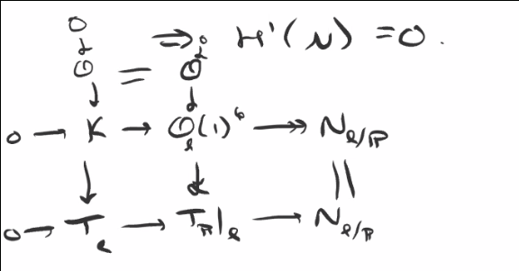

# Thursday April 9th

Let $F: \art/k \to \sets$ be a deformation functor with an obstruction theory.
Then H1-H3 imply the existence of a miniversal family, and gives us some control on the hull $h_R \to F$, namely
\begin{align*}
\dim \def(F) \geq \dim R \geq \dim \def(F) - \dim \obs(F)
.\end{align*}

In particular, if $\obs(F) = 0$, then $R \cong k[[\def(F)\dual]] = k[[ t_F\dual ]]$.

Example:
Let $M = \hilb_{\PP^n/k}^{dt + (1-g)}$ where $k=\bar k$, and suppose $[Z] \in M$ is a smooth point.

Then $\def = \hom_{\OO_x\dashmod}(I_Z, \OO_Z) = \hom_Z(I_Z/I_Z^2, \OO_Z) = H^0(N_{Z/X})$ the normal bundle $N_{Z/X} = (I/I^2)\dual$ of the regular embedding, and $\obs = H^1(N_{Z/X})$.

Claim: If $H^1(\OO_Z(1)) = 0$ (e.g. if $d > 2g-2)$ then $M$ is smooth.

Proof:
The tangent bundle of $\PP^n$ sits in the Euler sequence
\begin{align*}
0 \to \OO \to \OO(1)^{n+1} \to T_{\PP^n} \to 0
.\end{align*}

And the normal bundles satisfies
\begin{align*}
0 \to T_Z \to T_{\PP^n}\mid_Z \to N_{Z/\PP^n} \to 0
.\end{align*}

which is the dual of
\begin{align*}
0 \to I/I^2 \to \Omega \mid_Z \to \Omega \to 0
.\end{align*}

and there is another SES:
\begin{align*}
?????
.\end{align*}

Taking the LES in cohomology yields

\begin{align*}
H^1(\OO_Z(1)^{n+1})=0 \to H^1(N_{Z/\PP^n}) =0 \to 0
.\end{align*}

and thus $M$ is smooth at $[Z]$.

We can compute the dimension using Riemann-Roch:

\begin{align*}
\dim_{[Z]} M = \dim H^0(N_{Z/\PP^n}) \\
= \chi(N_{Z/\PP^n}) \\
= \deg N + \rk N(1-g) \\
= \deg T_{\PP^n} \mid _Z - \deg T_Z + (n-1)(1-g) \\
= d(n+1) + (2-2g) + (n-1)(1-g)
.\end{align*}

This is one of the key outputs of obstruction theory: being able to compute these dimensions.

Example:
Let $X \subset \PP^5$ be a smooth cubic hypersurface and let $H = \hilb_{X/k}^{\text{lines} = t+1} \subset \hilb_{\PP^5/k}^{t+1} = \Gr(1, \PP^5)$, the usual Grassmannian.

Claim
: Let $[\ell] \in H$, then the claim is that $H$ is smooth at $[\ell]$ of dimension 4.

Proof:

We have

- $\def = H^0(N_{\ell/X})$
- $\obs = H^1(N_{\ell/X})$

We have }n exact sequence
\begin{align*}
0 \to N_{\ell/X} \to N_{\ell/\PP} \to N_{X/\PP}\mid_\ell \to 0 \\
.\end{align*}

There are surjections from $\OO_\ell(1)^6$ onto the last two terms.

Subclaim:
For $N = N_{\ell/\PP}$ or $N_{X/\PP}\mid_\ell$, we have $H^1(N) = 0$ and $\OO(1)^6 \surjects N$ is surjective on global sections.

Proof
: Because $\ell$ is a line, $\OO_\ell(1) = \OO(1)$ and $H^1(\OO_\ell(1)) = 0$ and the previous proof applies, so $H^1(N) = 0$.

We have a diagram:

In particular, $\T_\ell = \OO(2)$, and the LES for $0 \to \OO \to K \to T_\ell$ shows $H^1(K) = 0$.
Looking at the horizontal SES $0 \to K \to \OO_\ell(1)^6 \surjects N_{\ell/\PP}$ yields the surjection claim.
