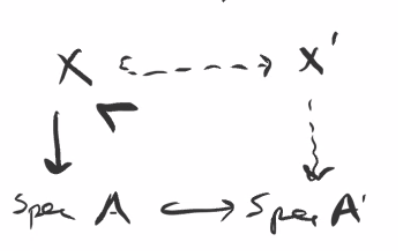
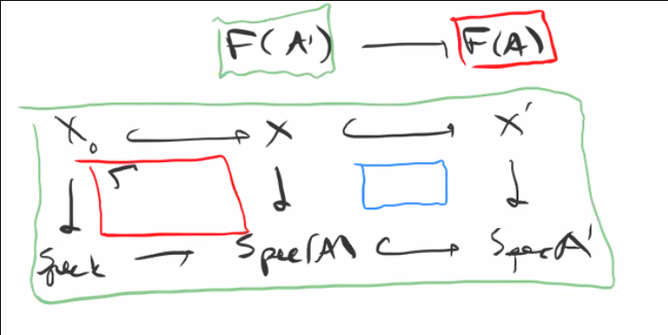

# Tuesday April 14th

Recall that we are looking at $X_0/k$, $F: \art/k \to \sets$ where $A$ is sent to $X/A$ flat with $i: X_0 \injects X$ where $i\tensor k$ is an isomorphism.
The second condition is equivalent to a cartesian diagram
\begin{center}
\begin{tikzcd}
X_0 \ar[r, hook]\ar[d] & X \ar[d] \\
\spec k \ar[r, hook] & \spec A
\end{tikzcd}
\end{center}

We showed we always have H1 and H2, and H3 if $X_0/k$ is projective or $X_0$ is affine with isolated singularities.
In this situation we have a miniversal family.

This occurs iff for $A' \to A$ a small thickening and $(X_0 \injects X) \in F(A)$, we have a surjection
\begin{align*}
\Aut_{A'}(X_0 \injects X') \surjects \Aut_A(X_0 \injects X)
.\end{align*}

where the RHS are automorphisms of $X/A$, i.e. those which commute with the identity on $A$ and $X_0$.

We had a naive functor $F_n$ where we don't include the inclusion $X_0 \injects X$.
When $F$ has a hull then the naive functor has a versal family, since there is a forgetful map that is formally smooth.

If it's the case that for all $A' \to A$ small and $F_{\text{n}} \to F_n(A)$ we have $\Aut_{A'}(X') \surjects \Aut_A (X)$, then $F = F_n$ and both are pro-representable.
The forgetful map is smooth because given $X/A$ in $F_n(A)$, we have some inclusion $X_0 \injects X$, so one gives surjectivity.
Using the surjectivity on automorphisms, we get
\begin{center}
\begin{tikzcd}
X_0\ar[rd, hook] \ar[rr, hook] & & X\ar[ld, dotted] \\
& X & 
\end{tikzcd}
\end{center}

Deformation theory is better at answering when the following diagrams exist:

\

i.e., the existence of an extension of $X$ to $A'$.
This is different than understanding diagrams of the following type

\

where we're considering isomorphism classes of the squares, and deformation theory helps understand the blue one.

Example:
Hypersurface singularities.

Take $S = k[x, y]$ and $B = S/(f)$, then deformations of $\spec B$ to ?

Given $k \to k[\eps] \to k$ we can tensor to obtain

> For flat maps, tensoring up to an isomorphism implies isomorphism.

