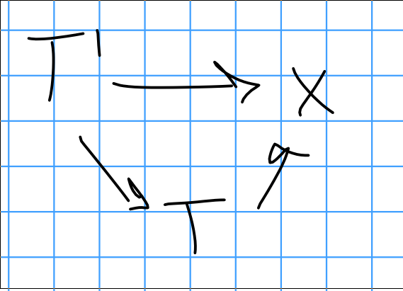

# Thursday January 9th

Last time:
Fix an $S\dash$scheme, i.e. a scheme over $S$.

Then there is a map

\begin{align*}
\mathrm{Sch}/S &\to \mathrm{Fun}( \mathrm{Sch}/S^{op}, Sets )\\
x &\mapsto h_x(T) = \hom_{Sch/S}(T, x)
.\end{align*}

where $T' \mapsvia{f} T$ is given by 

\begin{align*}
h_x(f): h_x(T) \to h_x(T') \\\
T \maps to x &\to \text{triangles}
\end{align*}

of the form

Lemma (Yoneda):
$\hom_{Fun}(h_x, F) = F(x)$.

Corollary:
$\hom_{Sch/S}(x, y) \cong \hom_{fun}(h_x, h_y)$.

Definition:
A moduli functor is  amap

\begin{align*}
F: (Sch/S)^{op} \to \mathrm{Sets} \\
F(x) &= \text{ "Families of something over $x$" } \\
F(f) &= \text{"Pullback"}
.\end{align*}

A *moduli* space for that "something" appearing above is an $M \in \mathrm{Obj}(Sch/S)$ such that $F \cong h_M$.

Now fix $S = \spec(k)$.

Remarks:

> $h_m$ is the functor of points over $M$

1. $h_m(\spec(k)) = M(\spec(k)) \cong$ "families over $\spec k$" $= F(\spec k)$.
2. $h_M(M) \cong F(M)$ are families over $M$, and $\id_M \in \mathrm{Mor}_{Sch/S}(M, M) = \xi_{Univ}$ is the universal family
3. Every family is uniquely the pullback of $\xi_{Univ}$ 

> This makes it much like a classifying space.

For $T\in Sch/S$,

\begin{align*}
h_M \mapsvia{\cong} F \\
f\in h_M(T) \mapsvia{\cong} F(T) \ni \xi = F(f)(\xi_{Univ})
.\end{align*}

where $T\mapsvia{f} M$ and $f = h_M(f)(\id_M)$.

4. If $M$ and $M'$ both represent $F$ then $M \cong M'$ up to unique isomorphism.

\begin{tikzcd}
\xi_M              &  & \xi_{M'} \\
M \arrow[rr, "f"]  &  & M'       \\
                   &  &          \\
M' \arrow[rr, "g"] &  & M        \\
\xi_{M'}           &  & \xi_M   
\end{tikzcd}

which shows that $f, g$ must be mutually inverse by using universal properties.

Example:
A length 2 subscheme of $\AA^1_k$ then $F(S) = \theset{ V(x^2 + bx + c) \subset \AA_5'$ where $b, c \in \mathcal O_s(s) }$, which is funtorially bijective with $\theset{b, c \in \mathcal O_s(s)}$ and $F(f)$ is pullback.

Then $F$ is representable by $\AA_k^2(b, c)$ and the universal object is given by $V(x^2 + bx + c) \subset \AA^1(?) \cross \AA^2(b, c)$ where $b, c \in k[b, c]$.
