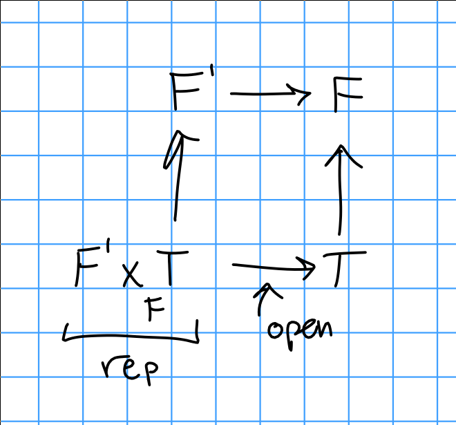
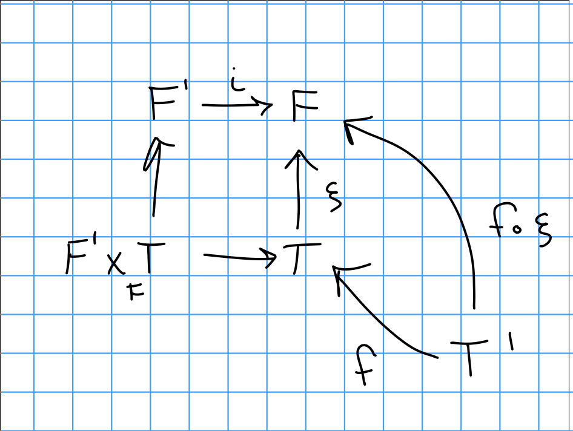
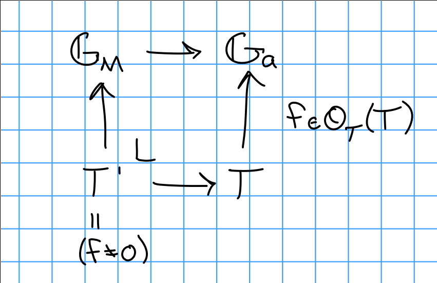
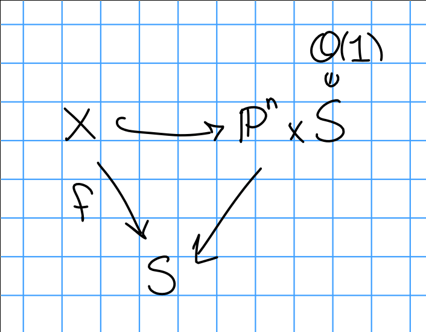

# Thursday January 16th

Subfunctors:

A functor $F' \subset F: (\Sch/S)^{op} \to \Sets$ is open iff for all $T \mapsvia{\xi} F$ where $T = h_T$ and $\xi \in F(T)$.
We can take fiber products:

So we can think of "inclusion in $F$" as being an open condition: for all $T/S$ and $\xi \in F(T)$, there exists an open $U \subset T$ such that for all covers $f: T' \tp T$, we have $F(f)(\xi) = f^*(\xi) \in F'(T')$ iff $f$ factors through $U$.

Suppose $U \subset T$ in $\Sch/T$,  we then have

\begin{align*}
h_{U/T}(T') = \begin{cases}
\emptyset & T' \to T \text{ doesn't factor } \\
\pt & \text{otherwise}
\end{cases}
.\end{align*}

which follows because the literal statement is $h_{U/T}(T') = \hom_T(T', U)$.

By the definition of the fiber product, $(F' \cross_F T)(T') = \theset{ (a,b) \in F'(T) \cross T(T) \suchthat \xi(b) = \iota(a) \text{ in  } F(T)}$, where $F' \mapsvia{\iota} F$ and $T \mapsvia{\xi} F$.

So note that the RHS diagram here is exactly given by pullbacks, since we identify sections of $F/T'$ as sections of $F$ over $T/T'$ (?).

We can thus identify $(F' \cross_F T)(T') = h_{U/S}(T')$, and so for $U \subset T$ in $\Sch/S$ we have $h_{U/S} \subset h_{T/S}$ is the functor of maps that factor through $U$.
We just identify $h_{U/S}(T') = \hom_S(T', U)$ and $h_{T/S}(T') = \hom_S(T', T)$.

Example: $GG_m, \GG_a$.
$\GG_a$ represents giving a global function, $\GG_m$ represents giving an invertible function.

Where $\mathcal O_T(T))$ are global functions.

## Actual Geometry: Hilbert Schemes

> The best moduli space!

Want to parameterize families of subschemes over a fixed object.
Fix $k$ a field, $X/k$ a scheme; we'll parameterize subschemes of $X$.

Definition:
The hilbert functor is given by

\begin{align*}
\Hilb_{X/S}: (\Sch/S)^{op} \to \Sets
.\end{align*}

which sends $T$ to closed subschemes $Z \subset X \cross_S T \to T$ which are flat over $T$.

> Here flatness replaces the Cartier condition.

Recall (flatness):
For $X \mapsvia{f} Y$ and $\FF$ a coherent sheaf on $X$, $f$ is flat over $Y$ iff for all x\in X$ the stalk $F_x$ is a flat $\mathcal O_{y, f(x)}\dash$module.
Note that $f$ is flat if $\mathcal O_x$ is.

> Flatness corresponds to varying continuously.

**Warning**:
Unless otherwise stated, assume schemes are Noetherian.

> Note that everything works out if we only path with finite covers.

Remark:
If $X/k$ is projective, so $X \subset \PP^n_k$, we have line bundles $\mathcal{O}_x(1) = \mathcal{O}_1$.
For any sheaf $F$ over $X$, there is a hilbert polynomial $P_F(n) = \chi(F(n)) \in \ZZ[n]$.
( i.e. we twist by $\mathcal O(1)$ $n$ times.)
The cohomology of $F$ isn't change by the pushforward into $\PP_n$ since it's a closed embedding, i.e. $\chi(X, F) = \chi(\PP^n, i_* F) = \sum (-1)^i \dim_k H^i(\PP^n, i_* F(n))$.

First fact:
For $n \gg 0$, $\dim_k H^0 = \dim M_n$, the $n$th graded piece of $M$, which is a graded module over the homogeneous coordinate ring whose $i_*F = \tilde M$.

In general, for $L$ ample of $X$ and $F$ coherent on $X$, we can define a hilbert polynomial $P_F(n) = \chi(F\tensor L^n)$.

This is an invariant of a polarized projective variety, and in particular subschemes.
Over irreducible bases, flatness corresponds to this invariant being constant.

Proposition:
For $f:X\to S$ projective, i.e. there is a factorization:

If $S$ is reduced, irreducible, locally Noetherian, then $f$ is flat iff $P_{\mathcal{O}_{x_s}}$ is constant for all $s\in S$.
(To be more precise, look the base change to $X_1$, and the pullback of the fiber? $\mathcal{O}\mid_{x_i}$?)

> Note: not using the word "integral" here!
> $S$ is flat iff the hilbert polynomial over the fibers are constant.

Example:
The zero-dimensional subschemes $Z \in \PP^n_k$, then $P_Z$ is the length of $Z$, i.e. $\dim_k(\mathcal O_Z)$.
And $P_Z(n) = \chi(\mathcal O_Z \tensor \mathcal O(n)) = \chi(\mathcal O_Z) = \dim_k H^0(Z; \mathcal O_Z) = \dim_k \mathcal{O}_Z(Z)$.

For two closed points in $\PP^2$, $P_Z = 2$.

Consider the affine chart $\AA^2 \subset \PP^2$, which is given by $\spec k[x, y]/(y, x^2) \cong k[x]/(x^2)$ and $P_Z = 2$.
I.e. in flat families, it has to record how the tangent directions come together.

Example:
Consider the flat family $xy = 1$ (flat because it's an open embedding) over $k[x]$, here we have points running off to infinity.

Proof of proposition:
Assume $S = \spec A$ for $A$ a local Noetherian domain.

