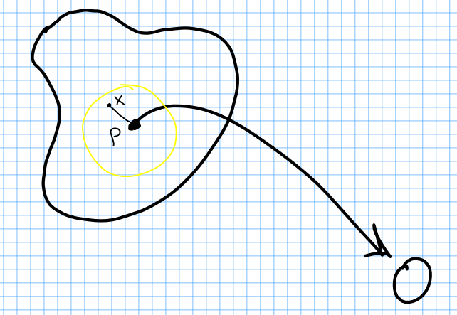
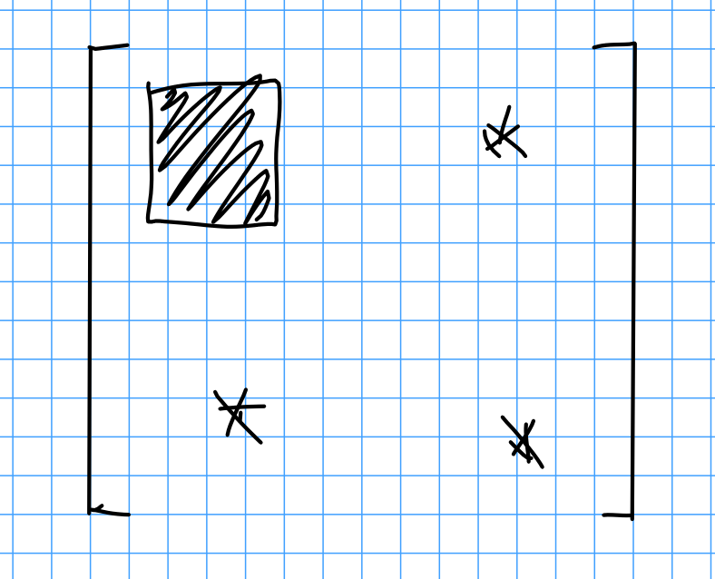

# Thursday January 9th

**Recall:**
For $M^n$ a closed smooth manifold, consider a smooth map $f: M^n \to \RR$.

**Definition:**
A critical point $p$ of $f$ is *non-degenerate* iff $\det( H\definedas \frac{\del^i f}{\del x_i \del x_j}(p)) \neq 0$ in some coordinate system $U$.

**Lemma (The Morse Lemma)**:
For any non-degenerate critical point $p$ there exists a coordinate system around $p$ such that

\begin{align*}
f(x_1, \cdots, x_n) = f(p) - x_1^2 - x_2^2 - \cdots - x_\lambda^2 + x_{\lambda+1}^2 + \cdots + x_n^2
.\end{align*}

$\lambda$ is called the *index of $f$ at $p$*.

**Lemma:**
$\lambda$ is equal to the number of *negative* eigenvalues of $H(p)$.

*Proof:*
A change of coordinates sends $H(p) \to A^t H(p) A$, which (exercise) has the same number of positive and negative values.

> Exercise: show this assuming that $A$ is invertible and not necessarily orthogonal.

This means that $f$ can be written as the quadratic form

\begin{align*}
\left[\begin{array}{cc}
-2  & 0  & 0       & 0    & 0 \\
0   & -2 & 0       & 0    & 0 \\
0   & 0  & \ddots  &  0   & 0 \\
0   & 0  & 0       &  2   & 0 \\
0   & 0  & 0       &  0   & 2 \\
\end{array}\right]
.\end{align*}

*Proof of Morse Lemma:*

Suppose that we have a coordinate chart $U$ around $p$ such that $p\mapsto 0\in U$ and $f(p) = 0$.

**Step 1 -- Claim:**
There exists a coordinate system around $p$ such that 

\begin{align*}
f(x) = \sum_{i,j=1}^n x_i x_j h_{ij}(x)
,\end{align*}

where $h_{ij}(x) = h_{ji}(x)$.

*Proof:*
Pick a convex neighborhood $V$ of $0\in \RR^n$.

\

Restrict $f$ to a path between $x$ and $0$, and by the FTC compute

\begin{align*}
I = \int_0^1 \frac{df(tx_1, tx_2, \cdots, tx_n) }{dt}  ~dt = f(x_1, \cdots, x_n) - f(0) = f(x_1, \cdots, x_n)
.\end{align*}

since $f(0) = 0$.

We can compute this in a second way,
\begin{align*}
I = \int_0^1 \dd{f}{x_1} x_1 + \dd{f}{x_2} x_2 + \cdots \dd{f}{x_n} x_n ~dt 
\implies \sum_{i=1}^n x_i \int_0^1  \dd{f}{x_i} ~dt = f(x)
.\end{align*}

Morse Function

We thus have $f(x) = \sum_{i=1}^n x_i g_i(x)$ where $\dd{f}{x_i}(0) = 0$,
and $\dd{f}{x_i} = x_1 \dd{g_1}{x_i} + \cdots + g_i + x_i \dd{g_i}{x_i} + \cdots + x_n \dd{g_n}{x_i}$.

When we plug $x = 0$ into this expression, the only term that doesn't vanish is $g_i$, and thus $\dd{f}{x_i}(0) = g_i(0)$ and $g_i(0) = 0$.

Applying the same result to $g_i$, we obtain $g_i(x) = \sum_{j=1}^n x_j h_{ij}(x)$, and thus $f(x)  = \sum_{i, j =1}^n x_i x_j h_{ij}(x)$.

We still need to show $h$ is symmetric. 
For every pair $i, j$, there is a term of the form $x_i x_j h_{ij} + x_j x_i h_{ji}$.
So let $H_{ij}(x) = \frac{h_{ij}(x) + h_{ji}(x)}{2}$ (i.e. symmetrize/average $h$), then $f(x) = \sum_{i, j = 1}^n x_i x_j H_{ij}(x)$ and this shows claim 1.

$\qed$

**Step 2 -- Induction:**
Assume that in some coordinate system $U_0$,

\begin{align*}
f(y_1, \cdots, y_n) = \pm y_1^2 \pm y_2^2 \pm \cdots \pm y_{r-1}^2 + \sum_{i, j \geq r} y_i y_j H_{ij}(y_1, \cdots, y_n)
.\end{align*}

Note that $H_{rr}(0)$ is given by the top-left block of $H_{ij}(0)$, which thus looks like

\

