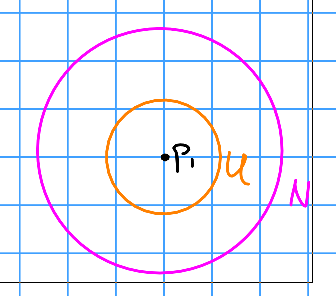

# Thursday January 16th

Theorem:
Let $f: M \to \RR$ be morse with critical points $p_1, \cdots, p_k$.
Then $f$ can be approximated by a morse function $g$ such that 

1. $g$ has the same critical points of $f$
2. $g(p_i) \neq g(p_j)$ for all $i\neq j$.

> Idea: Change $f$ gradually near critical points without actually changing the critical points themselves.

Proof:
Suppose $f(p_1) = f(p_2)$.

Choose $\bar U \subset N$ open neighborhoods of $p_1$ such that $\bar N$ doesn't contain $p_i$ for any $i$ except for 1.
Note that this is possible because the critical points are isolated.

Choose a bump function $\lambda \equiv 1$ on $U$ and $0$ on $M\setminus N$.
Now let $f_1 = f + \varepsilon \lambda$, where we'll see how to choose $\varepsilon$ small enough soon.

Let $K \definedas \theset{ x \suchthat 0 < \lambda(x) < 1 }$, which is compact.

Pick a Riemannian metric on $M$, then we can talk about gradients.
Recall that $\grad f$ is the vector field that satisfies $\inner{X}{f}$ for all vector fields $X$ on $M$.
Because $f$ has no critical points in $K$, $X(f)$ is nonzero for some field $X$, so $\grad f$ is nonzero, noting that $\grad f$ is only zero at the critical points of $f$.

In particular, on $K$ we have $0 < c \leq \abs{\grad f}$ for some $c$, and $\grad \lambda \leq c'$ for some $c'$.
So pick $0 < \varepsilon  < c'/c$ such that $f_1(p_1) \neq f_1(p_2)$, $f_1(p_1) = f(p_1) + \varepsilon$, and$f_1(p_i) = f(p_i)$ for all $i\neq 1$.
Note that this is possible because there are only finitely many points, so almost every $\varepsilon$ will work.

**Claim 1:**
The critical points of $f_1$ are exactly the critical points of $f$.

In $K$, we have
\begin{align*}
\grad f_1 = \grad f + \varepsilon \grad \lambda \implies \abs{\grad f_1} \geq \abs{\grad f} - \varepsilon \abs{\grad \lambda} \geq x - \varepsilon c' > 0
.\end{align*}

If $x\not\in K$, we have

1. $x\in U$, or
2. $x\in M\setminus N$

In case 1, $\lambda$ is constant and $\grad \lambda = 0$, so $\grad f_1 = \grad f$.
In case 2, $\lambda$ is again constant, so the same conclusion holds.

$\qed$

**Claim 2:**
$f_1$ is morse.

Proof:
In a neighborhood of $p_1$, we have $f_1 \equiv f + \varepsilon$.
In a neighborhood of $p_i$, we have $f_1 \equiv f$.

We can then check that $J_{f_1}(p_i) = J_f(p_i)$, and since $f$ is morse, $f_1$ is morse as well.

$\qed$

Recall that this lets us put an order on $f(p_i)$.
