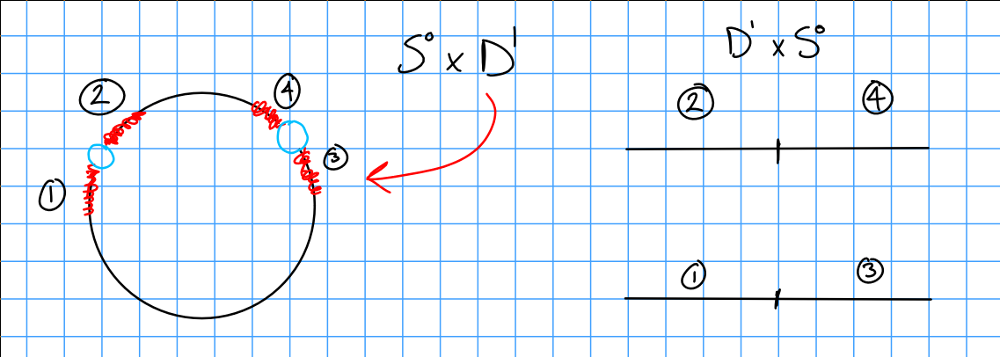
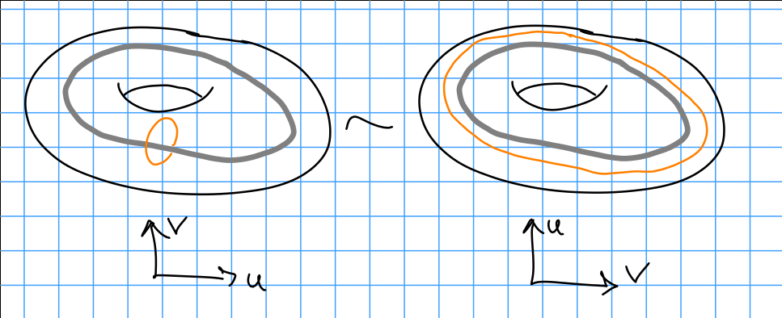

# Elementary Cobordism

Recall that an elementary cobordism is a cobordism that has a Morse function with exactly one critical point.

Definition:
An $n\dash$dimensional $\lambda\dash$handle is a copy of $D^{\lambda} \times D^{n-\lambda}$ which is attached to $\bd M^n$ via an embedding $\phi: \bd D^\lambda \cross D^{n-\lambda} \injects \bd M$.

Example:
Let $\lambda = 1, n = 2, n-\lambda = 1$ and take $M^2 = D^2$ and we attach $D^1 \cross D^1$.
Note that there's not necessarily a smooth structure on the resulting manifold, so we can "smooth corners":

Example:

> Note: the above is just a homeomorphism.

Definition:
Let $M$ be an $n-1$ dimensional smooth manifold, and $\rho: S^{\lambda-1} \cross D^{n-\lambda} \injects $M^{n-1}$ be an embedding.

Then noting that $\bd D^{n-\lambda} = S^{n-\lambda-1$, consider the space

\begin{align*}
X(M, \phi) = (M\setminus \rho(S^{\lambda-1} \cross \theset{0}) ) \cross (D^\lambda \cross S^{n-\lambda-1}) / \generators{ \rho(u, tv) \sim (tu, v) \suchthat t\in (0, 1), \forall u\in S^{\lambda-1}, \forall v\in S^{n-\lambda-1} }
,\end{align*}

where we note that we can parameterize $D^{n-\lambda} = tv$ where $v$ is a point on the boundary.

Note that this accomplishes the goal of smoothing, and is referred to as surgery (of type $\lambda, n-\lambda$) on $M$ along $\phi$.

Example:

Example:
$n-1 = 3$ and $\lambda = 2$ implies $\lambda-1 = 1$, and take $\rho: S^1 \cross D^2 \to S^3$, which has image a tubular neighborhood of a knot.
Then $\phi(S^1 \cross\theset{0}) = K$ for some knot, and $(S^3\setminus K) \disjoint (D^2 \cross S^1) / \cdots$.
Then note that $\bd \phi(\theset{u} \cross D^2) = \theset{u}\cross S^1$, which no longer bounds a disk since we have removed the core of tube.

Theorem:
Suppose $M' = X(M, \rho)$ is obtained from $M$ by surgery of type $\lambda$. 
Then there exists an elementary cobordism $(W; M, M')$ with a Morse function $f: W \to [-1, 1]$ with only one index $\lambda$ critical point.
