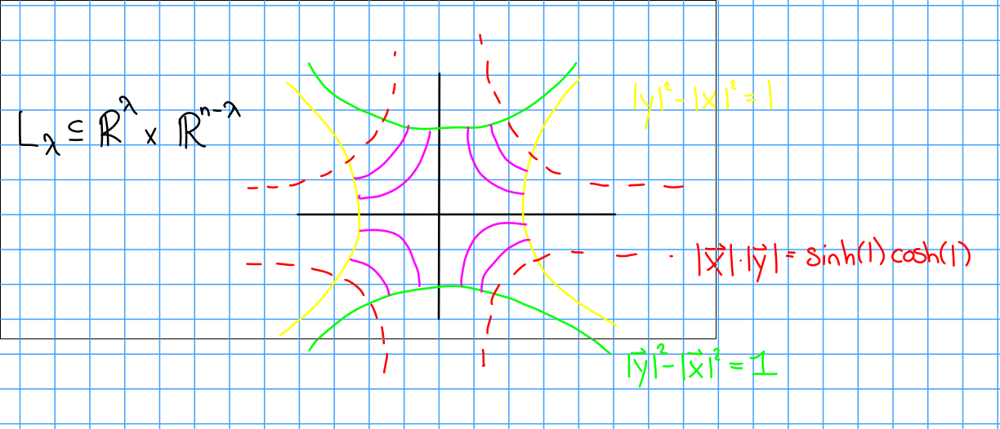
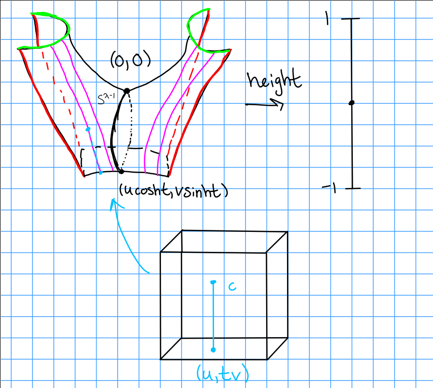
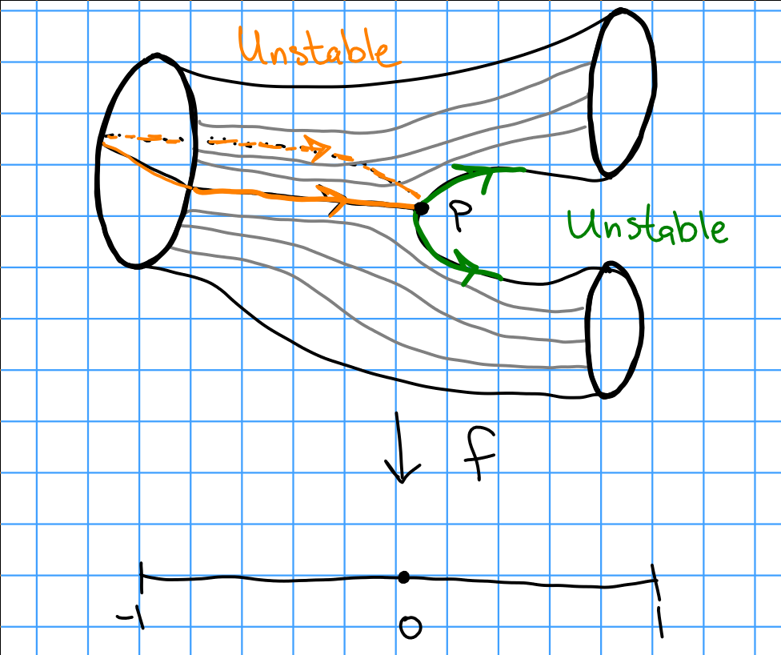

# Thursday January 23rd

Recall from last time:
$M$ is a closed smooth $n-1$ manifold and $\phi: S^{\lambda - 1} \cross D^{n-\lambda} \injects M$, and we used surgery to obtain $\chi(M, \phi)$ and a cobordism $W(M, \phi)$ from $M$ to $\chi(M, \phi)$.

This yields a saddle $L_\lambda \subseteq \RR^n = \RR^{\lambda} \cross \RR^{n - \lambda}$.
We construct the cobordism using

\begin{align*}
S^{\lambda - 1} \cross D^{n-\lambda} &\to \bd_L \\
(u, tv) &\mapsto (u\cosh t, v\sinh t)
.\end{align*}

This yields

\begin{align*}
M\setminus \theset{\phi{S^{\lambda - 1} \cross \theset{0} }} \disjoint L_\lambda 
/ \generators{(u, tv)\cross c \sim (\vector x, \vector y) \suchthat \norm{x}^2 + \norm{y}^2 = c, x, y \\ 
\text{ are on curve that starts from } (u\cosh t. v\sinh t)  }
.\end{align*}

\

\

> Todo: review!

Suppose $W(; M_0, M_1)$ is an elementary cobordism and $f: W \to [-1, 1]$ is a Morse function with one critical point $p$, and $\xi$ a gradient-like vector field for $f$.

The goal is to construct $\phi_L: S^{\lambda - 1} \cross D^{n-\lambda} \injects M_0$, the characteristic embedding.

Let $\psi_x$ be the integral curve of $\xi$ such that $\psi_x(0) = x$, and define $W^s(p) = \theset{x\in W \suchthat \lim_{t\to\infty} \psi_x(t) = p}$ to be the stable manifold, and $W^u(p) = \theset{x\in W \suchthat \lim_{t\to -\infty} \psi_x(t)= p}$.

Claim:
$W^s(p), W^u(p)$ are diffeomorphic to disks of dimension $\lambda$ and $n-\lambda$ respectively.

\

Moreover, $\bd W^s(p) = W^s(p) \intersect M_0 \cong S^{\lambda - 1}$ (Milnor refers to this as the "left sphere" $S_L$ and $\bd W^u(p) = W^u(p) \intersect M_1 = S^{n - \lambda - 1}$ (the "right sphere" $S_R$).

