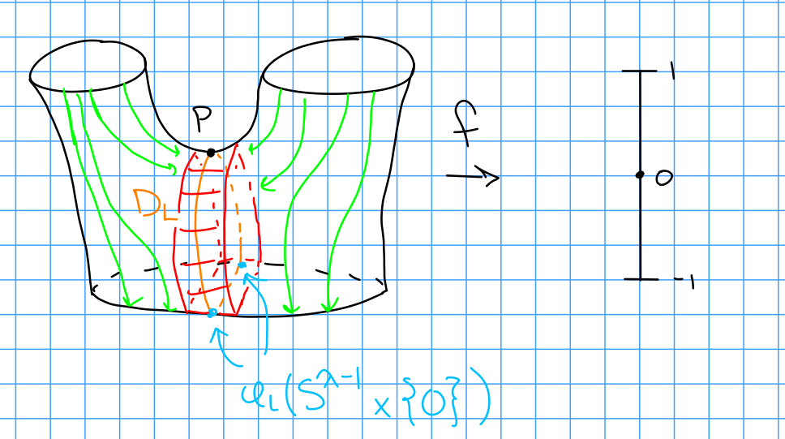
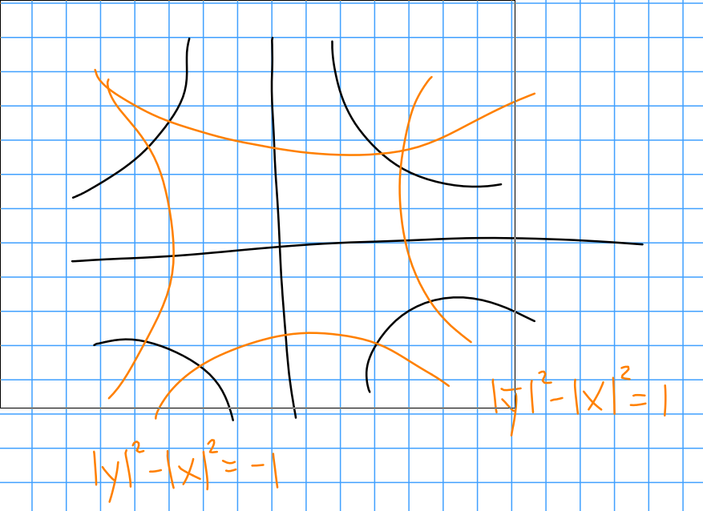
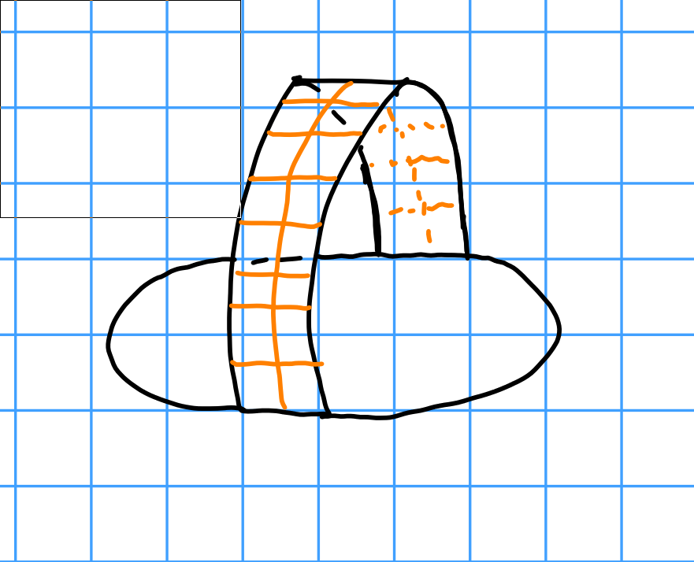
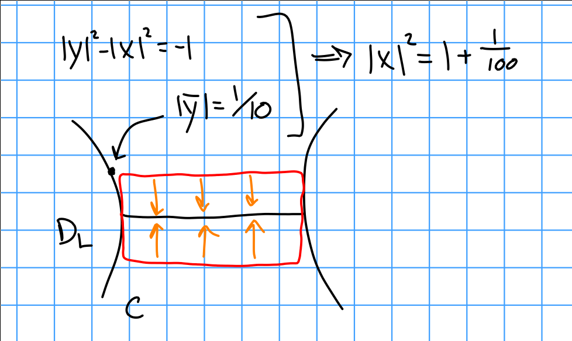

# Tuesday January 28th

Setup:
Fix an elementary cobordism $(W; M_0, M_1)$, a Morse function $f: W\to [-1, 1]$ with exactly one critical point $p$ with index $\ind_(p) = \lambda$.
This yields a gradient-like vector field $\xi$, and $D_L = W^s(p) = \theset{x\in W \suchthat \lim_{t\to\infty} \psi_x(t) = p}$ the stable manifold.

**Theorem:**
$W \cong M_0 \union D_L$, a $\lambda$ dimensional disk, is a homotopy equivalence.
More precisely, there is a deformation retract.

Proof:
Take the characteristic embedding $\phi_L: S^{\lambda - 1} \cross OD^{n-\lambda} \injects M_0$.
We have a cobordism $(W(M_0, \phi_L); M_0, \chi(M_0, \phi_L)) \cong (W; M_0, M_1)$.

Recall that the LHS is constructed via $(M_0 \setminus \phi(S^{\lambda-1} \cross 0)) \cross D_1 \disjoint L_\lambda / \sim$.

Retraction 1:
$W(M_0, \phi_L) \mapsvia{r_t} M_0 \union C$.
We'll construct this retraction.
This follows the green integral curves to retract onto the red.

\

Identify $D_L = \thset{(\vector x, \vector 0)} \subset L_\lambda$ in the local picture:

\

Define $C = \theset{(\vector x, \vector y) \suchthat \norm{\vector y} \leq \frac 1 {10}}$.

Choose $(Z, c)$ such that $z\in M_0 \setminus \phi_L( S^{\lambda-1} \cross OD^{n-\lambda}  )$ and $c\in [-1, 1]$.
Let $r_t(z, c) = (z, c + t(-1-c))$, note what happens at $t=-1, 1, 0$.

We can parameterize the integral curves in the local picture as $(\vector x/r, r\vector y)$.

So for $(\vector x, \vector y) \in L_\lambda$, we can define

\begin{align*}
r_t(\vector x, \vector y) =
\begin{cases}
(\vector x, \vector y) & \norm{\vector y} \leq \frac 1 {10} \iff (\vector x, \vector y) \in C \\
? & ? \\
(\vector x/\rho(t), \rho(t) \vector y) & \norm{\vector y} \geq \frac{1}{10}
\end{cases}
.\end{align*}

where $\rho(t)$ is the solution of

\begin{align*}
\rho(t)^2 \norm{\vector y}^2 - \norm{\vector x}^2/\rho(t)^2 = \qty{ \norm{\vector y}^2 - \norm{\vector x}^2  }(1-t) - t \\
\rho(t) \norm{\vector y}^2 \geq \frac{1}{10} \implies \rho(t) \geq \frac{1}{10 \norm{\vector y}}
.\end{align*}

So we define $\rho(t) = \max(\text{positive solutions for the above equation}, \frac{1}{10\norm{\vector y}})$.

Retraction 2:
$M_0 \union C \mapsvia{r_t'} M_0 \union D_L$

\

We want the restriction of $r_t'$ to $M_0\setminus C$ to be the identity, so for $(\vector x, \vector y) \in C$ we define

\begin{align*}
r_t'(\vector x, \vector y) = 
\begin{cases}
(\vector x, (1-t) \vector y) & \norm{\vector x} \leq 1 \\
? & 1 \leq \norm{\vector x} \leq ?
\end{cases}
.\end{align*}

\
