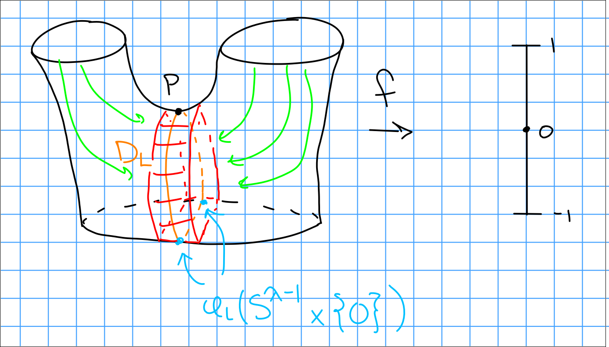

# Tuesday January 28th

Setup:
Fix an elementary cobordism $(W; M_0, M_1)$, a Morse function $f: W\to [-1, 1]$ with exactly one critical point $p$ with index $\ind_(p) = \lambda$.
This yields a gradient-like vector field $\xi$, and $D_L = W^s(p) = \theset{x\in W \suchthat \lim_{t\to\infty} \psi_x(t) = p}$ the stable manifold.

**Theorem:**
$W \cong M_0 \union D_L$, a $\lambda$ dimensional disk, is a homotopy equivalence.
More precisely, there is a deformation retract.

Proof:
Take the characteristic embedding $\phi_L: S^{\lambda - 1} \cross OD^{n-\lambda} \injects M_0$.
We have a cobordism $(W(M_0, \phi_L); M_0, \chi(M_0, \phi_L)) \cong (W; M_0, M_1)$.

Recall that the LHS is constructed via $(M_0 \setminus \phi(S^{\lambda-1} \cross 0)) \cross D_1 \disjoint L_\lambda / \sim$.

Retraction 1:
$W(M_0, \phi_L) \mapsvia{r_t} M_0 \unionc C$.
This follows the green integral curves to retract onto the red.

Identify $D_L = \thset{(\vector x, \vector 0)} \subset L_\lambda$ in the local picture
