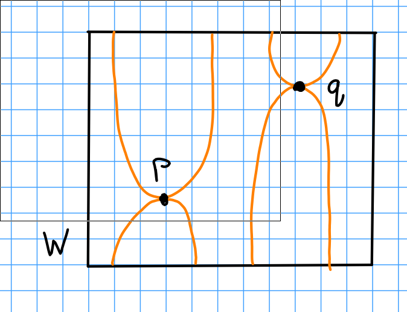
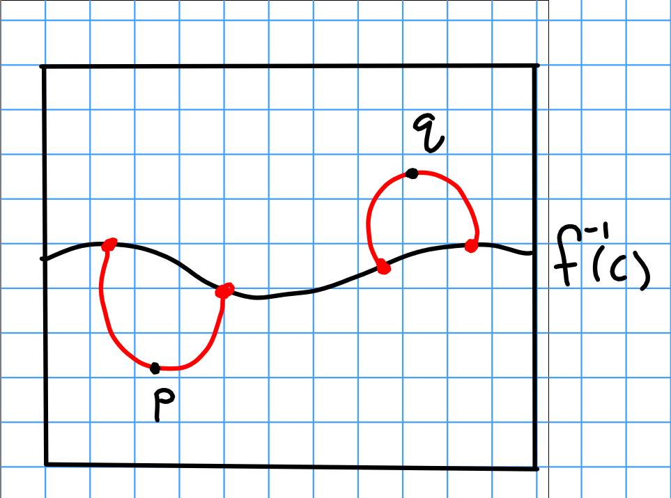
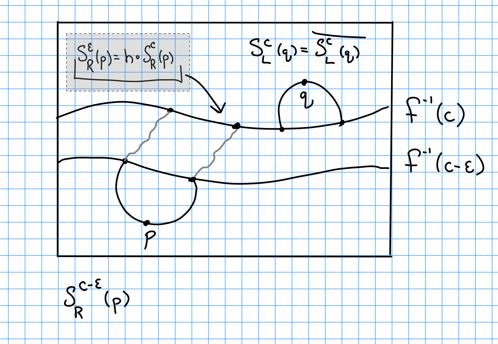

# Tuesday February 4th

Recall:
$f: W \to I$ Morse, $\crit(F) = \theset{p, q}$ where $f(p) < f(q)$, and $\xi$ a gradient-like vector field for $f$.

Theorem:
If $W^*(p) \intersect W^*(q) = \emptyset$ then for any $a, b\in (0 ,1)$ we can change $f$ "nicely" to a new Morse function $g$ such that $g(p) = a$ and $g(q) = b$.

\

Note that these are disjoint iff $W^u(p) \intersect W^s(q) = \emptyset$ iff $S_R^c(p) \intersect S_L^c(q) = \emptyset$.
If $\in(p) \geq \in (q)$ then $\dim S_R^c(p) = \dim S_L^c(q) < n-1 = \dim f\inv(c)$.

**Lemma 1:**
For $M^m, N^n \subset V^v$ submanifolds with $m+n < v$, there exists a diffeomorphism $h: V \to V$ smoothly isotopic to $\id_V$ such that $h(M) \intersect N = \emptyset$.

> I.e. low enough dimension submanifolds can smoothly be made disjoint.

**Lemma 2:**
Let $f: W\to I$ be Morse with gradient-like vector field $\xi$ and regular value $x\in (0, 1)$.
Let $h: f\inv (c) \to f\inv(c)$ be smoothly isotopic to the identity, and define $M \definedas f\inv(c)$.
Then we can change $\xi$ over $f\inv [c-\eps, c]\lambda$ to a new gradient-like vector field $\bar \xi$ such that if we let $\Phi: f\int(c-\eps) \tp M$ be the flow induced by $\xi$ and $\bar\Phi: f\inv(c-\eps) \to M$ be induced by $\bar \xi$.
Then $\bar \xi = h\circ \Phi$, and we have the following situation:

\

> Note that the left/right spheres are defined in terms of gradient-like vector fields, so "bar" here refers to a new gradient-like vector field.

Then picking $h$ from lemma 1, we can arrange so that $\bar S_L^c(q) \intersect \bar S_R^c(p) = \emptyset$

*Proof of lemma 2:*

We have $[c-\eps, c] \cross M \mapsvia{\phi} f\inv[c-\eps, c]$.
