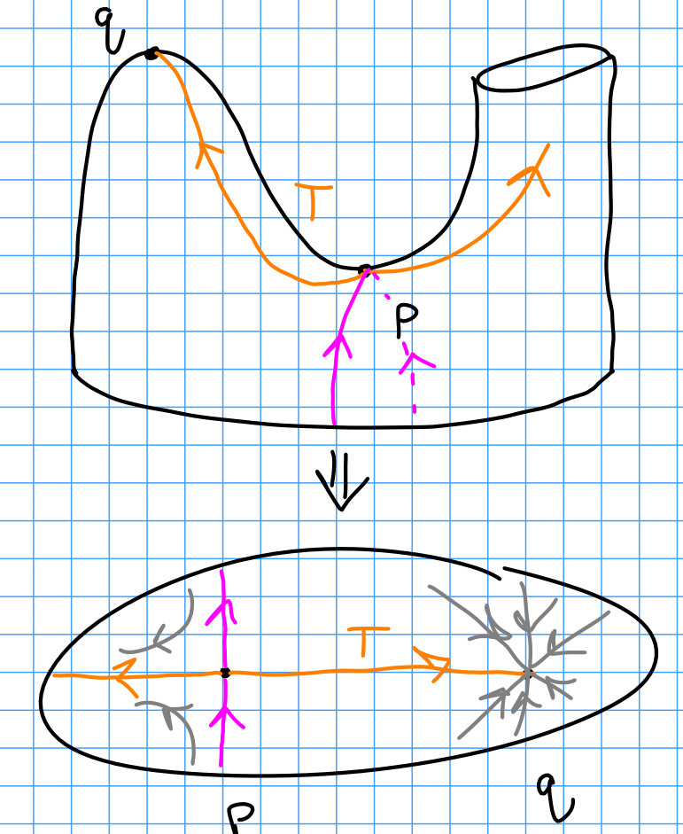
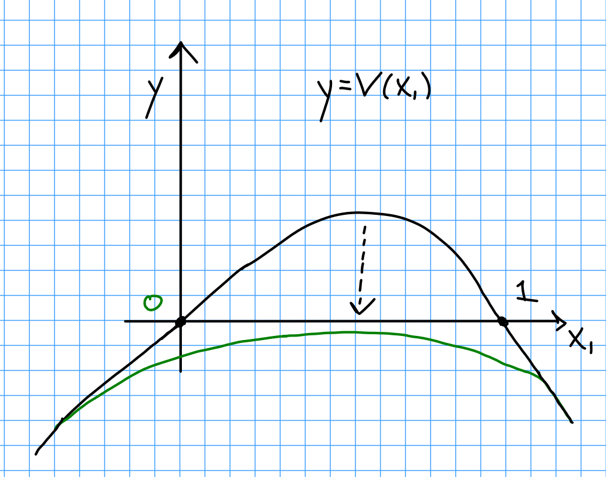
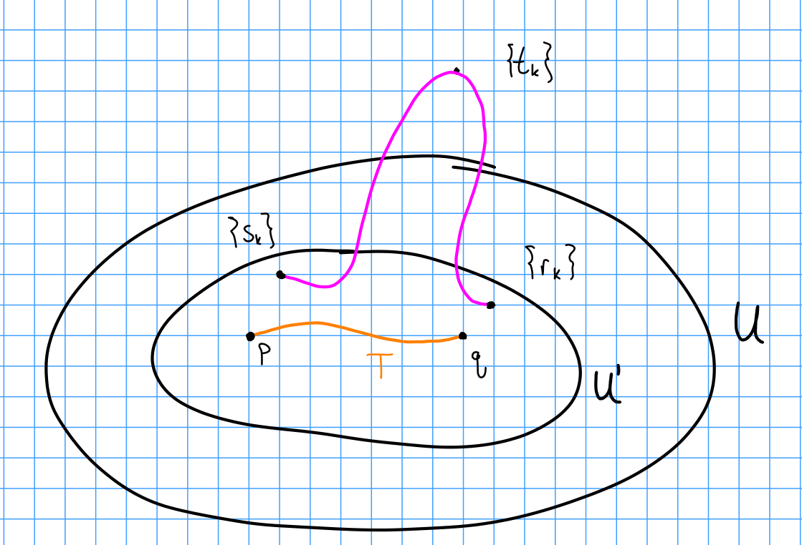

# Thursday February 6th

Cancellation:
Let $f: W \to I$ be Morse, $\crit(f) = \theset{p, q}$ with $f(p) < f(q)$ and $\ind(p) = \lambda,~\ind(q) = \lambda+1$.
Let $\xi$ be its gradient-like vector field, then $S_R^c(p) \intersect S_L^c(q) = \pt$, so there exists a unique integral curve $T$ from $p$ to $q$.

In this situation $W$ is diffeomorphic to the product cobordism.

We will show

**Theorem 1:**
We can change $\xi$ in a compact neighborhood of $T$ to get a nonvanishing vector field $\xi'$ for which the integral curves originate at $M_0$ and end at $M_1$.

Example:

\

Moreover, it takes a particularly nice standard form:

There exists a neighborhood $U_T$ and a coordinate chart $h: U_T \to \RR^n$ such that

1. $h(p) = (0, \cdots, 0)$ and $h(q) = (1, 0, \cdots, 0)$.

2. $h_* \xi = (V(x_1), -x_2, -x_3, \cdots, -x_{\lambda+1}, x_{\lambda+2}, \cdots, x_n)$.

3. $V(x)$ is smooth and positive over $(0, 1)$with $V(0) = V(1) = 0$, and $V(x) < 0$ everywhere else.

4. (Minor) $\abs{V'(0)} = \abs{V'(1)} = 1$.

Thus near $p$ we have $(x_1, -x_2, \cdots, -x_{\lambda+1}, x_{\lambda+2}, \cdots, x_n)$ and near $q$, we have $(-x_1, -x_2, \cdots, -x_{\lambda+1}, x_{\lambda+2}, x_n)$.

*Proof:*

*Step 1:*

Consider $(U(x_1, \rho), -x_2, -x_3, \cdots, -x_{\lambda+1}, x_{\lambda+2}, \cdots, x_n)$ where $\rho(\vector x) = (x_2^2 + x_3^2 + \cdots x_n^2)^{1/2}$, which measures the distance between the two curves above.
Some facts:

1. $U(x_1, \phi)$ is equal to $V(x_1)$ outside of a compact neighborhood of $h(T)$ in $h(U_T)$.

2. $U(x_1, 0) < 0$ for all $x_1$.

Then $\xi' = h_*(u, -x_2, \cdots, x_n)$ in $U_T$ and $\xi' = \xi$ everywhere else.
Thus $\xi'$ is nowhere vanishing.

*Step 2:*

We want to pick $U'$ such that $T\subset U' \subset \bar U \subset U_T$ where $\bar U$ is a compact set such that any trajectory of $\xi$ that exits $U$ never re-enters $U'$.

\

Suppose such a $U'$ does not exist.
Then there exist sequences of points $\theset{s_k}, \theset{r_k} \subset U$ and $\theset{t_k} \subset W\setminus U$.
