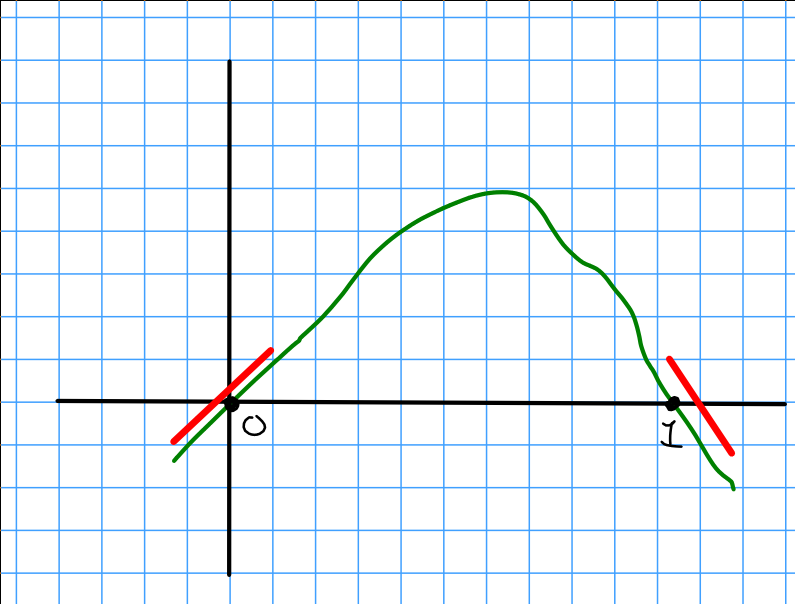
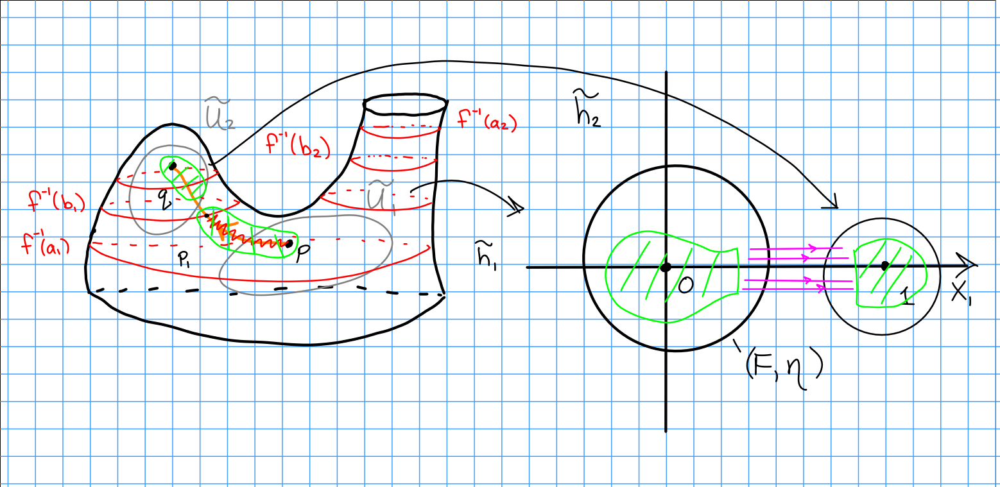

# Tuesday February 11th

## Cancellation

The setup:
$f: W \to [0, 1]$ a morse function with $\crit(f) = \theset{p, q}$ with $\ind(p) = \lambda$ and $\ind(q) = \lambda + 1$, with a gradient-like vector field $\xi$ such that there exists a *single* flow line $T$ from $p$ to $q$.

Lemma:
There exists a gradient-like vector field $\xi'$ for $f$ such that

1. $T$ is still the single flow line from $p$ to $q$.
2. $\xi'$ is *standard* in a neighborhood $U_T$ of $T$, i.e. there exists $h: U_T \to \RR^n$ such that $h(p) = (0, 0, \cdots, 0)$, $h(q) = (1, 0,\cdots, 0)$,
  $h(T)$ is contained in the $x\dash$axis, and $h_* \xi' = (V(x_1), -x_2, \cdots, -x_{\lambda+1}, x_{\lambda+2}, \cdots, x_n)$,
  where $V$ satisfies the property that near 0 and 1, $\abs{V'} = 1$:

\

Proof:

Let $\eta = V(x_1)$ from above.
Define the following vector field:

\begin{align*}
F(\vector x) = f(p) + 2 \int_0^{x_1} v(t) ~dt -x_2^2 - x_3^2 - \cdots x_{\lambda+1}^2 \cdots + x_n^2
.\end{align*}

Then $\eta$ is gradient-like for $F$, and we can pick $v(t)$ such that

\begin{align*}
F(1, 0, \cdots, 0) &=
f(p) + 2\int_0^1 v(t) ~dt &= f(q) \\
\implies \int_0^1 v(t) &= \frac{1}{2}\qty{ f(q) - f(p)  }
.\end{align*}

We know that $v(t) = t$ near $(0, 0, \cdots, 0)$, and since $\int_0^1 t~dt = 2\frac{x_1^2}{2}$, we have

\begin{align*}
F(\vector x) 
&= f(p) + 2\int_0^{x_1} t~dt + \cdots + x_n^2 = f(p) + x_1^2 - x_2^2 - \cdots - x_{\lambda+1}^2 + \cdots + x_n^2 \\
\implies \eta(\vector x) 
&= (x_1, -x_2, \cdots, -x_{\lambda+1}, x_{\lambda+2}, \cdots x_n)
.\end{align*}

Then there exists a neighborhood $\tilde U_1$ of $p$ and $h_1: \tilde U_1 \to \RR^n$ such that $\tilde h_1(p) = (0, 0, \cdots, 0)$ with $F \circ \tilde h_1 = f$ and $\tilde h_{1*} = \eta$.

\

Similarly, near $(1, 0, \cdots, 0)$ we have $v(t) = 1 -t$ and since $\int_0^1 v(t)~dt = f(q) - f(p)$, we have

\begin{align*}
F(\vector x) = f(p) + 2\int_0^1 v(t) ~dt + 2\int_1^{x_1} (1-t) ~dt - \cdoots + x_n^2 = f(q) - (x_1 - 1)^2 - x_2^2 - \cdots + x_n^2
,\end{align*}

and there exists a neighborhood $\tilde U_2$ of $q$ and $\tilde h_2: \tilde U_2 \to \RR^n$ such that $\tilde h_2(q) = (1, 0, \cdots, 0)$, $F\circ \tilde h_2 = f$, and $\tilde h_{2*} \xi = \eta$.

So pick $(\tilde U_1,\tilde h_1)$ and $(\tilde U_2, \tilde h_2)$ such that $\tilde U_1 \intersect \tilde U_2 = \emptyset$ and $\tilde h_1(\tilde U_1) \intersect \tilde h_2(\tilde U_2) = \emptyset$.

Pick $a_1 < f(p) < b_1 < b_2 < f(q) < a_2$ such that $f\inv [a_1, b_1] \intersect T \subset \tilde U_1$ and $f\inv [b_2, a_2] \intersect T \subset \tilde U_2$, and set $p_i = f\inv b_i \intersect T$.

Let $U_1 and U_2$ be closed neighborhood of the arc $p p_1$ in $\tilde U_1 \intersect f\inv[a_1, b_1]$ and $q p_2$ in $\tilde U_2 \intersect f\inv[b_2, a_2]$.
Let $h_i = \tilde h_i \mid_{U_i}$.
Then $\xi$ yields a diffeomorphism $\psi: f\inv(b_1) \to f\inv(b_2)$.

\

Fix a small neighborhood $\lambda$ of $h_1(p_1)$ in $h_1(f\inv(b_1) \intersect U_1)$, following the flow lines of $\eta$ yields a diffeomorphism $\phi$

