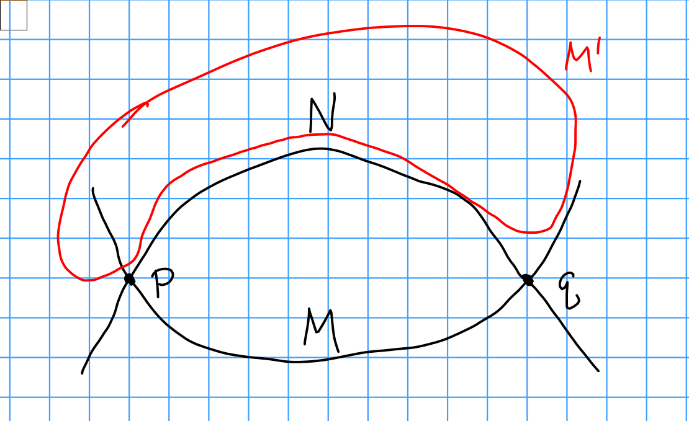
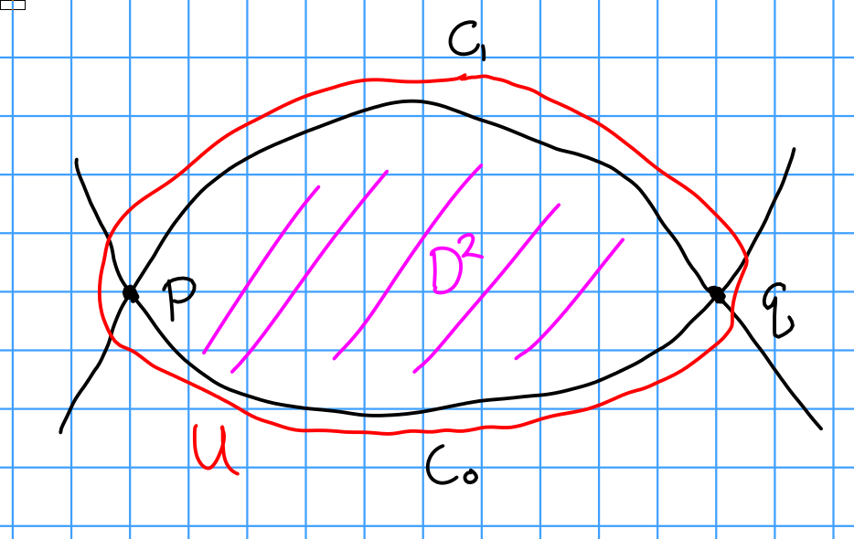
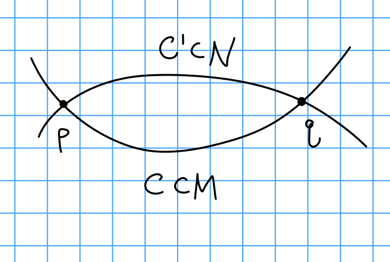
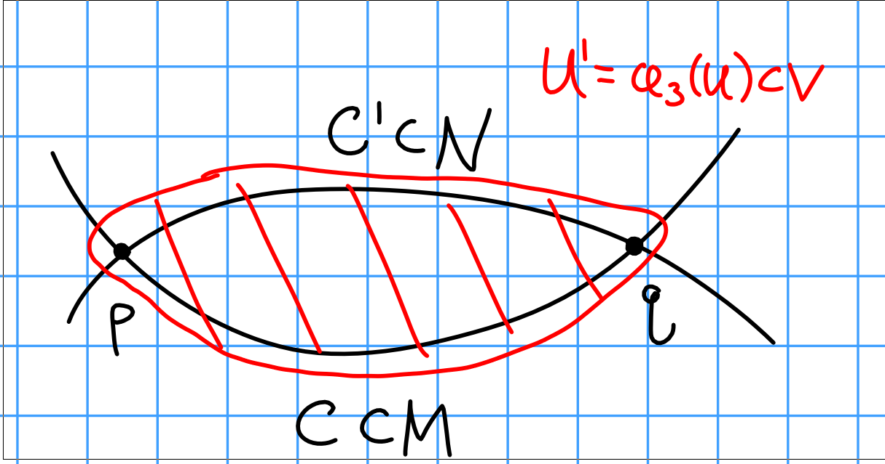

# Thursday February 27th 

Setup: $M^m, N^n \subset V^{m+n}$ closed submanifolds, $M\transverse N$, $M$ oriented (i.e. an orientation of $TM)$ and $N$ co-oriented (i.e. an orientation $\nu_N = TM/TV$).

Each $p\in M\intersect N$ has a sign $\eps(p) \in \theset{-1, 1}$.
If $p, q \in M\intersect N$ with $\eps(p) = 1, \eps(1) = -1$, we would like an isotopy $(h_t)_{0 \leq t \leq 1}$ of $V$ such that $h_0 = \id$ and $h(M) \intersect N = (M\intersect N) \setminus\theset{p, q}$.

Idea: we want to push $M$ off of $N$:

\

From last week, assume $\dim V \geq 5$ and $\dim N \geq 3$ and $\pi_1(V\setminus N) = \pi(V) = 0$.

> Why? In the 2-dimensional model above, we want the disc in the middle to be contractible.

\
\

Then there is a smooth embedding $\phi_3: U \to V$, 2-dimensional to $n+1$ dimensional, sending $U \intersect C_i$ to $C_i$ and $U(C_0 \union C_0')$ to $V\setminus (M\union N)$.

Goal for today: under the same hypotheses, $\phi_3$ extends to an embedding $\phi: U \cross \RR^{m-1} \cross \RR^{n-1} \to V$ such that $\phi\inv(M) = (U\intersect C_0) \cross \RR^{m-1} \cross \theset{0}$ and $\phi\inv(N) = (U \intersect C_0') \cross \theset{0} \cross \RR^{n-1}$.

Let $U' = \phi_3(U) \subset V$:

\

Lemma
: There exist vector fields along $U'$, $\xi_1, \cdots, \xi_{m-1}, \eta_1, \cdots, \eta_{n-1}$, such that

  1. These are orthonormal to each other and orthogonal to $U'$.
    
    > Note that we'll need a Riemannian metric to make sense of this, and particularly one such that $M, N$ are totally geodesic, and $T_p M \orthogonal T_p N$ and $T_q M \orthogonal T_q N$.
