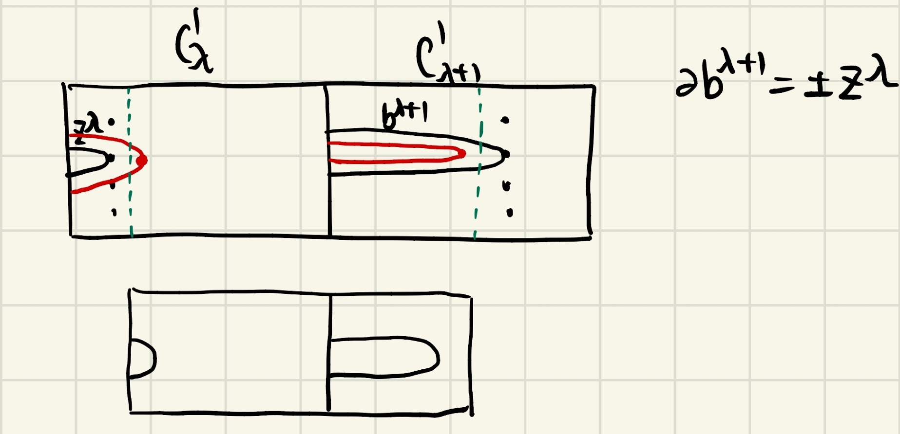

# Thursday March 5th

Theorem
: Let $(W, V, V')$ be a cobordism of dimension $n\geq 6$, $f$ Morse with all critical points of indices in $[2, \cdots, n-2]$.
  Suppose $m=0$ (?) and $H_*(W, V) = 0$; then this is homotopic (?) to the product cobordism.

### Proof of Theorem

Factor $c = c_2 c_3 \cdots c_{n-2}$; then from $H_*(W, V) = 0$ we have
\begin{align*}
0 \to C_{n-2} \mapsvia{\del} C_{n-3} \to \cdots \to C_2 \to 0
,\end{align*}
which has zero homology.

Thus for all $\lambda$, choose $\theset{z_1^{\lambda+1}, \cdots, z_{k_{\lambda+1}}^{\lambda+1}  }$ as basis of $\ker C_{\lambda+1} \to C_\lambda$.
Then choose $\theset{b_1^{\lambda+2}, \cdots, b_{\lambda+1}^{\lambda+2} }$ such that $\bd b_i^{\lambda+2} = z_i^{\lambda+1}$.
Then $\theset{b_i^{\lambda}, z_j^\lambda}$ forms an integral basis of $C_\lambda$.

From the basis theorem, we can choose a pair $(f', \xi')$ such that this basis is represented by $D_L$.

\

Claim
:   $\bd b^{\lambda+1} = \pm z^\lambda$, so $S_R(q) \intersect S_L(p) = \pm 1$.
    Using the 2nd Cancellation Theorem, the smaller cobordism is thus a product cobordism.

Proof
:   Recall the following:

    - If $X = \bd W$ with $W$ oriented, then $X$ is oriented by $\theset{\nu, \tau_1, \cdots, \tau_{n-1}}$.

    - There is a map

      \begin{align*}
      H_n(W, X) &\to H_{n-1}(X) \\
      [0_W] &\mapsto [0_X]
      .\end{align*}

    So choose an orientation of $W$ (which we'll notate $\circ W$) and all $D_L$, and orient the normal bundle of $D_R$ such that

    - $(\circ (D_R), \circ(D_L) ) = \circ W$
    - $D_R(q_i) \intersect D_L(q_i) = \pm 1$.

