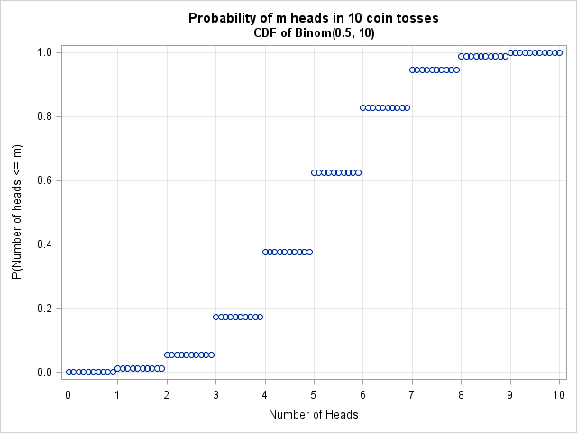

# Thursday January 30th

## Distributions

Example 1: 
Binomial Distribution

The state space is $S = \theset{0, 1, \cdots, n}$, and $P(X = i) = {n\choose i} p^j (1-p)^{n-j}$ for $0 < p < 1$.

> Note that flipping a coin once is a Bernoulli distribution, i.e. if $X$ is the number of heads in 1 flip, then $P(X=1) = p,~P(X=0) = 1-p$.

The distribution function is given by $F_X(x) = P(X < x)$ is a step function:

\

Note that this is left-continuous.

Example 2:
Gaussian (Normal) Distribution

This is given by $P(a < X < b) = \int_a^b \phi(t) ~dt$ where the density $\phi(x) = \frac{1}{\sqrt{2\pi} \sigma} e^{-\frac{(x-\mu)^2}{2\sigma^2}}$. 
The distribution function is given by $F_X(x) = P(X < x) = \int_{-\infty}^x \phi(t) ~dt$.

Consider the two experiments

| Flip a Coin | Roll a die |
| ----- | ----- |
|$\Omega = \theset{H, T}$ | $\Omega = [6]$ |
| $X_1 = 1$ iff $H$, $0$ iff $T$ | $X_2 = 1$ iff odd, $0$ iff even |

Note that $X_1, X_2$ have the same distribution, i.e. $P(X_1 \in A) = P(X_2 \in A)$ (??)

**Theorem:**
If $X_i, Y_i$ are two vectors of random variables with identical distribution functions, so $F_{X_i\cdots}(x_1, \cdots) = F_{Y_i \cdots}(y_1, \cdots)$,
then for all finite Borel functions $g$, $X = g(X_i, \cdots), Y = g(Y_i, \cdots)$ have identical distribution functions.

*Proof:*

1. $X$ and $Y$ are random variables, so this is clear. (?)

2. Letting $\mcg = \theset{B \in \mcb^n \suchthat P((X_i, \cdots) \in B) = P((X_i, \cdots) \in B) }$.
  Let $\mcd = \theset{\prod [-\infty, c_j) \suchthat c_j \in \RR }$, then $\mcd \subset \mcg$.
  It is also true that $\mcg$ is a $\lambda\dash$class (check).

Thus $\mcg \supset \lambda(\mcd)$, the $\lambda\dash$class generated by $\mcd$, and $\lambda(\mcd) = \sigma(\mcd)$, so $\mcd$ is a $\pi\dash$class.
Thus $P(g(x_i, \cdots) < \lambda) = P((X_i, \cdots) \in g\inv(-\infty, \lambda) (\in \mcb^n) ) = P( (Y_i, \cdots) \in g\inv[-\infty, \lambda)) = P(g(Y_i, \cdots) < \lambda)$.

$\qed$

## Chapter 3: Independence

Note that in the previous experiment, the two outcomes were independent, so $P(X_1 = 1, X_2 = 0) = P(X_1 = 1) P(X_2 = 2)$.
We can take this as the definition of independence.
Alternative characterization: $P(F_2 \mid F_1) = P(F_1 F_2) / P(F_1) = P(F_2)$.

Similarly, if 3 events are independent, but the condition $P(F_1 F_2 F_3) = P(F_1) P(F_2) P(F_3)$ is not sufficient to capture this notion.
We additionally need pairwise independence.

**Definition:**

1. A set of random variables $X_i$ are independent iff for all $A_i \in \sigma(X_i)$, $P(A_1, \cdots, A_n) = P(A_1) \cdots P(A_n)$.

2. The classes $\mcg_i$ are independent iff for all $A_i \in \mcg_i$, $P(A_1 \cdots A_n) = P(A_1) \cdots P(A_n)$.

3. The events $F_i$ are independent iff $I_{F_i}$ are independent (for $I$ indicator functions).

*Example:*
Let $n=3$, then $\sigma(I_{F_i}) = \theset{\emptyset,\Omega, F_i, F_i^c}$.
Then since $F_i \in \sigma(F_i)$, we have $P(F_1 F_2 F_3) = P(F_1) P(F_2) P(F_3)$.
We also have $P(F_1 F_2) = P(F_1 F_2 \Omega) = P(F_1) P(F_2) P(\Omega)$, so this recovers the pairwise independence.

A sequence of random variables is iid iff they are independent and identically distributed.

Recall that the event "$A_n$ happens infinitely often" is given by $A \definedas \limsup A_n = \intersect_k \union^k A_n$.

**Theorem (The Borel 0-1 Criterion):**
If $A_n$ are independent events, then $P(\limsup A_n) = 1$ iff $\sum P(A_n) = \infty$ and 0 otherwise.

Proof:
