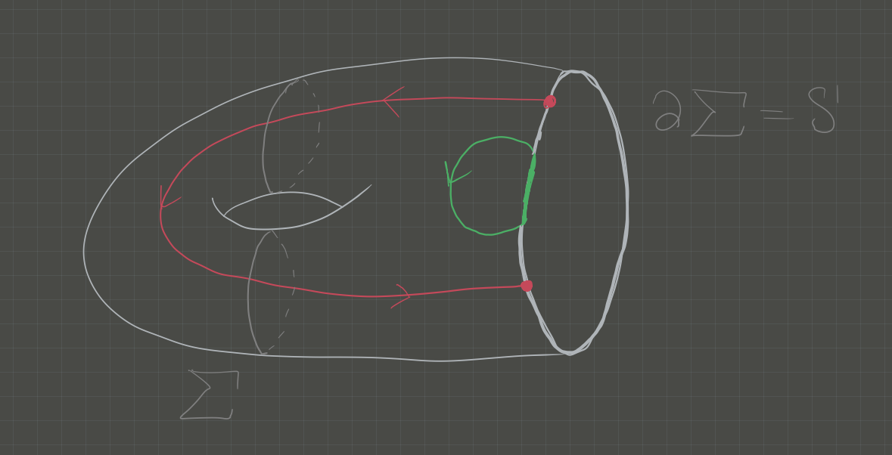

# Monday January 8th

Today: a review of singular homology, Mayer-Vietoris.

First we'll review reduced homology: if we have a chain complex $C_*X$, we can associate a *reduced chain complex* given by
\begin{align*}
\tilde C_*X \definedas \cdots \to C_1 X \to C_0 X \to C_{-1}X\definedas \ZZ \to 0
.\end{align*}

Why do this? 
It yields $\tilde H_*(\pt) = 0$, where we recall that the usual homology is given by
\begin{align*}
H_n(\pt) = 
\begin{dcases}
\ZZ, & n=1 \\
0, & \text{otherwise}
\end{dcases}
.\end{align*}

## Relative Homology

For $A\subset X$, there is an exact sequence
\begin{align*}
0 \to C_* A \to C_* X \to C_*(X, A) \definedas C_*X / C_* A,
,\end{align*}

and we define $C_*(X, A)$ to be the *relative chain complex*.
For $[x]\in C_n(X, A)$, we obtain a coset $[x] = x + C_n A$ where $x\in C_n(X)$.

Elements of $H_n(X, A)$ are therefore $n\dash$cycles $x\in C_{n}X$ such that $\bd x\in C_{n-1}A$.
This immediately yields a LES
\begin{align*}
H_nX \to H_n(X, A) \mapsvia{\delta} H_{n-1}A \mapsvia{\iota_*} H_{n-1}X \to \cdots
\end{align*}
where $A \mapsvia{\iota} X$.

Warning
:   $\iota$ injective does *not* imply $\iota_*$ is injective!
:   A counterexample is $S^{1} \injects D^2$, where the former has nontrivial homology but the latter is contractible.

Thus $H_n(X, A)$ measures the obstructions to the maps $\iota_*$ all being isomorphisms.

Warning
: $H_n(X, A) = 0$ does *not* imply that $H_n(A) \cong H_n(X)$, i.e. that $H_n(X, A) \cong H_nX / H_n A$

### Example 1

For $z$ a cycle, we ask if there exists a $y$ such that $\bd (y + C_{n+1} A) =z + C_n A$, and so $z-\bd y \in C_n A$ is the "error term".
So $z$ is a boundary, up to an error in $A$.

By considering the space simplicially, we have

\begin{center}
\begin{tikzpicture}
0 \ar[r] & H_2(\Sigma) \ar[r] & H_2(\Sigma, \bd \Sigma) \ar[lld, bend left] \\
H_1(\bd \Sigma) \ar[r] & H_1(\Sigma) \ar[r] & H_1(\Sigma, \bd \Sigma) \ar[lld, bend left] \\
H_0()bd \Sigma) \ar[r] & H_0(\Sigma) \ar[r] & H_0(\Sigma, \bd \Sigma) \ar[lld, bend left] 
\end{tikzpicture}
\end{center}

\begin{center}
\begin{tikzpicture}
0 \ar[r] & H_2(\Sigma) \ar[r] & H_2(\Sigma, \bd \Sigma) \ar[lld, bend left] \\
H_1(\bd \Sigma) \ar[r] & H_1(\Sigma) \ar[r] & H_1(\Sigma, \bd \Sigma) \ar[lld, bend left] \\
H_0()bd \Sigma) \ar[r] & H_0(\Sigma) \ar[r] & H_0(\Sigma, \bd \Sigma) \ar[lld, bend left] 
\end{tikzpicture}
\end{center}

### Example 2
