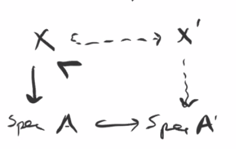
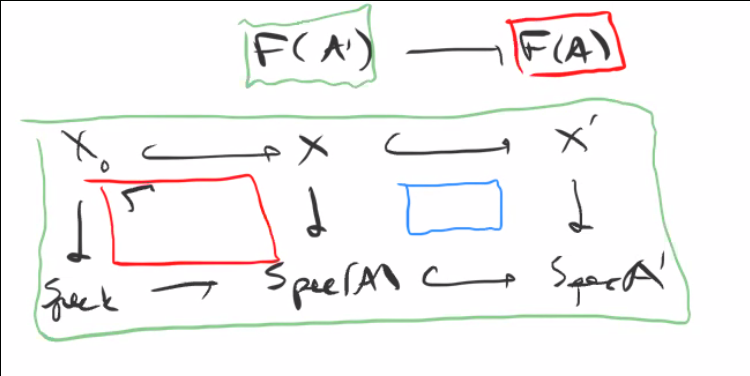

# Tuesday April 14th

Recall that we are looking at $X_0/k$, $F: \art/k \to \sets$ where $A$ is sent to $X/A$ flat with $i: X_0 \injects X$ where $i\tensor k$ is an isomorphism.
The second condition is equivalent to a cartesian diagram
\begin{center}
\begin{tikzcd}
X_0 \ar[r, hook]\ar[d] & X \ar[d] \\
\spec k \ar[r, hook] & \spec A
\end{tikzcd}
\end{center}

We showed we always have H1 and H2, and H3 if $X_0/k$ is projective or $X_0$ is affine with isolated singularities.
In this situation we have a miniversal family.

This occurs iff for $A' \to A$ a small thickening and $(X_0 \injects X) \in F(A)$, we have a surjection
\begin{align*}
\Aut_{A'}(X_0 \injects X') \surjects \Aut_A(X_0 \injects X)
.\end{align*}

where the RHS are automorphisms of $X/A$, i.e. those which commute with the identity on $A$ and $X_0$.

We had a naive functor $F_n$ where we don't include the inclusion $X_0 \injects X$.
When $F$ has a hull then the naive functor has a versal family, since there is a forgetful map that is formally smooth.

If it's the case that for all $A' \to A$ small and $F_{\text{n}} \to F_n(A)$ we have $\Aut_{A'}(X') \surjects \Aut_A (X)$, then $F = F_n$ and both are pro-representable.
The forgetful map is smooth because given $X/A$ in $F_n(A)$, we have some inclusion $X_0 \injects X$, so one gives surjectivity.
Using the surjectivity on automorphisms, we get
\begin{center}
\begin{tikzcd}
X_0\ar[rd, hook] \ar[rr, hook] & & X\ar[ld, dotted] \\
& X & 
\end{tikzcd}
\end{center}

Deformation theory is better at answering when the following diagrams exist:

i.e., the existence of an extension of $X$ to $A'$.
This is different than understanding diagrams of the following type

where we're considering isomorphism classes of the squares, and deformation theory helps understand the blue one.

Example:
Hypersurface singularities.

Take $S = k[x, y]$ and $B = S/(f)$, then deformations of $\spec B$ to ?

Given $k \to k[\eps] \to k$ we can tensor to obtain

> For flat maps, tensoring up to an isomorphism implies isomorphism.

We want to understand $F(k[\eps])$.
We know $f' = f + \eps g$ for some $g\in S$.
Some observations:

1. $g\in B$ and $f'' = f + \eps(g + cf)$ generates the same ideal.
2. We're free to reparameterize, i.e. $x \mapsto x + \eps a$ and $y \mapsto y + \eps b$ and thus $g \mapsto g + a f_x + b f_y$ (the partial derivatives).

Thus isomorphism classes of $B'$ in deformations $B' \to B$ only depend on the isomorphism classes $g\in B/(f_x, f_y) B$.
When the singularities are isolated, this quotient is finite-dimensional as a $k\dash$vector space.

Example
:   $F(k[\eps]) = B/(f_x, f_y)B$.

    Thus H3 holds and there is a miniversal family $h_R \to F$.
    We can describe it explicitly: take $g_i \in S$, yielding a $k\dash$basis in $S/(f, f_x, f_y)$.
    Then $V(f + \sum t_i g_i) \subset \spec k[[t_1, \cdots, t_n]][x, y]$.
    Set $R = k[[t_1, \cdots, t_n]]$, then this lands in $\AA_R^2$.

Example
:   The nodal curve $y^2 = x^3$, take $S/(y^2-x^3, 2y, -3x^2) = S/(y, x^2)$.
    So take $g_1 = 1, g_2 = x$, then the miniversal family is $V(y^2 - x^3 + t + t_2 x) \subset \AA^2_{k[[t_1, t_2]]}$.
    This gives all ways of smoothing the node.

Note that none of these are pro-representable. 
Given $X$ and $A$, we obtain a miniversal family over the formal spectrum $\spf(R) = (R, \xi)$ and a unique map:

We can take two deformations over $A = k[\xi]/ S^n$:

- $X_1 = V(x + y)$??
- $X_2 = V(x + uy)$??

As deformations over $A$, $X_1 \cong X_2$ where we send $s\mapsto s, y\mapsto y, x\mapsto ux$, since $(xy + us) = (uxy + us) = (u(xy + s)) = (xy + s)$.
But we have two different classifying maps, which do commute up to an automorphism of $A$, but are not equal.
Since they pullback to different elements (?), $F$ can not be pro-representable.

So reparameterization in $A$ yield different objects in $F(A)$.
In other words, $\mcx \to \spf(R)$ has automorphisms inducing reparameterizations of $R$.
This indicates why we need maps restricting to the identity.

## The Cotangent Complex 

For $X \mapsvia{f} Y$, we have $L_{X/Y} \in D \qcoh(X)$, the derived category of quasicoherent sheaves on $X$.
This answers the extension question:
For any square-zero thickening $Y \injects Y'$ (a closed immersion) with ideal $I$ yields an $\OO_Y\dash$module.

1. An extension exists iff $0 = \obs \in \ext^2(L_{X/Y}, f^* I)$
2. If so, the set of ways to do so is a torsor over this ext group.
3. The automorphisms of the completion are given by $\hom(L_{X/Y}, f^* I)$.

Special cases:
$X \to Y$ smooth yields $L_{X/Y} = \Omega_{X/Y}[0]$ concentrated in degree zero.
Example:
$Y = \spec k$ and $Y' = \spec k[\eps]$ yields $\obs \in \Ext_x^2(\Omega_{X/Y}, \OO_x)= H^2(T_{X/k})$.

For $X\injects Y$ is a regular embedding (closed immersion and locally a regular sequence) $L_{X/Y} = \qty{I/I^2}[1]$, the conormal bundle.

\

Example:
For $Y$ smooth, $X \injects Y$ a regular embedding, $L_{X/k} = \Omega_{X/k}$ with $\obs/\def = \Ext^{2/1}(\OMega_x, \OO)$ and the infinitesimal automorphisms are the homs.

Example:
For $YT = \spec k[x, y] = \AA^2$ and $X = \spec B = V(f) \subset \AA^2$ we get
\begin{align*}
0 \to I/I^2 \to \Omega_{X/k} \tensor B \to \Omega_?{X/k} \to 0 \\
= 0 \to B \mapsvia{1 \mapsto (f_x, f_y)} B^2 \to \Omega_{B/k} = L_{X/k} \to 0
.\end{align*}

Taking $\hom(\wait, B)$ yields
\begin{align*}
0 & \to \hom(\Omega, B) \to B^2 \mapsvia{(f_x, f_y)^t} \\ 
&\to \Ext^1(\Omega, B) \to 0 \to 0 \\
&\to \Ext^2(\Omega, B) \to 0 \to 0
.\end{align*}

So $\obs = 0, \def = B/(f_x, f_y)B$, and $\aut \neq 0$.

We have the following obstruction theories:

- For abstract deformations, we have $X_0/k$ smooth implies $\aut/\def/\obs = H^{0/1/2}(T_{X_0})$.
- For embedded deformations, $Y_0/k$ smooth, $X_0 \injects Y_0$ regular, we have $\aut/\def/\obs = 0, H^{0/1}(N_{X_0/Y_0})$.
  As an exercise, interpret this in terms of $L_{X_0/Y_0}$.
- For maps $X_0 \mapsvia{f_0} Y_0$, i.e. maps $X_0 \cross k[\eps] \mapsvia{f} Y_0 \cross k[\eps]$, we consider the graph $\Gamma(f_0) \subset X_0 \cross Y_0$.

 \

Since all of these structures are special cases of the cotangent complex, they place nicely together in the following sense:
Given $X \injects_{i} Y$ we have
\begin{align*}
0 \to T_{X} \to i^* T_{Y} \to N_{X/Y} \to 0
.\end{align*}

Yielding a LES
\begin{align*}
0 &\to H^0(T_X) \to H^0(i^* T_Y) \to H^0(N_{X/Y}) \\
&\to H^1(T_X) \to H^1(i^* T_Y) \to H^1(N_{X/Y}) \\
&\to H^2(T_X) 
.\end{align*}

\

Exercise:
Consider $X \subset \PP^3$ a smooth quartic, and show that $\def(X) \cong k^{20}$ but $\def_{\text{embedded}} \cong k^{19}$.
This is a quartic K3 surface for which deformations don't lift (non-algebraic, don't sit inside any $\PP^n$).

Next time:
Obstruction theory of sheaves, T1 lifting as a way to show unobstructedness.
