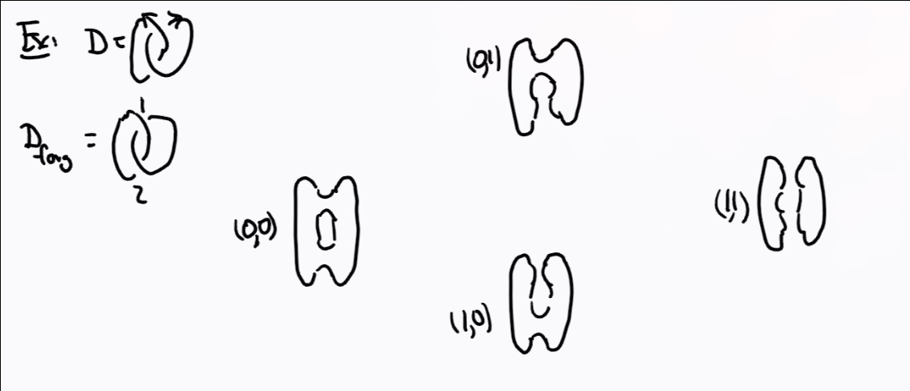
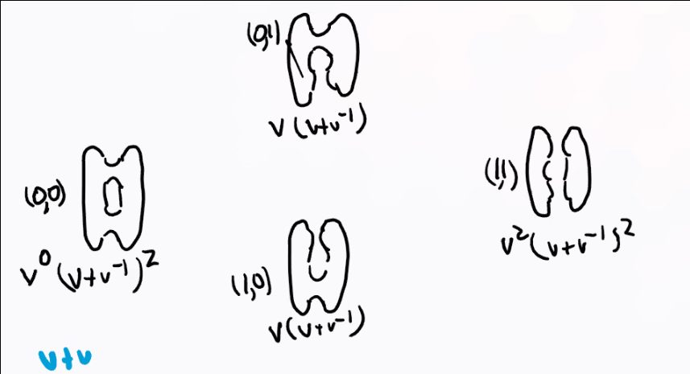

# Tuesday July 7th

Recall that we had recursive rules for computing the Kausffman bracket, and a normalization factor for the Jones polynomial that made it into an invariant.
We'd like a closed formula for these.

We do this by ordering the crossings of the unoriented link $1, \cdots, n$, then there is a correspondence
\begin{align*}
\theset{0, 1}^n \iff \text{Complete resolutions} \\
(\alpha_1, \cdots, \alpha_n) \iff \alpha \text{resolves the $i$th crossing}
.\end{align*}

Example:

Claim:
\begin{align*}
\gens{D} = \sum_{\alpha \in \theset{0, 1}^n} (-1)^{\abs \alpha}  v^{\abs \alpha} (v+v\inv)^{c_\alpha(D)}
,\end{align*}

where $\abs \alpha$ is the number of 1-resolutions and $c_\alpha$ is the number of circles in the resolution corresponding to $\alpha$.

Proof
: Idea: look at resolving the $n$th crossing locally and apply the recursive relation.
Then rewrite the sum by appending $\alpha_n = 0$ and $\alpha_n = 1$ respectively.

Note that we can rewrite the sum as 
\begin{align*}
\sum_{r=0}^n (-1)^r \sum_{\abs \alpha = r} v^r (v+v\inv)^{c_\alpha(D)}
.\end{align*}

This amounts to summing over the "columns" in the previous diagram:

Here this yields
\begin{align*}
(v+v\inv)^2 + (-1)2v(v+v\inv) + v^2 (v+v\inv)^2
.\end{align*}

Note that this formula starts to resemble an Euler characteristic!
The problem is that the coefficient $\sum v^r(v+v\inv)^{c_\alpha(D)} \in \ZZ^{\geq 0}[v, v\inv]$ is a Laurent polynomial instead of a natural number, so this can't immediately be interpreted as a dimension of a vector space.
