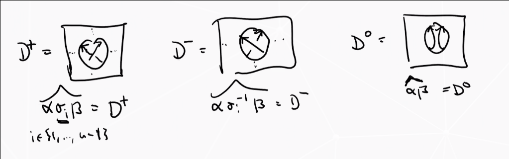

# Friday July 10th

Definition
:   For $n\geq 1$ and $R$ a commutative ring with $q,z \in R\units$, define the *Iwahoni-Hecke algebra* $H_n^R(q, z)$ is the associative unital $R\dash$algebra 
    \begin{align*}
    \gens{T_i \suchthat T_i T_j = T_j T_i (\abs{i - j} \geq 2) , T_i T_{i+1} T_i = T_{i+1} T_i T_{i+1}, T_i^2 = zT_i q1}
    \end{align*}
    where $1$ is the unit of the algebra.
    The first relation is the "braid relation", the others are the "quadratic" or "skein" relations.

Theorem (Basis of the Hecke Algebra)
:   \hfill

    1. For all $w \in S_n$, there exists a unique $T_w\in H_n^R(q, z)$ such that whenever $w = \prod s_{i_k}$ is a minimal expression as a product of simply transpositions, then $T_w = \prod T_{i_k}$.
    2. The set $\theset {T_w \suchthat w\in S_n}$ is an $R\dash$module basis of $H_n^R(q, z)$ (the standard basis).

Remarks
:   \hfill

    1. $H_n^R(q, z)$ is a two-parameter generalization of $C(B\\G/B)$, and in fact there is an $R\dash$algebra isomorphism 
    \begin{align*}
    H_n^\CC(q, q-1) &\cong C(B\\G/B)\\
    T_w &\mapsto \delta_w
    .\end{align*}

    2. There is an $R\dash$algebra isomorphism $H_n^R(1, 0) \cong R[S_n]$, so we interpret this as a deformation of the group algebra $R[S_n]$.

    3. There is an $R\dash$algebra isomorphism $H_n^R(q, z) \cong H_n^R(q, z) \cong R[B_n] / \gens{T_i^2 - zT_i - q\cdot 1}$ as a quotient of the group algebra on the braid group.

There is also an $R\dash$algebra morphism
\begin{align*}
\iota_n: H_n^R(q, z) *\to H_{n+1}^R(q, z) \\
T_i &\mapsto T_i
.\end{align*}

Theorem
:   There exists a unique collection of $R\dash$linear maps for $n\geq 1$:
    \begin{align*}
    \tr_n: H_n^R(q, z) &\to R
    .\end{align*}

    This is uniquely determined by the properties
    \begin{align*}
    \tr_n(ab) = \tr_n(ba) \quad \forall a,b\in H_n^R(q ,z) \\
    \tr_{n+1}(\iota(a) T_n) = \tr_n(a) = \tr_{n+1} (\iota(a) T_n\inv) \quad \forall a\in H_n^R(q, z) \\
    \tr_{n+1}(\iota(a)) = {1 - q \over z} \tr_n(a) \quad \forall a \in H_n^R(q, z) \\
    \tr_1(1) = {1 -q \over z}
    .\end{align*}

Proof
: See KT, slightly technical. Just have to do it and show uniqueness.

Note that a function from the braid group satisfying the first two conditions gives a Markov function.

Example: take $n=3$.
Let $1\in H_3^R(q, z)$.
\begin{align*}
\tr_3(1) \in H_3 = {1 -q \over z} \tr_2(1) \in H_2 = \qty{1 - q \over z}^2 \tr_1(1) \in H_1 = \qty{1-q \over z}^3
.\end{align*}

Now consider $T_1$. 
Using the fact that $a=1 \implies \iota(a) = 1$,
\begin{align*}
\tr_3(T_1) = {1-q \over z} Z \tr_2(T_1) = Z \tr_1(1) = Z^2 = \tr_3(T_2) \quad Z = {1-q \over z}
.\end{align*}

Now using relation 2 twice,
\begin{align*}
\tr_3(T_1 T_2) = \tr_2(T_1) = \tr_1(1) = Z = \tr_3(T_2 T_1)
.\end{align*}

Now using the quadratic relation,
\begin{align*}
\tr_3(T_2 T_1 T_2) = \tr_3(T_1 T_2^2) = \tr_3(zT_1 T_2 + qT_1) \equalsbecause{R\dash\text{linearity}} z\tr_3(T_1 T_2) + q\tr_1(T_1) = zZ = qZ^2
.\end{align*}

Theorem
:   The family $\theset{\tr_n \circ w_n: B_n \to R}_{n\geq 1}$ defined
    \begin{align*}
    B_n \mapsvia{w_n} H_n^R(q, z)\units \mapsvia{\tr_n} R \\
    \sigma_i \mapsto T_i \mapsto \tr_n(T_i)
    \end{align*}
    is a Markov function.

Proof
: Clear, because the first two relations are defined precisely to do this.

Note: taking $R = \CC(a, v)$ with $q = a^{-2}$ and $z = a\inv(v - v\inv)$ precisely recovers the HOMFLY-PT polynomial!
More precisely, if $D$ is an oriented link diagram with $b\in B_n$ and $\hat b = D$, then $P(D) = \tr_n(w_n(b))$.

\begin{align*}
T_i^2 - zT_i -q1 = 0 \mapsvia{\cdot T_i\inv} T_i -z1 - qT_i\inv = 0 \implies T_i - a\inv(v-v\inv)1 - a^{-2} T_i\inv = 0 \implies aT_i - (v-v\inv)1 - a\inv T_i\inv = 0
.\end{align*}

Note that since HOMFLY was a unique invariant, it suffices to check that this polynomial satisfies the skein relations and takes the correct value on the unknot.

To see that it takes the right value on the unknot, we can compute
\begin{align*}
\tr_1(w_1(1)) = \tr_1(1) = {1-q \over z} = {1 - a^{-2} \over a\inv(v - v\inv)} = {a\inv(a - a\inv) \over a\inv(v - v\inv)} = {a-a\inv \over v-v\inv}
.\end{align*}

Then to check that it satisfies the skein relations,
given an oriented link diagram, write the various resolutions at closures of braids:

\begin{align*}
a \tr_n \circ w_n(\alpha \sigma_1 \beta)- a\int \tr_n \circ w_n (\alpha \sigma_i\inv \beta) - (v-v\inv) \tr_n \circ w_n(\alpha \beta) \\
= a \tr_n \qty{ w_n(\alpha) T_i w_n(\beta)} - a\inv \tr_n \qty{ w_n(a) T_i\inv w_n(\beta)} - (v-v\inv) \tr_n\qty{ w_n(\alpha) w_n(\beta)} \\
= \tr_n \qty{ a \qty{ w_n(\alpha) T_i w_n(\beta)} - a\inv \qty{ w_n(a) T_i\inv w_n(\beta)} - (v-v\inv) \qty{ w_n(\alpha) w_n(\beta)}} \\
= \tr_n\qty{ w_n(\alpha) \qty{ aT_i - a\inv T_i\inv - (v-v\inv)  }w_n(\beta) } 
= 0
.\end{align*}

Idea: to categorify HOMFLY-PT, we will try to categorify the Heck algebra.
This doesn't quite make sense yet: what does it mean to categorify an entire algebra instead of just a number?

Definition
:   A category $\mca$ is *additive* iff

    1. The homs $\mca(X, Y)$ is a $\ZZ\dash$module for all $X, Y\in \mca$
    2. $\mca(X, Y) \cross \mca(Y, Z) \to \mca(X, Z)$ where $(f, g) \mapsto g\circ f$ is $\ZZ\dash$bilinear.
    3. $\exists 0\in \mca$, an object that is both initial and terminal.
    4. For all $X, Y\in \mca$, there exists a coproduct $X\oplus Y$

Recall that an object $I$ is initial in $A$ iff for every $X$ there exists a unique $I\to X$, and terminal iff there exists a unique $X\to I$.
Recall that a coproduct of $X, Y$ is an object $X\oplus Y$ with two morphism $\iota_X: X\to X\oplus Y, \iota_Y: Y\to X\oplus Y$ satisfying the appropriate universal property.

Example: $R\dash$bimodules over $R$ a ring.

Assume $\mca$ is additive an *essentially small*, so the isoclasses $[X]$ of objects form a set.
In this case, we can take the free abelian group on $F(\mca) \definedas \theset{[X] \suchthat X\in \mca}$.
We'll look at the subgroup $N(\mca) \definedas \theset{[X\oplus Y] - [X] - [Y]}$, and we'll define the *split Grothendieck group* $K_0^\oplus \definedas F(A) / N(A)$.

> Note that this starts to look like categorification: we can express direct sums in terms of sums in a module.
> Notation: mod denotes finitely generated, Mod denotes full categories.

Example: $\mca = k\dash$mod, the category of finite-dimensional $k\dash$vector spaces.
There is a well-defined group morphism defined on generators
\begin{align*}
\phi: F(\mca) &\surjects \ZZ \\
[V] &\mapsto \dim_k(V)
\end{align*}
which is surjective since $-[V]$ exists in the domain and $[k^n] \mapsto n$ for all $n$.

Note that this will factor through $K_0^\oplus(\mca) = F(\mca)/ N(\mca)$ via a map $\bar\phi$ iff $N(\mca) \subseteq \ker \phi$.
We can check
\begin{align*}
\phi\qty{[V\oplus W] - [V] - [W] } \\
= \dim(V\oplus W) - \dim(V) - \dim(W) = 0
.\end{align*}

Claim
: $\phi$ is actually injective.

Proof
:   Suppose 
    \begin{align*}
    0 = \bar\phi\qty{ \sum \lambda_i [V_i]} = \sum \lambda_i \bar \phi([V_i]) = \sum \lambda_i \dim(V_i)
    .\end{align*}

    We can now check
    \begin{align*}
    \sum \lambda_i [V_i] = \sum \lambda_i \dim(V_i) [k] = [k] \sum \lambda_i \dim(V_i)
    ,\end{align*}
    where we use the fact that if $\dim V = n$, then $[V] = [k^n] = n[k]$.

Definition
: Let $G$ be an abelian group, then $\mca$ categories $G$ iff $K_0^\oplus(\mca) \cong G$.

