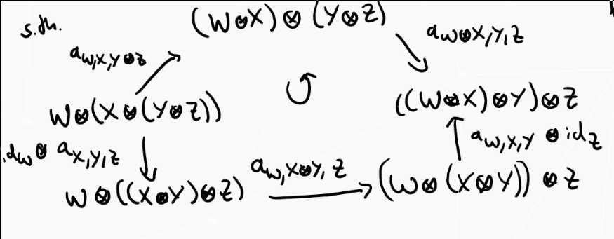

# Monday July 13th

Ring structure on $K_0^\oplus(\id)$.

Definition
:   A *monoidal category* is a tuple $(\mcc, \wait \tensor \wait, 1, \alpha, \ell, r)$ such that
  
    - $\mcc$ is a category
    - $\wait \tensor \wait: \mcc \cross \mcc \to \mcc$ is a bifunctor.
    - $1\in \mcc$
    - Natural isomorphisms $\alpha_{X,Y,Z}: (X\tensor Y)\tensor Z \mapsvia{\cong} X\tensor (Y\tensor Z)$ for all $X,Y,Z\in \mcc$ (associators).
    - Natural isomorphisms $\ell_X: 1\tensor X \mapsvia{\cong} X$ and $r_X:X\tensor 1 \mapsvia{\cong}X$ for all $X\in \mcc$.
    
    Along with coherence axioms: for all $W,X,Y,Z\in \mcc$,

    

    \begin{center}
    \begin{tikzcd}
    X \tensor(1\tensor Y)\ar[rd, "\id_x \tensor \phi_Y"] \ar[rr, "\alpha_{X, 1, Y}"] & & X\tensor 1 \tensor Y \ar[ld, "r_X \tensor \id_Y"] \\
    & X\tensor Y &
    \end{tikzcd}
    \end{center}

Remark
: If $\mcc$ is additive, we require $\wait \tensor \wait$ to be biadditive, i.e. $X\tensor \wait$ and $\wait \tensor Y$ are additive functors.
  In particular, $X\tensor (V\oplus W) \cong (X\tensor V) \oplus (X\tensor W)$ and similarly $(V\oplus W) \tensor Y \cong (V\tensor Y) \oplus (W\tensor Y)$.

Example: $\rmod$ with $R$ a commutative unital ring, take $\tensor \definedas \tensor_R$ with $1$ the "regular left $R\dash$module" ${}_R R$ with $R$ acting on the left by multiplication.
Similarly, $R\dash$bimodules, take $1 = {}_R R_R$.

Proposition
: If $\mca$ is additive and $(\mca, \tensor, 1, \alpha, \ell, r)$ is monoidal, then setting $[X] \cdot [Y] \definedas [X\tensor Y]$ defines a ring structure on $K_0^\oplus(\mca) = F(\mca) / N(\mca)$.

Proof
:   \hfill

    - This is well-defined on $F(\mca)$.
    - Unital: Check $[X][1] = [X\tensor 1] = [X] = [1\tensor X] = [1][X]$
    - Associativity: $([X][Y])[Z] = [X\tensor Y][Z] = [(X\tensor Y) \tensor Z] = [X\tensor (Y\tensor Z)] = [X][Y\tensor Z] = X([Y][Z])$.
    - Distributive: Check.
    
    Therefore $F(\mca)$ is a unital ring.

    - Check $N(\mca) \subseteq F(\mca)$ is a two-sided ideal (use the isomorphism from the earlier remark.)

Example
:   The group morphism $\bar \phi: K_0^\oplus(\kmod) \mapsvia{\cong} \ZZ$ is in fact a ring morphism.

    - Check $\bar \phi([V][W]) = \bar\phi([V\tensor_k W]) = \dim(V\tensor_k W)= \dim(V) \dim(W) = \bar\phi([V]) \bar\phi([W])$.
    - Check $\bar\phi([k]) = \dim k = 1$.

For $\mca$ an additive category, for all $i\in \ZZ$ there exist additive functors

\begin{align*}
(i): \mca &\to \mca \\
X &\mapsto (i)(X) = X(i)
.\end{align*}

Remark
: These satisfy $(j) \circ (i) = (i+j)$ and $(0) = \id_\mca$, so they will correspond to degree shifts.

Proposition
: Setting $v^i[X] \definedas [X(i)]$ defines a $\ZZ[v, v\inv]\dash$module structure on $K_0^\oplus(\mca)$.

Proof
:   \hfill

    - Check that this is well-defined on $F(\mca)$; the module axioms will follow from the above remark.

    - Check that is descends to the quotient, i.e $v^i([X\oplus Y] -[X] - [Y])= v^i]X\oplus Y - v^i[X] - v^i [Y] = [(X\oplus Y)(i)] - [X(i)] - [Y(i)] =[X(i)\oplus Y(i)] - [X(i)] - [Y(i)]$.

Exercise
: Show that $K_0^\oplus(k\dash\text{grmod}) \cong \ZZ[v, v\inv]$ where $[v] \mapsto \sum_{k\in \ZZ} \dim(V_n)v^n$ is an isomorphism of $\ZZ[v,v\inv]\dash$modules (and in fact an isomorphism of $\ZZ[v,v\inv]\dash$algebras).

Remark
:   For $(\mca, \tensor, 1, \alpha, \ell, r)$ a monoidal category with additive functors $(i)$ as above, if
    \begin{align*}
    (i) \circ (X\tensor \wait) \cong (X\tensor \wait) \circ (i) \\
    (i) \circ (\wait \tenjsor Y) \cong (\wait \tensor Y) \circ (i) 
    .\end{align*}
    using the fact that $(X\tensor Y)(i) \cong X \tensor (Y(i)) \cong (X(i)) \tensor Y$.
    Thus $K_0^\oplus(\mca)$ is a $\ZZ[v, v\inv]\dash$algebra.

Recall that $H_n^R(q, q-1)$ taking $R = \ZZ[v, v\inv]$ with $q=v^{-2}$ and $q-1 = z$ was the Iwahari-Hecke algebra, generated by $\theset{T_i}_{i\leq n-1}$ and the braid/skein relations.

Substitute $Hs_i = vT_i$ (Soergel's correction) to obtain a new presentation of $H_n^{\ZZ[v, v\inv]}(v^{-2}, v^{-2}-1)$.
The generators are now $H_{s_i}_{i\leq n-1}$ and 
\begin{align*}
H_{s_i} H_{s_{i+1}} H_{s_i} = H_{s_{i+1}} H_{s_i} H_{s_{i+1}} \\
H_{s_i} H_{s_j} = H_{s_j} H_{s_i} \quad \abs{i-j} \geq 2 \\
H_{s_i}^2 = v^2 T_i^2 = v^2 \qty{ (v^{-2} - 1)T_i + v^{-2}1} = (1-v^{-2}) T_i + 1 = (v\inv - v) H_{s_i} +1
.\end{align*}

Notation: we'll abbreviate $\mch(S_n) = H_n^{\ZZ[v, v\inv]} (v^{-2}, v^{-2} - 1)$.
There is a standard basis
\begin{align*}
H_w \definedas H_{s_{i_1}} \cdots H_{s_{i_r}} = v^{\ell(w)} T_w \quad w\in S_n, w = s_{i_1} \cdots s_{i_r}, \ell(w) = r
.\end{align*}
where $w$ is written as a minimal length reduced expression.

