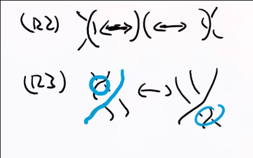
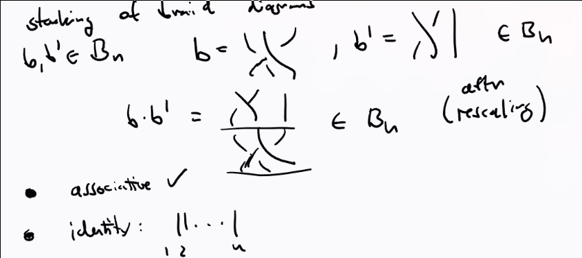

# Wednesday July 8th

Recall that we assigned a chain complex of graded vector spaces to links, where the chains where various tensor powers and shifts of $\mca \definedas H^*(S^2; \CC)(-1)$.

We can consider the diagonal embedding
\begin{align*}
S^s \mapsvia{\Delta} S^2 \cross S^2
\end{align*}

which induces maps on both cohomology and homology, and applying the Kunneth formula and the Poincare isomorphism, we get maps
\begin{align*}
m:      H^*(S^2)^{\tensor 2} &\to H^*(S^2) \\
\delta: H^*(S^2) &\to H^*(S^2)^{\tensor 2}
.\end{align*}

We thus get maps
\begin{align*}
m:        \CC[x]/(x^2) \tensor \CC[x]/(x^2) \to \CC[x]/(x^2) \\
\delta:   \CC[x]/(x^2) \to \CC[x]/(x^2) \tensor \CC[x]/(x^2) \\
.\end{align*}

See notes for how to construct differentials out of these, categorifying the bracket, and how to correct with shifts to categorify the Jones polynomial

## Lecture 3

For $n\geq 1$, the geometric braid $b$ on $n$ strands is a topological subspace of $\RR^2 \cross [0, 1]$ such that

a. $b \cong \disjoint_{i=1}^n [0, 1]$ is a homeomorphism
b. $b\intersect (\RR^2 \cross \theset{0}) = \theset{(1,0,0), \cdots, (n,0,0)}$ and
$b\intersect (\RR^2 \cross \theset{1}) = \theset{(1,0,1), \cdots, (n,0,1)}$.
c. The projection $\RR^2 \cross [0, 1] \mapsvia{\mathrm{pr}_2}$ maps each strand homeomorphically onto $[0, 1]$.

Braids can be moved via isotopy, and part (c) prevents the following situation:

There is a purely combinatorial description, namely braid diagrams.
Isotopies on the geometric side will correspond to planar isotopies and Reidemeister moves R2 and R3 (since R1 is ruled out).

It is a theorem that two braids are isotopic iff their diagrams are related by planar isotopy and a finite sequence of Reidemeister moves.

Define $B_n$ to be the set of braid diagrams on $n$ strands up to isotopy and Reidemeister moves, then there is a multiplication given by stacking braid diagrams.
This is associative with identity, so we obtain a monoid:

We define elementary braids:

Remarks

- $\theset{\sigma_i^\pm}_{i=1}^{n-1}$ generates $B_n$ as a monoid, so $\beta \in B_n$ implies $\beta = \prod_{k=1}^n \sigma_{i_k}^{\eps_k}$ where $i_k \in \theset{1, \cdots, n-1}$ and $\eps_j \in \theset{\pm 1}$.

- $\sigma_i^+ \sigma_i^- = \sigma_i^- \sigma_i^+ = 1$ for all $i$, thus every braid $b$ has a two-sided inverse given by reversing the $\sigma_{i_k}$s and swapping $\pm$, so $B_n$ is a group.

We can describe this group completely algebraically as $B_n^{\text{Artin}}$, the group generated by $\theset{\sigma_i}_{i=1}^{n-1}$ with relations $\sigma_i \sigma_j = \sigma_j \sigma_i$ for $\abs{i-j} \geq 2$, and $\sigma_i \sigma_{i+1} \sigma_i = \sigma_{i+1} \sigma_i \sigma_{i+1}$ for $i\in \theset{1, \cdots, n-2}$.

Proposition
: There is an isomorphism
\begin{align*}
B_n^{\text{Artin}} &\mapsvia{\cong} B_n \\
\sigma_i &\mapsto \sigma_i^+ \\
\sigma_i\inv *\mapsto \sigma_i^-
.\end{align*}

Proof
:   \hfill

    - Well defined:
      - Need to check that the map preserves the relations, this is a consequence of changing height of crossings by planar isotopy:

      

       

    - Surjectivity: clear by definition of map.

    - Injectivity: omitted.

Importantly, we have a way of going from braids to knots and links.
Let $D^{\text{or}}$ be the set of oriented planar link diagrams, then define a map
\begin{align*}
B_n &\to D^{\text{or}} \\
b &\mapsto \hat b
\end{align*}

where $\hat b$ is given by "closing" the braid:

Theorem (Alexander)
: Every oriented link in $\RR^3$ is isotopic to a closed braid.

In fact, there is a map
\begin{align*}
\disjoint_{n\geq 1} &\surjects D^{\text{or}} /\sim \\
b & \mapsto \hat b
\end{align*}
 
where the RHS is the equivalence relation generated by planar isotopy and Reidemeister moves.
This is not injective, since many braids can map onto the unknot.
