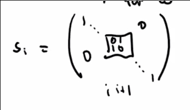
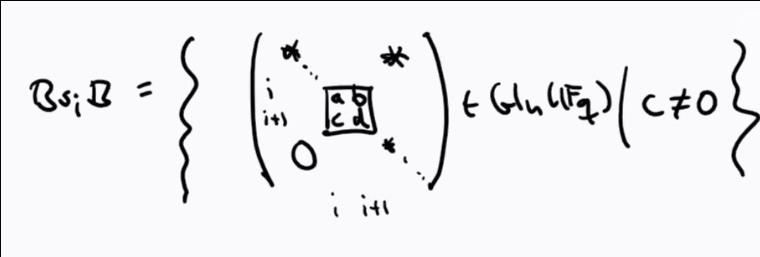

# Thursday July 9th

Problem: the map sending links to the Artin braid group is surjective but not injective, so we need to mod out by some form of equivalence in the domain.

We have a directed system of inclusions $B_n \injects B_{n+1}$, so we can consider the group $\disjoint_{n\geq 1} B_n$.
The equivalence relation we'll take is *Markov equivalence* $\sim_M$:

Theorem
: $b \sim_M b' \iff ?$

Proof
:   For the reverse direction

     

   For the forward direction, see Kassel-Tuvaev's "Braid Groups" for a full rigorous proof.

Definition
:   For any set $E$, a *Markov function* is a family of maps $\theset{f_n: B_n \to E}_{n\geq 1}$ such that

    1. $f_n(\alpha \beta) = f_n(\beta\alpha)$ for all $\alpha, \beta\in B_n$

    2. $f_{n+1}(i_n(\beta)\sigma_n\inv) = f_n(\beta) = f_{n+1}(i_n(\beta) \sigma_n)$ for all $n\geq, \beta \in B_n$.

Question: where does the skein relation come from? 
Take $\FF_q$ a finite field of size $q$ and set $G = \Gl(n, \FF_q)$.
Define $C(G) = \theset{G\to \CC}$ which is a $\CC\dash$vector space with an associative multiplication given by $(f\ast f')(g) = \sum_{n\in G} f(n) f'(n\inv g)$.

Define $C\qty{\dcoset{B}{G}{B}} = \theset{f: G\to \CC \suchthat f(bg) = f(g) = f(gb)}$ the set of bi-invariant functions.
This is closed under $\ast$ with a unit defined by setting $\delta_g(h) = \indic(h=g)$ and defining $\delta_0 = {1\over \abs B} \sum_{g\in B} \delta_g$.

There is an augmentation map $\eps: \qty{\dcoset B G B} \to \CC$ with $\eps(f) = \sum_{g\in G} f(g) \in \CC$, which is a $\CC\dash$algebra morphism.
Can we write down a basis?

Recall that the symmetric group is generated by adjacent transpositions, say $s_1, \cdots, s_{n-1}$, so we can write
\begin{align*}
S_n \cong \gens{\bar s_1, \cdots, \bar s_{n-1} \suchthat \bar s_i^2 = 1, \bar s_i \bar s_j = \bar s_j \bar s_i, \bar s_i \bar s_{i+1} \bar s_i = \bar s_{i+1} \bar s_i \bar s_{i+1} }
.\end{align*}

> Need to check that elements in $S_n$ satisfy these relations, check cardinality, etc.

For any $w\in S_n$, we can consider its length $\ell(w)$ defined as the smallest number of adjacent transpositions need to write $w$ as a product of adjacent transpositions.
We define the *Bruhat cell* $B w B \definedas \theset{bwb\inv \suchthat b, b' \in B}$ where $B$ is a permutation matrix for $w$.

Example of a permutation matrix for $s_i$:

Exercise:

Proposition
: The functions $\delta_w: G\to \CC$ given by $\delta_w(g) = {1\over \abs B}\indic(g\in BwB)$  as $w$ ranges over $S_n$ form a basis for $\qty{\dcoset B G B}$.

Proof
: Use the Bruhat decomposition $G = \disjoint_{w\in S_n} BwB$.

There is a multiplicative structure, since $(\delta_{s_i} \ast \delta_{s_i})(g) \definedas \sum_{h\in G} \delta_{s_i}(h) \delta_{s_i}(h\inv g) = \sum_{h\in Gs_i B} {1\over \abs B} \delta_{s_i} (h\inv g) = \sum_{h\in Bs_i B, h\inv g\in Bs_i B} {1\over \abs{B}^2} = {\abs{Bs_i B \intersect gBs_i B} \over \abs{B}^2}$.

To express this in terms of our basis, check where $B_si B \intersect g B s_i B \neq \emptyset$.
If $h$ is in this intersection, then $h = bs_i b = gb'' s_i b'''$, so $g = b s_i b' (b''')\inv s_i (b'')\inv \in Bs_i Bs_i B \subset P_i$, where $P_i$ is a parabolic subgroup of $G$ defined by

We can identify $P_i = Bs_i B \union B$ (i.e. add in upper triangular matrices).
We can thus write $\delta_{s_i} \ast \delta_{s_i} = \alpha \delta_{s_i} + \beta \delta_0$ where $\delta_0 = \delta_e$ and $\alpha, \beta \in \CC$.

Let $\bbone$ be the identity matrix,  then 

\[ 
{\abs{B s_i B} \over \abs{B}^2} 
= (\delta_{s_i} \ast \delta_{s_i}) (\bbone) 
= \alpha \delta_{s_i} + \beta \delta_0(\bbone)
.\]

where the first term is in $B$ and thus equals zero, and the second term equals $1\over \abs B$, so this equals $\beta{1\over \abs{B}}$, thus $\beta = {\abs{Bs_i B} \over \abs{B} }$.
Similarly, we get $\alpha = {\abs{Bs_i B} \over \abs B} - 1$.

A counting argument shows $\abs{B} = (q-1)^n q q^2 \cdots q^{n-1} = (1-1)^n q^{n(n-1) \over 2}$.

Similarly $\abs{Bs_i B} = (q-1)^n q^{{n(n-1) \over 2} + 1}$ and thus ${\abs{Bs_i B} \over \abs B} = 1$.

Thus
\begin{align*}
(\delta_{s_i} \ast \delta_{s_i}) 
= (q-1) \delta_{s_i} + q\delta_0
.\end{align*}

In particular, $\delta_{s_i}$ is a unique with inverse $q\inv \delta_{s_i} - (1-q\inv) \delta_0$.

More generally, for $s_i \in S_n, w\in S_n$ with $\ell(s_i w) > \ell(w)$, we have $\delta_{s_i} \ast \delta_w = \delta_{s_i w}$.

> Proof omitted, see Bump "Hecke Algebras".

Upshot: we have a group morphism
\begin{align*}
\phi: B_n &\to C\qty{\dcoset B G B}\units \\
\sigma_i &\mapsto \delta_{s_i}
.\end{align*}

Need to check that this is well-defined using the braid relations, comes from $\delta_{s_i} \ast \delta_{s_j} = \delta_{s_i s_j} = \delta_{s_j s_i} = \delta_{s_j} \ast \delta_{s_i}$.

Note that since 
