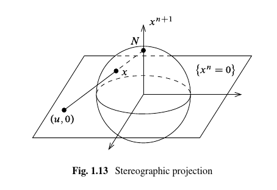
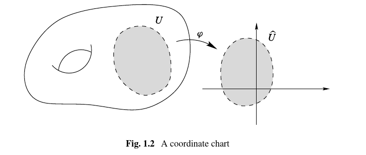
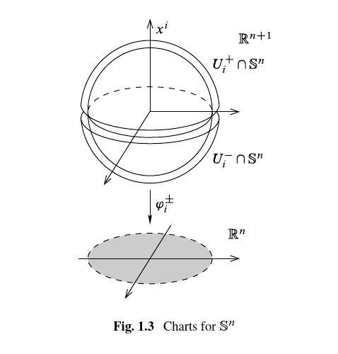

# Chapter 1 

Pages 1- 29.

## Recommended Problems

Exercise (Problem 1.6) 
:   Show that if $M^n\neq \emptyset$ is a topological manifold of dimension $n\geq 1$ and $M$ has a smooth structure, then it has uncountably many distinct ones. \todo{Recommended problem}

    > Hint: show that for any $s> 0$ that $F_s(x) \definedas \abs{x}^{s-1}x$ defines a homeomorphism $F_x: \DD^n \to \DD^n$ which is a diffeomorphism iff $s=1$.

Exercise (Problem 1.7)
:   Let $N\definedas \thevector{0, \cdots, 1} \in S^n$ and $S\definedas \thevector{0, \cdots, -1}$ and define the stereographic projection
    \todo{Recommended problem}
    \begin{align*}
    \sigma: S^n\setminus N &\to \RR^n \\
    \thevector{x^1, \cdots, x^{n+1}} &\mapsto {1 \over 1-x^{n+1}} \thevector{x^1, \cdots, x^n}
    \end{align*}
    and set $\tilde\sigma(x) = -\sigma(-x)$ for $x\in S^n\setminus S$ (projection from the South pole)
    
    

    1. For any $x\in S^n\setminus N$ show that $\sigma(x) = \vector u$ where $(\vector u, 0)$ is the point where the line through $N$ and $x$ intersects the linear subspace $H_{n+1} \definedas \theset{x^{n+1} = 0}$.
  
        Similarly show that $\tilde \sigma(x)$ is the point where the line through $S$ and $x$ intersects $H_{n+1}$.
  
    2. Show that $\sigma$ is bijective and 
    \begin{align*}
    \sigma\inv(\vector u) = \sigma\inv\qty{\thevector{u^1, \cdots, u^n }} = {1\over \norm{\vector u}^2 + 1} \thevector{2u^1, \cdots, 2u^n, \norm{\vector u}^2 - 1}
    .\end{align*}
  
    3. Compute the transition map $\tilde \sigma \circ \sigma\inv$ and verify that the atlas
    \begin{align*}
    \mca \definedas \theset{(S^n\setminus N, \sigma), (S^n\setminus S, \tilde \sigma)  }
    \end{align*}
    define a smooth structure on $S^n$.
  
    4. Show that this smooth structure is equivalent to the standard smooth structure:
        Put graph coordinates on $S^n$ as outlined in \ref{ex:sphere_is_a_manifold} to obtain $\theset{(U_i^\pm, \phi_i^{\pm})}$.
      
        For indices $i<j$, show that
        \begin{align*}
        \phi_i^\pm \circ (\phi_j^\pm)\inv \thevector{u^1, \cdots, u^n} = \thevector{u^1, \cdots, \hat{u^i}, \cdots, \pm\sqrt{1 - \norm{\vector u}^2}  ,\cdots u^n}
        \end{align*}
        where the square root appears in the $j$th position.
        Find a similar formula for $i>j$.
        Show that if $i=j$, then
        \begin{align*}
        \phi_i^\pm \circ (\phi_j^\pm)\inv = \phi_i^- \circ (\phi_i^+)\inv = \id_{\DD^n} 
        .\end{align*}
      
        Show that these yield a smooth atlas.

    

Exercise (Problem 1.8)
:   Define an *angle function* on $U\subset S^1$ as any continuous function $\theta:U\to\RR$ such that $e^{i\theta(z)} = z$ for all $z\in U$.
    \todo{Recommended problem}

    Show that $U$ admits an angle function iff $U\neq S^1$, and for any such function $\theta$, $(U, \theta)$ is a smooth coordinate chart for $S^1$ with its standard smooth structure.

Exercise (Problem 1.9)
:   Show that $\CP^n$ is a compact $2n\dash$dimensional topological manifold, and show how to equip it with a smooth structure, using the correspondence
    \todo{Recommended problem}
    \begin{align*}
    \RR^{2n} &\iff \CC^n \\
    \thevector{x^1, y^1, \cdots, x^n, y^n} &\iff \thevector{x^1 + iy^1, \cdots, x^n + iy^n}
    .\end{align*}

## Notes

Definition (Topological Manifold)
:   A topological space $M$ that satisfies

    1. $M$ is Hausdorff, i.e. points can be separated by open sets
    2. $M$ is second-countable, i.e. has a countable basis
    3. $M$ is locally Euclidean, i.e. every point has a neighborhood homeomorphic to an open subset $\hat U$ of $\RR^n$ for some fixed $n$.

The last property says $p\in M \implies \exists U$ with $p\in U \subseteq M$, $\hat U\subseteq \RR^n$, and a homeomorphism $\phi: U \to \hat U$.

> Note that second countability is primarily needed for existence of partitions of unity.

Exercise
: Show that the in the last condition, $\hat U$ can equivalently be required to be an open ball or $\RR^n$ itself.

Theorem (Topological Invariance of Dimension)
: Two nonempty topological manifolds of different dimensions can not be homeomorphic.

Exercise
: Show that in a Hausdorff space, finite subsets are closed and limits of convergent sequences are unique.

Exercise 
: Show that subspaces and finite products of Hausdorff (resp. second countable) spaces are again Hausdorff (resp. second countable).\label{ex:subspaces_and_products_of_hausdorff}

Thus any open subset of a topological manifold with the subspace topology is again a topological manifold.

Exercise
: Give an example of a connected, locally Euclidean Hausdorff space that is not second countable.

Definition (Charts)
: A chart on $M$ is a pair $(U, \phi)$ where $U\subseteq M$ is open and $\phi: U \to \hat U$ is a homeormohpsim from $U$ to $\hat U = \phi(U) \subseteq \RR^n$.
  If $p\in M$ and $\phi(p) = 0 \in \bar U$, then the chart is said to be *centered* at $p$.
  Note that any chart about $p$ can be modified to a chart $(\phi_1, \hat U_1)$ that is centered at $p$ by defining $\phi_1(x) = x - \phi(v)$.
  
  

  $U$ is the *coordinate domain* and $\phi$ is the *coordinate map*.

  Note that we can write $\phi$ in components as $\phi(p) = \thevector{x^1(p), \cdots, x^n(p)}$ where each $x^i$ is a map $x^i: U \to \RR$.
  The component functions $x^i$ are the *local coordinates* on $U$.

Shorthand notation: $\thevector{x^i} \definedas \thevector{x^1, \cdots, x^n}$.

Example (Graphs of Continuous Functions)
:   Define 
    \begin{align*}
    \Gamma(f) = \theset{(x, y) \in \RR^{n} \cross \RR^{k} \suchthat x\in U,~ y = f(x) \in \hat U }
    .\end{align*}

    This is a topological manifold since we can take $\phi: \Gamma(f) \to U$ by restricting $\pi_1: \RR^{n}\cross \RR^k \to \RR^n$ to the subspace $\Gamma(f)$.
    Projections are continuous, restrictions of continuous functions are continuous.\todo{Thus graphs of continuous functions $f: \RR^n \rightarrow \RR^k$ are locally Euclidean?}
    
    This is a homeomorphism because the map $g: x \mapsto (x, f(x))$ is continuous and $g\circ \pi_1 = \id_{\RR^n}$ is continuous with $\pi_1 \circ g = \id_{\Gamma(f)}$.
    Note that $U \cong \Gamma(f)$, and thus $(U, \phi) = (\Gamma(f), \phi)$ is a single *global* coordinate chart, called the *graph coordinates* of $f$.

Note that this works in greater generality:: 
\todo{Coordinates as numbers vs functions?} 
"The same observation applies to any subset of $\RR^{n+k}$ by setting *any* $k$ of the coordinates equal to some continuous function of the other $n$."

Example (Spheres)
:   $S^n$ is a subspace of $\RR^{n+1}$ and is thus Hausdorff and second-countable by exercise \ref{ex:subspaces_and_products_of_hausdorff}.\label{ex:sphere_is_a_manifold}

     
    
    To see that it's locally Euclidean, take
    \begin{align*}
    U_i^+ &\definedas \theset{\thevector{x^1, \cdots, x^n} \in \RR^{n+1} \suchthat x^i > 0} \qtext{for} 1 \leq i \leq n+1 \\
    U_i^- &\definedas \theset{\thevector{x^1, \cdots, x^n} \in \RR^{n+1} \suchthat x^i < 0} \qtext{for} 1 \leq i \leq n+1
    .\end{align*}

    Define
    \begin{align*}
    f: \RR^{n} &\to \RR^{\geq 0} \\
    \vector x &\mapsto \sqrt{1 - \norm{\vector x}^2}
    .\end{align*}

    Note that we immediately need to restrict the domain to $\DD^n \subset \RR^n$, where $\norm{x}^2 \leq 1\implies 1 - \norm{x}^2 \geq 0$, to have a well-defined real function $f: \DD^n \to \RR^{\geq 0}$.

    Then (claim) 
    \begin{align*}
    U_i^+ \intersect S^n \qtext{is the graph of} & x^i = f(x^1, \cdots, \hat{x^i}, \cdots, x^{n+1}) \\
    U_i^- \intersect S^n \qtext{is the graph of} &x^i = -f(x^1, \cdots, \hat{x^i}, \cdots, x^{n+1})
    .\end{align*}

    This is because 
    \begin{align*}
  \Gamma(x^i) 
    &\definedas \theset{(\vector x, f(\vector x)) \subseteq \RR^n \cross \RR} \\
    &= \theset{ \thevector{x_1, \cdots, \hat{x^i}, \cdots, x^{n+1}}, f\qty{\thevector{x_1, \cdots, \hat{x^i}, \cdots, x^{n+1} }}\subseteq \RR^n \cross \RR } \\
    &= 
    \theset{ \thevector{x_1, \cdots, \hat{x^i}, \cdots, x^{n+1} }, 
    \qty{1 - \sum_{\substack{j=1 \\ j\neq i}}^{n+1} (x^j)^2}^{1\over 2} 
    \subseteq \RR^n \cross \RR } \\
    \end{align*}

    and any vector in this set has norm satisfying
    \begin{align*}
    \norm{(\vector x, y)}^2 =
    \sum_{\substack{j=1 \\ j\neq i}}^{n+1} (x^j)^2 + 
    \qty{1 - \sum_{\substack{j=1 \\ j\neq i}}^{n+1} (x^j)^2} = 1
    \end{align*}
    and is thus in $S^n$.

    To see that any such point also has positive $i$ coordinate and is thus in $U_i^+$, 
    we can rearrange (?) coordinates to put the value of $f$ in the $i$th coordinate to obtain
    \todo[fancyline]{Seems like $f$ is always the *last* coordinate in the graph} 
    \begin{align*}
    \Gamma(x_i) = \theset{\thevector{x^1, \cdots, f(x^1, \cdots, \hat{x^i}, \cdots, x^n), \cdots, x^n  }}
    \end{align*}
    and note that the square root only takes on positive values.

    Thus each $U_i^{\pm} \intersect S^n$ is the graph of a continuous function and thus locally Euclidean, and we can define chart maps
    \begin{align*}
    \phi_i^{\pm}: U_i^{\pm} \intersect S^n &\to \DD^n \\
    \thevector{x^1, \cdots, x^n} &\mapsto [x^1, \cdots, \hat{x^i}, \cdots, x^{n+1}]
    \end{align*}
    yield $2(n+1)$ charts that are graph coordinates for $S^n$.

Definition (Quotient Map)
:   A continuous surjective map $p: X\surjects Y$ is a *quotient map* if $U\subseteq Y$ is open iff $p\inv(U) \subset X$ is open.

    Equivalently, $p$ is continuous and maps saturated subsets of $X$ to open subsets of $Y$.

> Note that this is stronger than continuity

Definition (Saturated)
:   A subset $A\subseteq X$ is *saturated* with respect to $p:X\to Y$ if whenever $p\inv(\theset{y}) \intersect A \neq \emptyset$, then $p\inv(\theset{y}) \subseteq A$.

    Equivalently, $A = p\inv(B)$ for some $B\subseteq Y$, i.e. it is a complete inverse image of some subset of $Y$.

Definition (Universal Property of Quotient Maps)
:   For $\pi :X\to Y$ a quotient map, if $g:X\to Z$ is a map that is constant on each $p\inv(\theset{y})$, then there is a unique map $f$ making the following diagram commute:

    \begin{center}
    \begin{tikzcd}
    X \ar[d, "\pi"] \ar[rd, "g"] & \\
    Y \ar[r, "f", dotted] & Z
    \end{tikzcd}
    \end{center}

Example (Projective Space)
:   Define $\RP^n$ as the space of 1-dimensional subspaces of $\RR^{n+1}$ with the quotient topology determined by the map
    \hspace{10em} \todo[fancyline]{How is this map a quotient map?}
    \begin{align*}
    \pi: \RR^{n+1}\smz &\to \RP^n\\
    \vector x &\mapsto \spanof_\RR\theset{\vector x}
    .\end{align*} 

    Notation: for $\vector x \in \RR^{n+1}\smz$ write $[\vector x] \definedas \pi(\vector x)$, the line spanned by $\vector x$.

    Define charts:
    \begin{align*}
    \tilde U_i \definedas \theset{\vector x \in \RR^{n+1}\smz \suchthat x^i \neq 0}, \quad U_i = \pi(\tilde U_i) \subseteq \RP^n \\
    .\end{align*}

    and chart maps
    \begin{align*}
    \tilde \phi_i: \tilde U_i &\to \RR^n \\
    \thevector{x^1, \cdots, x^{n+1}} &\mapsto \thevector{{x^1 \over x^i}, \cdots \hat{x^i}, \cdots {x^{n+1} \over x^i}  }
    .\end{align*}

    Then (claim) this descends to a continuous map $\phi_i: U_i \to \RR^n$ by the universal property of the quotient:

    \begin{center}
    \begin{tikzcd}
    \tilde U_i \ar[d, "\pi_U"'] \ar[rd, "\tilde \phi_i"] & \\
    U_i \ar[r, "\phi_i", dotted] & \RR^n
    \end{tikzcd}
    \end{center}

    - The restriction $\pi_U: \tilde U_i \to U_i$ of $\pi$ is still a quotient map because $\tilde U_i = \pi_U\inv(U_i)$ where $U_i\subseteq \RP^n$ is open in the quotient topology and thus $\tilde U_i$ is saturated.
    
      Thus $\pi_U$ sends saturated sets to open sets and is thus a quotient map.
    
    - $\tilde \phi_i$ is constant on preimages under $\pi_U$: fix $y\in U_i$, then $\pi_U\inv(\theset{y}) = \theset{\lambda \vector y \suchthat \lambda \in \RR\smz}$, i.e. the point $y \in \RP^n$ pulls back to every nonzero point on the line spanned by $\vector y\in \RR^n$.

      But 
      \begin{align*}
      \tilde \phi_i(\lambda \vector y) 
      &= \phi_i \qty{ \thevector{\lambda y^1, \cdots, \lambda y^i, \cdots, \lambda y^n} } \\
      &= \thevector{{\lambda y^1 \over \lambda y^i}, \cdots, \hat{\lambda y^i}, \cdots, {\lambda y^{n+1} \over \lambda y^i}} \\
      &= \thevector{{y^1 \over y^i}, \cdots, \hat{y^i}, \cdots, {y^{n+1} \over y^i}} \\
      &= \tilde \phi_i(\vector y)
      .\end{align*}

  So this yields a continuous map
  \begin{align*}
  \phi_i: U_i \to \RR^n
  .\end{align*}

  We can now verify that $\phi$ is a homeomorphism since it has a continuous inverse given by
  
  \begin{align*}
  \phi_i\inv: \RR^n &\to U_i \subseteq \RP^n \\
  \vector u \definedas \thevector{u^1, \cdots, u^n } &\mapsto \thevector{u^1, \cdots, u^{i-1}, {\color{red}1}, u^{i+1}, \cdots, u^n}
  .\end{align*}

  It remains to check: \todo{Exercise}

  1. The $n+1$ sets $U_1, \cdots, U_{n+1}$ cover $\RP^n$.
  2. $\RP^n$ is Hausdorff
  3. $\RP^n$ is second-countable.

    
   
Exercise (1.6)
: Show that $\RP^n$ is Hausdorff and second countable.

Exercise (1.7)
: Show that $\RP^n$ is compact. (Hint: show that $\pi$ restricted to $S^n$ is surjective.)

