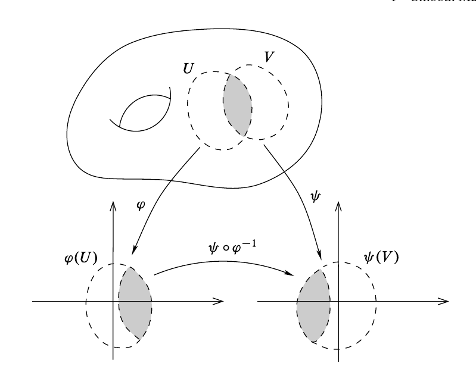

# Chapter 1: Smooth Manifolds

Definition (Smooth Functions)
: A function $f:\RR^n \to \RR^m$ given by $\thevector{f_1(\vector x^n), f_2(\vector x^n), \cdots, f_m(\vector x^n)}$ (or any subsets thereof) is said to be $C^\infty$ or **smooth** iff each $f_i$ has continuous partial derivatives of all orders.

Definition (Diffeomorphism)
: A smooth bijective map with a smooth inverse is a *diffeomorphism*.

Note that a diffeomorphism is a homeomorphism.

Definition (Transition Maps)
:   If $(U, \phi), (V, \psi)$ are two charts on $M$ such that $U\intersect V \neq \emptyset$, the compositve map $\psi \circ \phi\inv: \phi(U\intersect V) \to \psi(U\intersect V)$ is a function $\RR^n\to\RR^n$ and is called the *transition map* from $\phi$ to $\psi$.
    
    Two charts are *smoothly compatible* iff $U\intersect V = \emptyset$ or $\psi \circ \phi\inv$ is a diffeomorphism.

Definition
:   A collection of charts $\mca \definedas \theset{(U_\alpha, \phi_\alpha)}$ is an *atlas* for $M$ iff $\theset{U_\alpha} \covers M$, and is a *smooth atlas* iff all of the charts it contains are pairwise smoothly compatible.

Note: to show an atlas is smooth, it suffices to show that an arbitrary $\psi \circ \phi\inv$ is smooth.
This is because this immediately implies that its inverse is smooth, and these these are diffeomorphisms.
Alternatively, one can show that $\psi\circ\phi\inv$ is smooth, injective, and has nonsingular Jacobian at each point.

Remark
:   Attempting to define a function $f: M\to \RR$ to be smooth iff $f\circ \phi\inv: \RR^n \to \RR$ is smooth for each $\phi$ may not work because many atlases give the "same" smooth structure in the sense that they all determine the same collection of smooth functions on $M$. \todo{What does "determine the same collection of smooth functions" mean?}

    For example, take the following two atlases on $\RR^n$:
    \begin{align*}
    \begin{array}{l}
    {\mca}_{1}=\left\{\left(\mathbb{R}^{n}, \operatorname{Id}_{\mathbb{R}^{n}}\right)\right\} \\
    {\mca}_{2}=\left\{\left(\DD_{1}(\vector x), \id_{\DD_{1}(\vector x)}\right)\suchthat \vector x \in \mathbb{R}^{n}\right\}
    \end{array}
    .\end{align*}

    Claim: a function $f:\RR^n \to \RR$ is smooth wrt either atlas iff it is smooth in the usual sense.

Definition (Maximal or Complete Atlas)
: A smooth atlas on $M$ is *maximal* iff it is not properly contained in any larger smooth atlas.

Definition (Smooth Structures and Smooth Manifolds)
: If $M$ is a topological manifold, a maximal smooth atlas $\mca$ is a *smooth structure* on $M$. 
  The triple $(M, \tau, \mca)$ where $\mca$ is a smooth structure is a *smooth manifold*.

