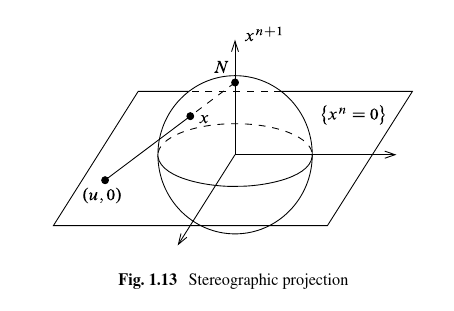

# Chapter 1 Problems

## Recommended Problems

Exercise (Problem 1.6) 
:   Show that if $M^n\neq \emptyset$ is a topological manifold of dimension $n\geq 1$ and $M$ has a smooth structure, then it has uncountably many distinct ones. \todo{Recommended problem}

    > Hint: show that for any $s> 0$ that $F_s(x) \definedas \abs{x}^{s-1}x$ defines a homeomorphism $F_x: \DD^n \to \DD^n$ which is a diffeomorphism iff $s=1$.

Solution:

Claim: $F_s$ is a continuous map
\begin{align*}
F_s: \DD^n &\to \DD^n \\
\vector x &\mapsto \norm{\vector x}^{s-1} \vector x = \norm{\vector x}^s{\vector x \over \norm{\vector x}} \definedas \norm{\vector x}^s \hat{\vector x}
.\end{align*}

Claim: $F_s$ is a bijection. 

This follows because we can construct a two-sided inverse that composes to the identity, namely $F_{1\over s}$.
We can check that
\begin{align*}
\qty{F_s \circ F_{1\over s}}(\vector x)
&= F_s(\norm{\vector x}^{1\over s} \hat{\vector x}) \\
&= \norm{ \norm{\vector x}^{1\over s} \hat{\vector x} }^{s} \cdot \norm{\vector x}^{1\over s} \hat{\vector x} \\
&= \norm{\vector x} \cdot \norm{ \hat{\vector x} }^{s} \cdot \norm{\vector x}^{1\over s} \hat{\vector x}
.\end{align*}

Exercise (Problem 1.7)
:   Let $N\definedas \thevector{0, \cdots, 1} \in S^n$ and $S\definedas \thevector{0, \cdots, -1}$ and define the stereographic projection
    \todo{Recommended problem}
    \begin{align*}
    \sigma: S^n\setminus N &\to \RR^n \\
    \thevector{x^1, \cdots, x^{n+1}} &\mapsto {1 \over 1-x^{n+1}} \thevector{x^1, \cdots, x^n}
    \end{align*}
    and set $\tilde\sigma(x) = -\sigma(-x)$ for $x\in S^n\setminus S$ (projection from the South pole)
    
    

    1. For any $x\in S^n\setminus N$ show that $\sigma(x) = \vector u$ where $(\vector u, 0)$ is the point where the line through $N$ and $x$ intersects the linear subspace $H_{n+1} \definedas \theset{x^{n+1} = 0}$.
  
        Similarly show that $\tilde \sigma(x)$ is the point where the line through $S$ and $x$ intersects $H_{n+1}$.
  
    2. Show that $\sigma$ is bijective and 
    \begin{align*}
    \sigma\inv(\vector u) = \sigma\inv\qty{\thevector{u^1, \cdots, u^n }} = {1\over \norm{\vector u}^2 + 1} \thevector{2u^1, \cdots, 2u^n, \norm{\vector u}^2 - 1}
    .\end{align*}
  
    3. Compute the transition map $\tilde \sigma \circ \sigma\inv$ and verify that the atlas
    \begin{align*}
    \mca \definedas \theset{(S^n\setminus N, \sigma), (S^n\setminus S, \tilde \sigma)  }
    \end{align*}
    define a smooth structure on $S^n$.
  
    4. Show that this smooth structure is equivalent to the standard smooth structure:
        Put graph coordinates on $S^n$ as outlined in \ref{ex:sphere_is_a_manifold} to obtain $\theset{(U_i^\pm, \phi_i^{\pm})}$.
      
        For indices $i<j$, show that
        \begin{align*}
        \phi_i^\pm \circ (\phi_j^\pm)\inv \thevector{u^1, \cdots, u^n} = \thevector{u^1, \cdots, \hat{u^i}, \cdots, \pm\sqrt{1 - \norm{\vector u}^2}  ,\cdots u^n}
        \end{align*}
        where the square root appears in the $j$th position.
        Find a similar formula for $i>j$.
        Show that if $i=j$, then
        \begin{align*}
        \phi_i^\pm \circ (\phi_j^\pm)\inv = \phi_i^- \circ (\phi_i^+)\inv = \id_{\DD^n} 
        .\end{align*}
      
        Show that these yield a smooth atlas.

    

Exercise (Problem 1.8)
:   Define an *angle function* on $U\subset S^1$ as any continuous function $\theta:U\to\RR$ such that $e^{i\theta(z)} = z$ for all $z\in U$.
    \todo{Recommended problem}

    Show that $U$ admits an angle function iff $U\neq S^1$, and for any such function $\theta$, $(U, \theta)$ is a smooth coordinate chart for $S^1$ with its standard smooth structure.

Exercise (Problem 1.9)
:   Show that $\CP^n$ is a compact $2n\dash$dimensional topological manifold, and show how to equip it with a smooth structure, using the correspondence
    \todo{Recommended problem}
    \begin{align*}
    \RR^{2n} &\iff \CC^n \\
    \thevector{x^1, y^1, \cdots, x^n, y^n} &\iff \thevector{x^1 + iy^1, \cdots, x^n + iy^n}
    .\end{align*}

