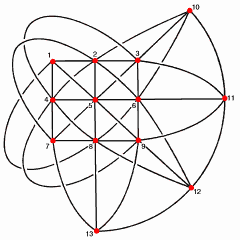

# Notes from Daniel's Office Hours

0. Definition of Zeta functions
0. Statement of the conjectures
2. Easy examples: $\PP^n_{\kk},\Gr_{\kk}(k, n) = \GL(n, \kk) / P$ the stabilizer of an $\kk\dash$point in $\CC^n, \FF_{p^n}$.
3. Medium example: $E/\kk$ an elliptic curve.
4. Work out a harder example as in Weil

References

- http://www-personal.umich.edu/~mmustata/zeta_book.pdf
- https://youtu.be/wEz7fCvK6sM?t=293
- [Explanation of exponential appearing](https://mathoverflow.net/questions/325186/motivation-for-zeta-function-of-an-algebraic-variety)
- [https://arxiv.org/pdf/1807.10812.pdf](https://arxiv.org/pdf/1807.10812.pdf)

## Definition of Zeta Function

Fix $q$ a prime and $\FF \definedas \FF_q$ the finite field with $q$ elements, along with its unique degree $n$ extensions 
$$
\FF_n \definedas \FF_{q^n} = \theset{x\in \bar \FF_p \suchthat x^{q^n} - x = 0} \quad \forall~ n\in \ZZ^{\geq 2}
$$ 

Definition
:  Let  
    $$
    J = \gens{f_1, \cdots, f_M} \normal k[x_0, \cdots, x_n]
    $$ 
    be an ideal, then a *projective algebraic* variety $X\subset \PP^N_\FF$ can be given by 
    $$
    X = V(J) = \theset{\vector x \in \PP^\infty_\FF \suchthat f_1(\vector x) = \cdots = f_M(\vector x) = \vector 0}
    $$ 
    where an ideal generated by *homogeneous* polynomials in $n+1$ variables, i.e. there is some fixed $d\in \ZZ^{\geq 1}$ such that 

    \begin{align*}
    f(\vector x) = \sum_{\substack{\vector I = (i_1, \cdots, i_n) \\ \sum_j i_j = d}} \alpha_{\vector I} \cdot x_0^{i_1}\cdots x_n^{i_n} 
    \qtext{ and } f(\lambda \cdot \vector x) = \lambda^d f(\vector x)
    .\end{align*}

> For the experts: we can take a reduced (possibly reducible) scheme of finite type over a field $\FF_p$.
> We will be thinking of $K\dash$valued points for $K/\FF_p$ algebraic extensions.
> From the audience: what condition do we need to put on such a scheme to guarantee an embedding into $\PP^\infty$?

Examples:

- Dimension 1: Curves
- Dimension 2: Surfaces
- Codimension 1: Hypersurfaces

Fix $X/\FF \subset \PP$ an $N\dash$dimensional projective algebraic variety, and say it's cut out by the equations $f_1, \cdots f_M \in \FF[x_0, \cdots, x_n]$.
Note that it then has points in any finite extension $L/K$.

Definition
:   Define the *local zeta function* of $X$ the following formal power series:

    \begin{align*}
    \zeta_X(z) &= \exp\qty{ \sum_{n=1}^\infty \alpha_n  {z^n \over n} } \in \QQ[[z]] \qtext{where} \alpha_n \definedas \# X(\FF_n)
    .\end{align*}

Concretely, for $X\subset \PP^M$ a variety cut out by $\theset{f_i} \subset \FF[x_0, \cdots, x_M]$ we are measuring the sizes of the sets
\begin{align*}
\alpha_n \definedas \# \theset{\vector x \in \PP^M_{\FF_{q^n}} \suchthat f_i(\vector x) = \vector 0 ~\forall i }
.\end{align*}

Note the following two properties:
\begin{align*}
\zeta_X(0) &= 1 \\
z \qty{\dd{}{z}} \log \zeta_X(z) &= t \qty{\zeta_X'(z) \over \zeta_X(z) } = \sum_{n=1}^\infty \alpha_n z^n = \alpha_1 z + \alpha_2 z^2 + \cdots
,\end{align*}
which is an *ordinary generating function* for the sequence $(\alpha_n)$.

> Todo: why not an OGF.

Remark: 
Note that for an OGF $F(x) = \sum_{n=0}^\infty f_n x^n$, we can extract coefficients in the following way:

\begin{align*}
f_n \definedas [x^n] F(x) = [x^n] T_{F, 0}(x) = \frac{1}{n!} \qty{\dd{}{x}}^{n} F(x) \mid_{x = 0}
.\end{align*}

Using the Residue theorem, we can also extract in the following way:
\begin{align*}
[x^n] F(x) = \frac{1}{2\pi i} \oint_{\SS^1} {F(z) \over z^{n+1}}
.\end{align*}

> Note: this is extremely amenable to numerical approximation if you have a closed form for $F$ or even just a black-box numerical version of $F$! I.e. easy to throw at a computer.

### Simple but Useful Example: A Point

Take $X = \theset{x = 0}/\FF$ a single point over $\FF$, then 
\begin{align*}
\#X(\FF) &\definedas \alpha_1 = 1 \\
\#X(\FF_2) &\definedas \alpha_2 = 1 \\
&\vdots \\
\#X(\FF_n) &\definedas \alpha_n = 1 \\
&\vdots
.\end{align*}

Recall that by integrating a geometric series we can derive
\begin{align*}
{1 \over 1-z} &= \sum_{n=0}^\infty z^n  &&= 1 + z + z^2 + \cdots\\
\int {1 \over 1-z} &= \int \sum_{n = 0}^\infty z^n &&= \sum_{n=0}^\infty \int z^n = \sum_{n=0}^\infty \frac{1}{n+1}z^{n+1} = z + \frac 1 2 z^2 + \frac 1 3 z^3 + \cdots \\
\implies \ln\qty{1-z} &= \sum_{n=1}^\infty {z^n \over n}   
.\end{align*}

and so 
\begin{align*}
\zeta_\pt(t) 
&= \exp\qty{ 1\cdot t + 1 \cdot {t^2 \over 2} + 1 \cdot {t^3 \over 3} + \cdots } \\
&= \exp\qty{ -\log\qty{1-t} } \\
&= {1 \over 1 - t} 
.\end{align*}

## Statement of Weil Conjectures

(Weil 1949)

Let $X$ be a smooth projective variety of dimension $N$ over $\FF_{q}$ for $q$ a prime and let $\zeta_X(z)$ be its zeta function.

1. (Rationality) 

    $\zeta_X(z)$ is a rational function:

    \begin{align*}
    \zeta_X(z) &= 
    {p_1(z) \cdot p_3(z) \cdots p_{2N-1}(z) 
    \over 
    p_0(z) \cdot p_2(z) \cdots p_{2N}(z)} \in \QQ(z),\quad\text{i.e. }\quad p_i(z) \in \ZZ[z] \\ \\
    P_0(z) &= 1-z \\
    P_{2n}(z) &= 1 - q^N z \\
    P_i(z) &= \prod_{j=1}^{\beta_i} \qty{1 - a_{ij}z} \qtext{for some} a_{ij} \in \CC
    .\end{align*}

2. (Functional Equation and Poincare Duality) 

    Let $\chi(X)$ be the Euler characteristic of $X$, i.e. the self-intersection number of the diagonal embedding $\Delta \injects X\cross X$; then $\zeta_X(z)$ satisfies the following *functional equation*:

    \begin{align*}
    \zeta_X\qty{1 \over q^n z} = \pm \qty{q^{n \over 2} z}^{\chi(X)} \zeta_X(z)
    .\end{align*}

3. (Riemann Hypothesis)

   The $a_{ij}$ are algebraic integers (roots of some monic $p\in \ZZ[x]$) which satisfy 
    \begin{align*}
    \abs{a_{ij}}_\CC = q^{i \over 2}  \qtext{for} 1 \leq i \leq 2N-1
    .\end{align*}
  

4. (Betti Numbers)
    If $X$ lifts to a variety $\tilde X/ \CC$, then the $\beta_i$ are the Betti numbers of $X/\CC$.

Moral: the Diophantine properties of a variety's zeta function are governed by its (algebraic) topology.
Conversely, the analytic properties of encode a lot of geometric/topological/algebraic information.

Remarks:

  - Resolved for varieties over $\FF_q$
- On $L_X$:
  - Conjectured for smooth varieties over $\QQ$ (rationality $\sim$ analytically continues to a meromorphic function, some functional equation), little is known.
  - Resolved for elliptic curves (Taylor-Wiles c/o the Taniyama-Shimura conjecture), implies $L_X$ is an $L$ function coming from a modular form.

### Aside: Why call it a Zeta function?

Knowing the zeta function of a point, we can now make a precise analogy.

Suppose we have an algebraic variety cut out by equations:
\begin{align*}
\AA_\ZZ^n \supseteq X = V(\gens{f_1, \cdots, f_d}) \qtext{where} f_i \in \ZZ[x_0, \cdots, x_{n-1}]
.\end{align*}

Then for every prime $q$, we can reduce the equations mod $p$ and consider 
$$
\AA_{\FF_q}^n \supseteq X_q \definedas V(\gens{f_1 \mod q, \cdots ,f_d \mod q}) \qtext{where} f_1 \mod q \in \FF_q[x_0, \cdots, x_{n-1}]
$$

Then define the *Hasse-Weil* zeta function:
\begin{align*}
L_X(s) = \prod_{p\text{ prime}} \zeta_{X_p}\qty{p^{-s}}
.\end{align*}

Take $X = \spec \QQ$ and $X_p = \spec \FF_p$, which is a single point since $\FF_p$ is a field. 
The previous example shows that
\begin{align*}
\zeta_{X_p}(z) 
= {1 \over 1-z}
,\end{align*}

We then find that
\begin{align*}
L_X(s) 
&= \prod_{p\text{ prime}} \zeta_{X_p}(p^{-s}) \\
&= \prod_{p\text{ prime}} \qty{ 1 \over 1 - p^{-s}} \\
&= \zeta(s)
,\end{align*}

which is the Euler product expansion of the classical Riemann Zeta function.

Moreover, it is a theorem (difficult, not proved here!) that for any variety $X/\FF_p$, we have
\begin{align*}
\zeta_X(t) 
= \prod_{x\in X_{\text{cl}}} \qty{1 \over 1 - t^{\deg(x)}} 
\quad \overset{t = p^{-s}}{\implies} \quad
\zeta_X(s) = \prod_{x\in X_{\text{cl}}} \qty{1 \over 1 - \qty{p^{\deg(x)}}^{-s} } 
,\end{align*}

which we can think of as attaching a "weight" to each closed point, $\abs{x} \definedas p^{\deg(x)}$, and the usual Riemann Zeta corresponds to assigning a weight of 1 to each point.

> Note that this immediately implies that $\zeta_X(t) \in \ZZ[[t]]$ is a *rational* function.

> Note for experts: $\zeta_X(z)$ an honest generating function for the 0-cycles on $X$ ($F(X_{\text{cl}})$) where are effective (nonnegative coefficients).

### More Examples

#### Example (Affine Line):

$X = \AA^1/\FF$ the affine line over $\FF$, then
Note that we can write 
$$
\AA^1(\FF_n) = \theset{\vector x = [x_1] \suchthat x_1 \in \FF_n}
$$ 
as the set of one-component vectors with entries in $\FF_n$, so
\begin{align*}
X(\FF) &= q \\
X(\FF_2) &= q^2 \\
&\vdots \\
X(\FF_n) &= q^n
.\end{align*}

Thus
\begin{align*}
\zeta_X(z) = \exp\qty{\sum_{n=1}^\infty {q^n \over n} z^n } = \frac 1 {1 - qz}
.\end{align*}

#### Example (Affine Space):

Set $X = \AA^m/\FF$, affine $m\dash$space over $\FF$, so we can just repeat with now $m$ coordinates
$$
\AA^1(\FF_n) = \theset{\vector x = [x_1, \cdots, x_m] \suchthat x_i \in \FF_n}
$$ 
Counting yields
\begin{align*}
X(\FF) &= q^m \\
X(\FF_2) &= (q^2)^m \\
&\vdots \\
X(\FF_n) &= (q^n)^m
.\end{align*}

Thus
\begin{align*}
\zeta_X(z) = \exp\qty{\sum_{n=1}^\infty {q^{nm} \over n} z^n } = \frac 1 {1 - q^m z}
.\end{align*}

#### Example (Projective Line):
$X = \PP^1/\FF$ the projective line over $\FF$, then we can write use some geometry to write
$$
\PP^1_\FF = \AA^1_\FF \disjoint \theset{\infty}
$$ 
as the affine line with a point added at infinity.

We can then count by enumerating coordinates:
\begin{align*}
\PP^1(\FF_n) 
&= \theset{[x_1, x_2] \suchthat x_1, x_2 \neq 0 \in \FF_n}/\sim  \\
&= \theset{[x_1, 1] \suchthat x_1 \in \FF_n} \disjoint \theset{[1, 0]}
.\end{align*}

Thus
\begin{align*}
X(\FF) &= q + 1\\
X(\FF_2) &= q^2 + 1 \\
&\vdots \\
X(\FF_n) &= q^n + 1\\
.\end{align*}

Thus
\begin{align*}
\zeta_X(z) = {1 \over (1-z)(1-qz)} \\ 
.\end{align*}

#### Example (Projective Space):

Take $X = \PP^n_{\FF}$, 

Example image of $\PP^2_{\GF(3)}$:
\

Note that we can identify $X = \Gr_{\FF}(1, n)$ as the space of lines in $\AA^n_\FF$.

Proposition
:   The number of $k\dash$dimensional subspaces of $\AA^m_\FF$ is the $q\dash$binomial coefficient:
    \begin{align*}
    \genfrac{[}{]}{0pt}{}{m}{k}_q \definedas \frac{(q^m - 1)(q^{m-1}-1) \cdots (q^{m - (k-1)} -  1)}{(q^k-1)(q^{k-1} - 1) \cdots (q-1)}
    .\end{align*}

Proof
:   To choose a $k\dash$dimensional subspace, 
    
    - Choose a nonzero vector $\vector v_1 \in \AA^n_\FF$ in $$q^m - 1$$ ways.
      - Identify $\#\spanof\theset{\vector v_1} = \#\theset{\lambda \vector v_1 \suchthat \lambda \in \FF} = \# \FF = q$.
    - Choose a nonzero vector $\vector v_2$ *not* in the span of $\vector v_1$ in $$q^m - q$$ ways.
      - Identify $\# \spanof\theset{\vector v_1, \vector v_2} = \# \theset{\lambda_1 \vector v_1 + \lambda_2 \vector v_2 \suchthat \lambda_i \in \FF} = q\cdot q = q^2$.
    - Choose a nonzero vector $\vector v_3$ not in the span of $\vector v_1, \vector v_2$ in $$q^m -q^2$$ ways.
    - $\cdots$ until $\vector v_k$ is chosen in $$(q^m-1)(q^m-q) \cdots (q^m - q^{k-1})$$ ways. 
      - This yields a $k\dash$tuple of linearly independent vectors spanning a $k\dash$dimensional subspace $V_k$
    - This overcounts because many linearly independent sets span $V_k$,  we need to divide out by the number of choose a basis inside of $V_k$.
    - By the same argument, this is given by $$(q^k-1)(q^k-q) \cdots (q^k - q^{k-1})$$ 

    Thus
    \begin{align*}
    \# \text{subspaces} 
    &= \frac{ (q^m-1)(q^m-q)(q^m - q^2) \cdots (q^m - q^{k-1}) }{ (q^k-1)(q^k-q)(q^k-q^2) \cdots (q^k - q^{k-1})}\\
    &= {q^m - 1 \over q^k - 1} \cdot \qty{q \over q} {q^{m-1} - 1 \over q^{k-1} - 1} \cdot \qty{q^2 \over q^2}{q^{m-2} - 1 \over q^{k-2} - 1} \cdots \qty{q^{k-1} \over q^{k-1}}{q^{m - (k-1)} - 1 \over q^{k - (k-1) - 1}}
    .\end{align*}

We obtain a nice simplification for the number of lines corresponding to setting $k=1$:
\begin{align*}
\genfrac{[}{]}{0pt}{}{m}{1}_q = {q^m-1 \over q - 1} = q^{m-1} + q^{m-2} + \cdots + q + 1 = \sum_{j=0}^{m-1} q^j
.\end{align*}

Thus
\begin{align*}
X(\FF) &= \sum_{j=0}^{m-1} q^j  \\
X(\FF_2) &= \sum_{j=0}^{m-1} \qty{q^2}^j  \\
&\vdots \\
X(\FF_n) &= \sum_{j=0}^{m-1} \qty{q^n}^j
.\end{align*}

So
\begin{align*}
\zeta_X(z) = \qty{1 \over 1 - z} \qty{1 \over 1 - qz} \qty{1 \over 1 - q^2 z} \cdots \qty{1 \over 1- q^m z}   \\ 
,\end{align*}

Note that geometry can help us here: we have a "cell decomposition" $\PP^n = \PP^{n-1} \disjoint \AA^n$, and so inductively
\begin{align*}
\PP^n = \AA^0 \disjoint \AA^1 \disjoint \cdots \disjoint \AA^n
,\end{align*}

and it's straightforward to prove that
$$
\zeta_{X\disjoint Y}(z) = \zeta_X(z) \cdot \zeta_Y(z)
$$

and recalling that $\zeta_{\AA^j}(z) = {1 \over 1 - q^j z}$ we have
\begin{align*}
\zeta_{\PP^m}(z) = \prod_{j=0}^m \zeta_{\AA^j}(z) = \prod_{j=0}^n {1 \over 1 - q^j z}
.\end{align*}

Example:
Take $X = \Gr_{\FF}(k, n)$, then ????? so
\begin{align*}
\zeta_X(t) = ? 
.\end{align*}

## Hard Example: An Elliptic Curve

Take $X = E/\FF$, then $\alpha_n = q^n - (a^n + \bar a^n - 1)$ where $\abs{a}_\CC = \abs{\bar \alpha}_\CC = \sqrt q$.
Then
\begin{align*}
\zeta_X(t) = {(1-aq^{-t}) (1 - \bar a q^{-t}) \over (1 - q^{-t})(1 - q^{1-s}) }
.\end{align*}
