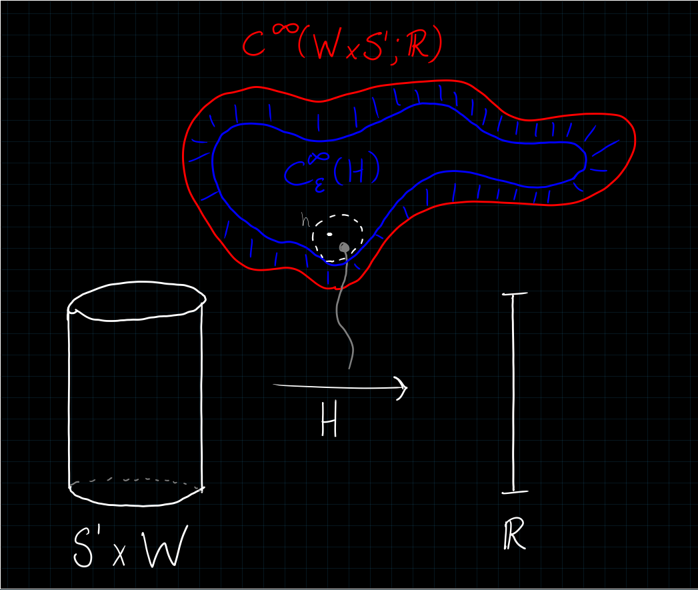
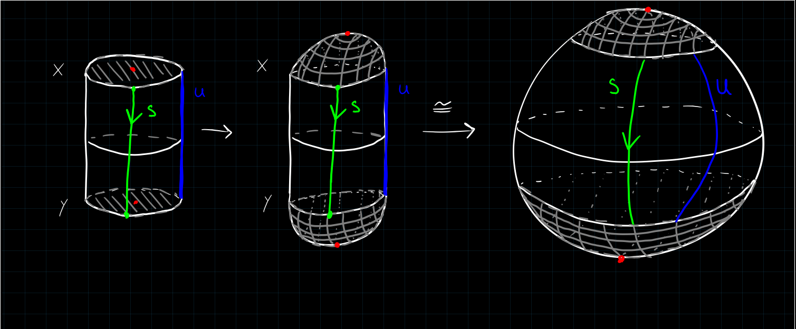

# Background and Notation

!include ./notation.md

# Talk

Overview:
Analyze the space $\mcm(x, y)$ of solutions to the Floer equation connecting two orbits $x, y$ of $H$.
Show $\mcm(x, y)$ is in fact a manifold of dimension $\mu(x) - \mu(y)$.

Strategy:

1. Describe $\mcm(x, y)$ as the zero set of a section of a vector bundle over the Banach manifold $\mcp(x, y)$.
2. Apply the Sard-Smale theorem: perturb $H$ to make $\mcm(x, y)$ the inverse image of a regular value of some map.
3. Show that the tangent maps (?) are Fredholm operators of index $\mu(x) - \mu(y) = \dim \mcm(x, y)$.

Goals:

- 8.3: Overview and big picture
- 8.4: Formula for linearization of $\mcf$.

## 8.3: The Space of Perturbations of $H$

Goal: given a fixed Hamiltonian $H\in C^\infty(W\cross S^1; \RR)$, perturb it (without modifying the periodic orbits) so that $\mcm(x, y)$ are manifolds of the expected dimension.

Start by trying to construct a subspace $\mcc_\eps^{\infty}(H) \subset \mcc^\infty(W\cross S^1; \RR)$, the space of perturbations of $H$ depending on a certain sequence $\eps = \theset{\eps_k}$, and show it is a dense subspace.

\

Idea: similar to how you build $L^2(\RR)$, define a norm $\norm{\wait}_\eps$ on $C_\eps^{\infty}(H)$ and take the subspace of finite-norm elements.

- Let $h(\vector x, t) \in C_\eps^\infty(H)$ denote a perturbation of $H$.
- Fix $\vector \eps = \theset{\eps_k \mid k\in \ZZ^{\geq 0}} \subset \RR^{>0}$ a sequence of real numbers, which we will choose carefully later.

- For a fixed $\vector x \in W, t\in \RR$ and $k \in \ZZ^{\geq 0}$, define 
  $$
  \abs{d^k h(\vector x, t)} = \max \theset {d^\alpha h(\vector x, t) \suchthat \abs{\alpha} = k}
  ,$$
  the maximum over all sets of multi-indices $\alpha$ of length $k$.

  > Note: I interpret this as 
  $$
  d^{\alpha_1, \alpha_2, \cdots, \alpha_k}h = \frac{\del^k h}{\del x_{\alpha_1} ~\del x_{\alpha_2} \cdots \del x_{\alpha_k}}
  ,$$
  the partial derivatives wrt the corresponding variables.

- Define a norm on $C^\infty(W\cross S^1; \RR)$:

  \begin{align*}
  \|h\|_{\vector \eps}
  &= \sum_{k \geq 0} \eps_{k} \sup _{(x, t) \in W \times S^{1}}\left|d^{k} h(x, t)\right|
  .\end{align*}

- Since $W\cross S^1$ is assumed compact (?), fix a finite covering $\theset{B_i}$ of $W\cross S^1$ such that 
  $$
  \union_i B_i^\circ = W \cross S^1
  .$$

  - Choose them in such a way we obtain charts 
    \begin{align*}
    \Psi_i: B_i &\to \bar{B(0, 1)} \subset \RR^{2n + 1} ~(?)
    .\end{align*}
  
- Obtain the computable form
  \begin{align*}
  \norm{h}_{\vector \eps} &= \sum_{k \geq 0} \eps_{k} \sup _{(x, t) \in W \times S^{1}} \sup_{i, z\in B(0, 1)} \abs{ d^k (h\circ \Psi_i\inv)(z)}
  .\end{align*}

- Define 
    $$
    C_\eps^\infty = \theset{h\in C^\infty(W\cross S^1; \RR) \suchthat \norm{h}_\eps < \infty} \subset C^{\infty}(W\cross S^1; \RR)
    ,$$ 
   which is a Banach space (normed and complete). 

- Show that the sequence $\theset{\eps_k}$ can be chosen so that $C_\eps^\infty$ is a *dense* subspace for the $C^\infty$ topology, and in particular for the $C^1$ topology.

Proposition
: Such a sequence $\theset {\eps_k}$ can be chosen.

Lemma
: $C^\infty(W \cross S^1; \RR)$ with the $C^1$ topology is separable as a topological space (contains a countable dense subset).

Proof (of Lemma, Sketch)
:   \hfill
    First prove for $C^0$:

    - **Idea:** reduce to polynomials in $\RR^m$.
    - Embed $W\cross S^1 \injects [-M, M]^m \cong I^m \subset \RR^m$ for some large $m$, reduces to proving it for $C^\infty(I^m; \RR)$.
    - Recall Stone-Weierstrass: 
      
      > For $A\leq C^0(X; \RR)$ a subalgebra with $X$ compact Hausdorff and $A$ containing a nonzero constant function, $A$ is dense iff it separates points (for all $a\neq b\in X$ there exists $f\in A$ such that $f(a) \neq f(b)$) 

    - Apply to $A = \QQ[x_1, \cdots, x_m]$ the subalgebra of polynomial functions, the nonzero constant function $c(x) = 1$, and show it separates points via $f(x) = x-a$, then $f(a) = 0$ and $f(b) = a-b \neq 0$ by assumption.
    
    - Thus $A$ is a countable dense subset.

    \

    Then prove for $C^1$:

    - **Idea**: Take polynomials convolved with a countable sequence of bump functions, which is still a countable dense subset.
    
    - Choose a smooth bump function $\chi$ supported on $B(0, 1)$
    
    - Define the sequence $\chi_k(x) \definedas k^m \chi(kx)$.
    
    - Prove that $(f\ast \chi_k) \converges{k\to\infty}\to f$ in the $C_\loc^0$ sense (?)
    
    - Show that for a fixed $k$, any other sequence $g_\ell \to f$ in $C_\loc^\infty$, we have $g_\ell \ast \chi_k \to f \ast \chi_k$ in the $C_\loc^0$ sense using 
    $$
    \abs{g_\ell - f} \to 0 \implies \sup_K \abs{\dd{}{x_i} (g_\ell - f) \ast \chi_k} \leq \sup_k \abs{g_\ell - f} \cdot (\cdots) \to 0 \quad \forall i
    $$
    
    - Conclude $\lim_\ell \lim_k g_\ell \ast \chi_k = f$.
    
    - Taking $g_\ell$ to be polynomial approximations, the following subset is countable and dense:
    $$
    \union_{k\in \ZZ^{\geq 0}} \theset{P\ast \chi_k \suchthat P \in \QQ[x_1, \cdots, x_m]}
    $$
    which are pushed through the charts $\Psi_i$ to actually compute.

The second part of this proof generalizes to $C^\infty$.

Proof (of Proposition, Sketch)
:   \hfill

    - By the lemma, produce a sequence $\theset{f_n} \subset C^\infty(W\cross S^1; \RR)$ dense for the $C^1$ topology.
    
    - Using the norm on $C^n(W\cross S^1; \RR)$ for the $f_n$, define
    
      \begin{align*}
      \frac 1 {\eps_n} = 2^n \displaystyle\max \theset {\norm{f_k} \suchthat k\leq n}
      \implies \eps_n \sup \abs{d^n f_k(x, t)} \leq 2^{-n}
      \end{align*}

      which is summable.

> Why does this imply density? I don't know.

The next proposition establishes a version of this theorem with compact support:

Proposition
: For any $(\vector x, t) \subset U \in W \cross S^1)$ there exists a $V\subset U$ such that every $h\in C^{\infty}(W\cross S^1; \RR)$ can be approximated in the $C^1$ topology by functions in $C_\eps^\infty$ supported in $U$.

Then fix a time-dependent Hamiltonian $H_0$ with nondegenerate periodic orbits and consider 
$$
\theset{ h\in C_\eps^\infty(H_0) \suchthat h(x, t) = 0 \text{ in some $U\supseteq$ the 1-periodic orbits of $H_0$}}
$$
Then $\supp(h)$ is "far" from $\per(H_0)$, so 
$$
\norm{h}_\eps \ll 1 \implies \per(H_0 + h) = \per(H_0)
$$ 
and are both nondegenerate.

## Review 8.2

What is $\mcf$?

We started with the unadorned Floer map:
\begin{align*}
\mathcal{F}: \mathcal{C}^{\infty}\left(\mathbb{R} \times S^{1} ; W\right) & \to \mathcal{C}^{\infty}\left(\mathbb{R} \times S^{1} ; T W\right) \\
u & \mapsto \frac{\partial u}{\partial s}+J \frac{\partial u}{\partial t}+\operatorname{grad}_{u}\left(H_{t}\right)
\end{align*}

and promoted this to a map of Banach spaces
\begin{align*}
\mcf: \mcp^{1, p}(x, y) &\to \mcl^p(x, y) \\
\mathcal{F}(u) &= \frac{\partial u}{\partial s}+J(u) \frac{\partial u}{\partial t}+\operatorname{grad} H_{t}(u)
.\end{align*}

What is the LHS?
It is the space of maps
\begin{align*}
\mcp^{1, p}(x, y): ? &\to ? \\
(s, t) &\mapsto \exp_{w(s, t)} Y(s, t)
.\end{align*}

where $Y \in W^{1, p}(w^* TW)$ and $w\in C^\infty_{\searrow}(x, y)$.

## 8.4: Linearizing the Floer equation: The Differential of $\mcf$

Choose $m> n = \dim (W)$ and embed $TW \injects \RR^m$ to identify tangent vectors (such as $Z_i$, tangents to $W$ along $u$ or in a neighborhood $B$ of $u$) with actual vectors in $\RR^m$.

> Why? Bypasses differentiating vector fields and the Levi-Cevita connection.

We can then identify 
$$
\im \mcf = C^\infty (\RR \cross S^1; \RR^m) \qtext{or} L^p(\RR\cross S^1; W)
,$$ 
and we seek to compute its differential $d \mcf$.

> We've just replaced the codomain here.

Recall that 

- $x, y$ are contractible loops in $W$ that are nondegenerate critical points of the action functional $\mca_H$, 
- $u \in \mcm(x, y) \subset C_\loc^\infty$ denotes a fixed solution to the Floer equation, 
- $C_{\searrow}(x ,y)$ was the set of solutions $u: \RR\cross S^1 \to W$ satisfying some conditions.

> Recall:
> \begin{align*}
C_{\searrow}(x, y) \definedas \{
u \in C^\infty(\RR\cross S^1; W) \suchthat 
&\lim_{s\to -\infty}u(s, t) = x(t),\quad 
\lim_{s\to\infty}u(s, t) = y(t)
\} \\
&\abs{\dd{u}{t}(s, t)} \quad \text{and}\quad \abs{\dd{u}{t}(s, t) - X_H(u)}  \sim \exp(\abs{s})
\end{align*}

Fix a solution
$$
u\in \mcm(x, y) \subset C_{\loc}^\infty(\RR\cross S^1; W)
.$$

We lift each solution to a map 
$$
\tilde u: S^2 \to W
$$ 
in the following way:
the loops $x, y$ are contractible, so they bound discs.
So we extend by pushing these discs out slightly::

\

From earlier in the book, we have

**Assumption (6.22)**:

For every $w\in C^\infty(S^2, W)$ there exists a symplectic trivialization of the fiber bundle $w^* TW$, i.e. $\inner{c_1(TW)}{\pi_2(W)} = 0$ where $c_1$ denotes the first Chern class of the bundle $TW$.

> Note: I don't know what this pairing is. The top Chern class is the Euler class (obstructs nowhere zero sections) and are defined inductively: 
$$
c_1(TW) = e(\Lambda^n(TW)) \in H^2(W; \ZZ)
$$
> Assumption is satisfied when all maps $S^2 \to W$ lift to $B^3$ $\iff \pi_2(W) = 0$.

We have a pullback that is a symplectic fiber bundle:
\begin{center}
\begin{tikzcd}
\tilde u^* TW \ar[r, "d\tilde u"] \ar[d]
\arrow[dr, phantom, "\scalebox{1.5}{\color{black}$\lrcorner$}" , very near start, color=black]
& TW\ar[d] \\
S^2 \ar[r, "\tilde u"] & W
\end{tikzcd}
\end{center}

- Using the assumption, trivialize the pullback $\tilde u ^* TW$ to obtain an orthonormal unitary frame $$\theset{Z_i}_{i=1}^{2n} \subset T_{u(s, t)} W$$ where
  - The frame depends smoothly on $(s, t) \in S^2$, 
  - $\lim_{s\to \infty} Z_i$ exists for each $i$.
  - $$\dd{}{s}, \quad \frac{\del^2}{\del s^2}, \quad \frac{\del^2}{\del s~\del t} \quad \actson Z_i \converges{s\to \pm\infty}\to 0\quad \text{for each } i$$

  > Claim: such trivializations exist, "using cylinders near the spherical caps in the figure".

> Recall what $\mcp^{1, p}(x, y), J, X_t$ are here.
 
- Use this frame to define a chart centered at $u$ of $\mcp^{1, p}(x, y)$ given by
\begin{align*}
\iota: W^{1, p}\left(\mathbb{R} \times S^{1} ; \mathbb{R}^{2 n}\right) & \longrightarrow \mathcal{P}^{1, p}(x, y) \\
\vector{y} = \left(y_{1}, \dots, y_{2 n}\right) & \longmapsto \exp _{u}\left(\sum y_{i} Z_{i}\right)
.\end{align*}

- Define and compute the differential of the composite map $\tilde\mcf$ defined as follows:
  \begin{center}
  \begin{tikzcd}
  \mathcal{P}^{1, p}(x, y) \ar[r, "\mathcal{F}"] \ar[rr, dotted, "\tilde \mcf", bend left]
  & L^{p}\left(\mathbb{R} \times S^{1} ; T W\right) \ar[r]
  & L^{p}\left(\mathbb{R} \times S^{1} ; \mathbb{R}^{m}\right) \\
  u \ar[rr, "\tilde \mcf"] & &\frac{\partial u}{\partial s}+J(u)\left(\frac{\partial u}{\partial t}-X_{t}(u)\right)
  \end{tikzcd}
  \end{center}

  - From now on, let $\mcf$ denote $\tilde \mcf$.

- Take the vector $$Y(s, t) \definedas (y_1(s, t), \cdots) \in \RR^{2n} \subset \RR^m$$
  
    - View $Y$ as a vector in $\RR^m$ tangent to $W$, given by $Y = \sum_{i=1}^{2n} y_i Z_i$.

- Plug $u + Y$ into the equation for $\mcf$, directly yielding
  \begin{center}
  \begin{tikzcd}[column sep=0.1em]
  \mcf(u) =
  & \frac{\partial u}{\partial s} 
  & + J(u) \frac{\partial u}{\partial t} 
  & - J(u)X_{t}(u) \\
  \implies \mathcal{F}(u+Y) =
  & \frac{\partial(u+Y)}{\partial s}
  &+ J(u+Y) \frac{\partial(u+Y)}{\partial t}
  &- J(u+Y) X_{t}(u+Y)
  \end{tikzcd}
  \end{center}

- Extract the part that is linear in $Y$ and collect terms:
  \begin{align*}
  (d \mathcal{F})_{u}(Y)
  & = {\color{red}\frac{\partial Y}{\partial s}} +(d J)_{u}(Y) \frac{\partial u}{\partial t} + {\color{red} J(u) \frac{\partial Y}{\partial t}} -(d J)_{u}(Y) X_{t}-J(u)\left(d X_{t}\right)_{u}(Y) \\ \\ 
  & = 
  \qty{ {\color{red}\frac{\partial Y}{\partial s}} + {\color{red} J(u) \frac{\partial Y}{\partial t}}} +  
  \qty{ (d J)_{u}(Y) \frac{\partial u}{\partial t} - (d J)_{u}(Y) X_{t}-J(u)\left(d X_{t}\right)_{u}(Y)} \\
  .\end{align*}

  - Observe that this is a sum of two differential operators:
    - One of order 1, one of order 2 (Perspective 1)
    - The Cauchy-Riemann operator, and one of order zero.

Lemma (Acting by Derivation)
:   For any $J \to \endo(\RR^m)$ and $Y, v: ? \to \RR^m$ we have
    \begin{align*}
    (dj)(Y) \cdot v = d(Jv)(Y) - J dv(Y)
    .\end{align*}

> There is a proof.

For every such smooth map $u: \RR\cross S^1 \to W$, $(d\mcf)_u(Y) = O_1 + O_0$ where $O_i$ are differential operators of order $i$, and in fact $O_1$ can be chosen to be a Cauchy-Riemann operator.
In this specific chart, we can in fact decompose $(d\mcf)_u(Y) = \bar\del Y + SY$ where $S: \RR \cross S^1 \to \endo(\RR^n)$ is linear of order 0, and in fact we have

Proposition
: If $u$ solves Floer's equation, then $(d\mcf)_u = \bar\del + S( s, t)$ where $S$ is linear, tends to a symmetric operator as $s\to \pm \infty$, and $\lim \del_t S = 0$ uniformly in $t$.

> There is a very long computational proof.

Denote the order $0$ part of $(d\mcf)_u$ as $Y \mapsto S\cdot Y$ so $S: \RR \cross S^1 \to \endo(\RR^{m})$ and define $S^\pm \definedas \lim_{s\to\pm \infty} S(s, \wait)$.

Proposition
: The equation $\del_t Y = J_0 S^{\pm} Y$ linearizes Hamilton's equation $\dot z = X_t(z)$ at $x = \lim_{s\to \pm\infty} u$ for $S^+$ and $S^-$ respectively.

> Proof: uses previous proposition.

Given a solution $u$, the product 
\begin{align*}
u \cdot s: ? \to ? \\
(\sigma, t) \mapsto u(\sigma + s, t)
\end{align*}
is also a solution and $\mcf(u \cdot s) = 0$ for all $s$.

**Punchline**:

Thus $\dd{u}{s}$ is a solution of the linearized equation, since
\begin{align*}
0 = \dd{}{s} \mcf (u\cdot s) = (d\mcf)_u \qty{\dd{u}{s}}
.\end{align*}

Along any nonconstant solution connecting $x$ and $y$, $\dim \ker (d_\mcf)_u \geq 1$.

